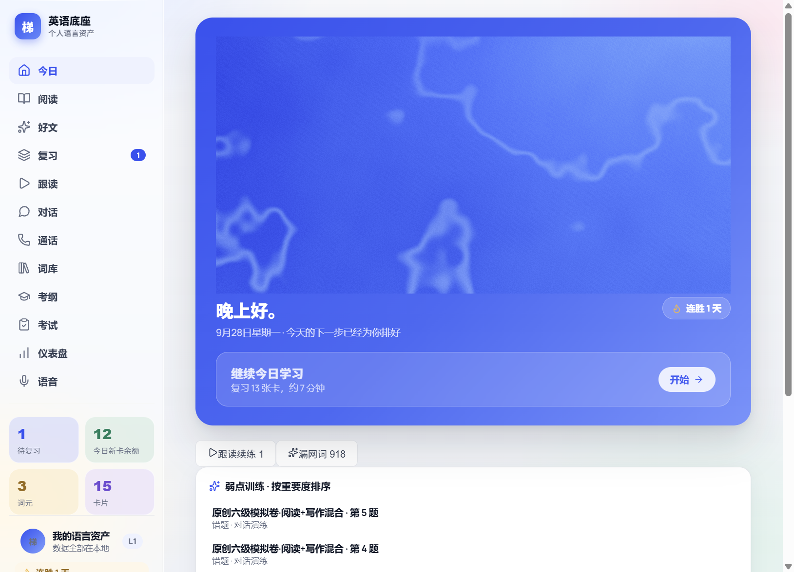
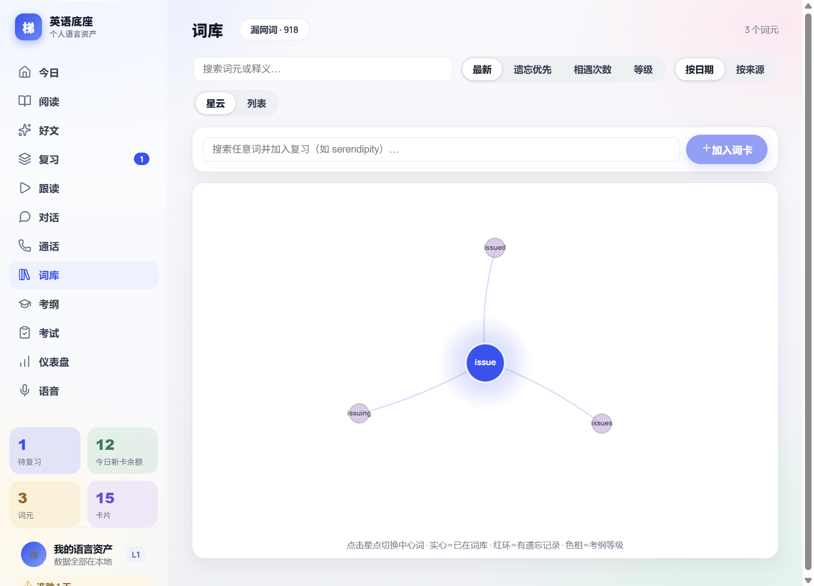
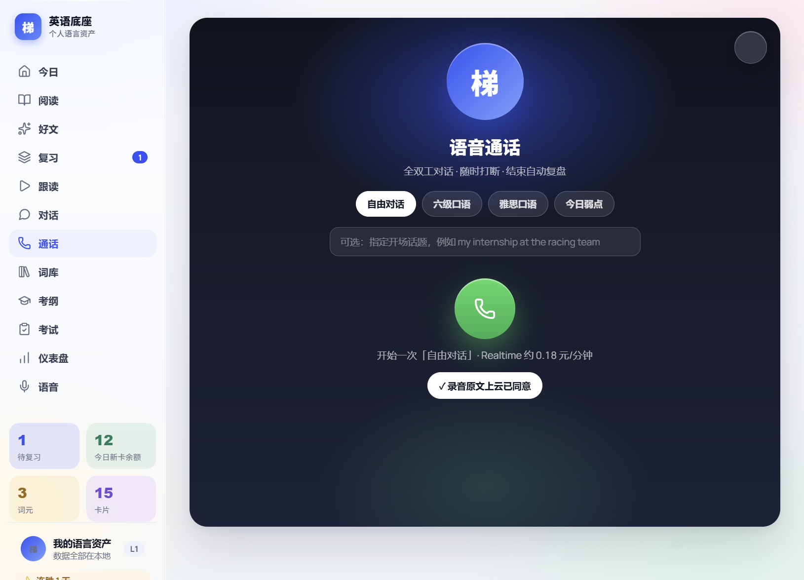
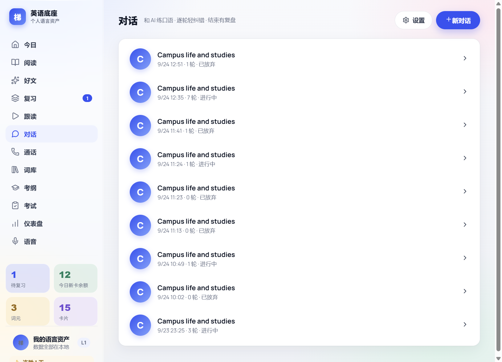
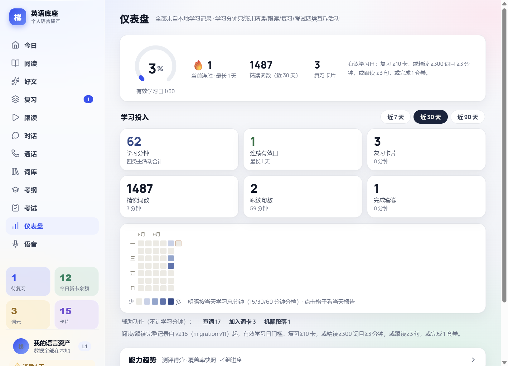
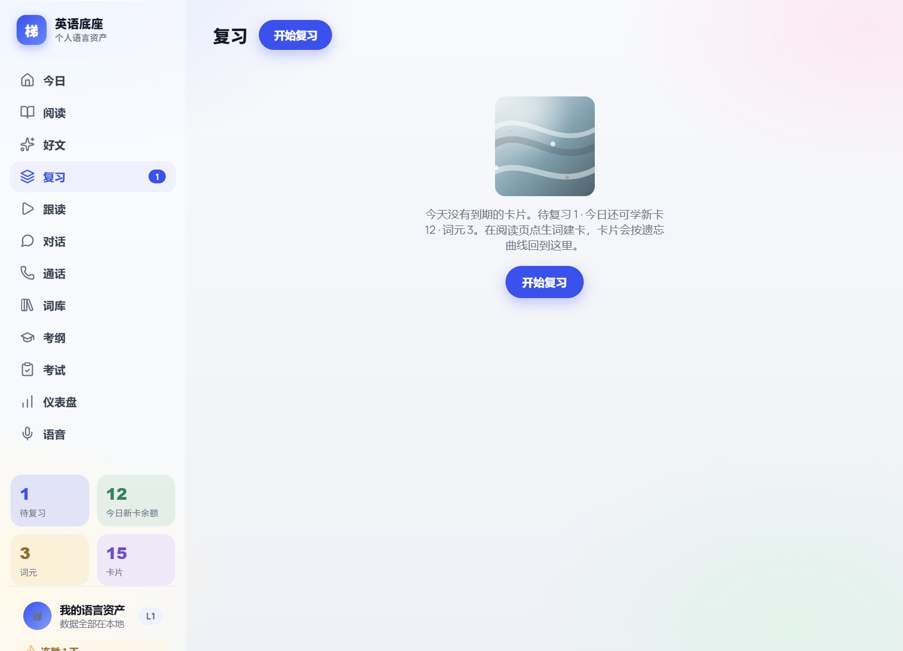
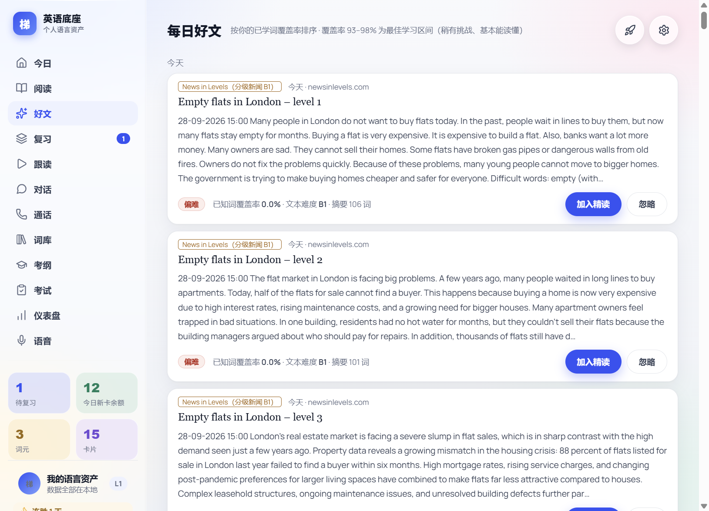
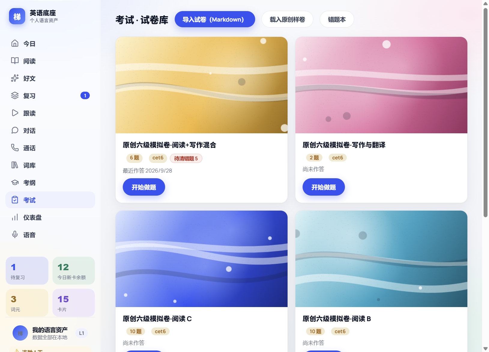
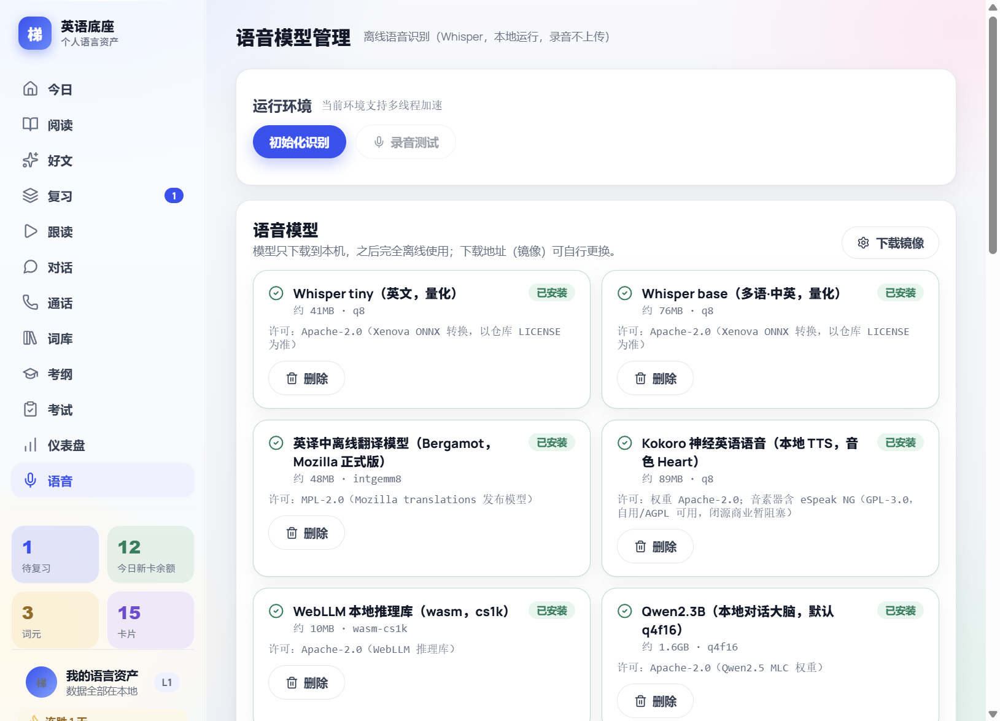

# 个人英语能力底座 (English Base)

> 本地优先的个人英语学习工具。读、练、说、测一体：精读挖矿建卡、FSRS 复习、离线跟读打分、GLM Realtime 全双工语音对话（可打断、中文兜底、结束复盘），全部数据留在本机。

<p align="center">
  
</p>

## 这是什么

一个跑在桌面端的**个人英语能力底座**：把「读文章 → 查词 → 建卡 → 复习 → 口语输出」串成一条闭环，所有学习记录、词典、语音模型都在本机，不依赖账号体系。

| | |
|---|---|
| **精读挖矿** | 导入 txt/md/epub/pdf/docx/网页，点词即查即建卡（认读/挖空/回忆/听音/拼写五卡） |
| **FSRS 复习** | 遗忘曲线调度，弱项资产（词/词块/语法/发音）跨模块调度优先级 |
| **语音通话** | GLM Realtime 全双工口语对话：随时打断、中文兜底、逐轮纠错、结束自动复盘入复习 |
| **离线跟读** | 句子跟读 → 本地 Whisper 识别 → 三分打分（文本/完整度/流利度），录音不上传 |
| **每日好文** | RSS 抓取 + 按你的词汇覆盖率排序，一键加入精读 |
| **考试模式** | Markdown 导入试卷 → 答题 → 错题本 1/3/7 天重做 |
| **词库星云** | 中心词 + 同根/近义星点图谱，按考纲等级与遗忘着色 |
| **仪表盘** | 四类互斥学习分钟、热图、连续有效日、覆盖率快照 |

## 界面

<p align="center">
  
  
  
  
</p>

<details>
<summary>更多截图</summary>

<p align="center">
  
  
  
  
</p>

</details>

## 下载安装

到 [**Releases**](https://github.com/lhy-frighter/english-base/releases/tag/v1.0.0) 下载（Windows 10/11 x64）：

| 文件 | 说明 |
|---|---|
| `EnglishBase-Setup-1.0.0.exe` (225MB) | 安装版：双击安装，可选目录，免管理员 |
| `个人英语能力底座-1.0.0-win.zip` (400MB) | 便携版：解压即用，数据跟文件夹走 |

首跑内置 81MB 离线词典（ECDICT）与每日好文源；语音模型（Whisper / Kokoro TTS / Bergamot 机翻 / Qwen2.5 本地大脑）在「语音」页按需下载，下载后完全离线。

**云端功能（可选）**：语音通话与云端对话需要自备 [bigmodel](https://open.bigmodel.cn) API Key 并显式授权数据上传——不授权则对应功能不联网；本地路径（离线 ASR/TTS/机翻）永远可用。

## 隐私

- 学习记录、词典查询、跟读录音**只存本机**
- 三类云端数据（学习画像 / 历史对话文本 / 录音原文）各自独立开关，默认全关，可随时关闭
- API Key 经 Windows 密钥链加密存储，永不明文落盘、不下发给渲染层

## 技术栈

Electron 38 + React 19 + TypeScript · node:sqlite（零原生模块）· ts-fsrs · onnxruntime-web（Whisper/VAD/Smart Turn，纯 WASM）· Kokoro ONNX TTS · Bergamot WASM 机翻 · WebLLM（Qwen2.5 本地对话）· GLM Realtime（云端语音）· Vite

## 开发

```bash
cd app-electron
pnpm install          # 或 npm install
npm start             # 开发运行
npm run dist          # 构建渲染层
npm test              # 全量测试链（60 链）
npx electron-builder --win   # 打 Windows 安装包
```

要求：Node ≥ 22（node:sqlite）、pnpm ≥ 12（nodeLinker: hoisted 已配置在 pnpm-workspace.yaml）。

## 目录结构

```
├── app-electron/        # 主应用（主进程 *.cjs + src/ 渲染层 + dist/ 构建产物）
│   ├── DESIGN.md        # 视觉方向 v2（分区混合：业务区亮蓝 / 沉浸区词典纸）
│   ├── UI-BLUEPRINT.md  # 逐页 UI 执行规范
│   └── data/            # 运行时数据（词典/内置素材入库；个人数据不进 git）
├── docs/
│   ├── adr/             # 架构决策记录（运行时/语音栈/翻译引擎/TTS）
│   ├── 方案/            # 各版本功能方案与验证报告
│   ├── 产品方案/        # 产品定义 v0.1 → v1.6
│   ├── 验收/            # 实机闸门清单与手动测试
│   ├── 交接文档.md      # 全量开发日志（#1–#185，含每轮验证数据）
│   └── screenshots/     # 界面截图
├── design-skills/       # 设计方法论沉淀（ui-design-flow 流程 skill 副本）
├── research/            # 技术调研
├── browser-extension/   # 配套「一键收藏网页正文」浏览器扩展
├── V0验证工具包/        # 立项期标注预演与验证资产
└── 论文库 试卷库-* 外网文章 test-files/   # 学习语料
```

## 文档导航

- [交接文档](docs/交接文档.md) — 全量开发日志，每轮含验证数据（最新：#180–#185 UI v2 + 打包分发）
- [DESIGN.md](app-electron/DESIGN.md) — 视觉方向 v2「分区混合」+ [UI-BLUEPRINT.md](app-electron/UI-BLUEPRINT.md) 逐页规范
- [ADR 目录](docs/adr/) — 运行时切换 Electron / 语音栈 Electron 化 / 离线翻译选型 / 本地 TTS 选型
- [ui-design-flow](design-skills/ui-design-flow-SKILL.md) — 本项目 UI 设计流程沉淀的 skill

## 已知边界

- 仅 Windows x64 打包（macOS/Linux 理论可跑未验证）
- 语音通话与云端对话消耗 bigmodel 额度（通话约 0.18 元/分钟）
- 首次使用需在「对话」页云端设置保存 API Key，并在「语音」页下载所需模型（全部离线可用后不再联网）
