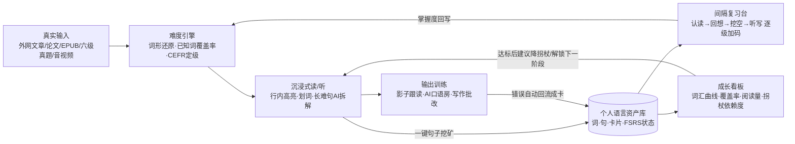
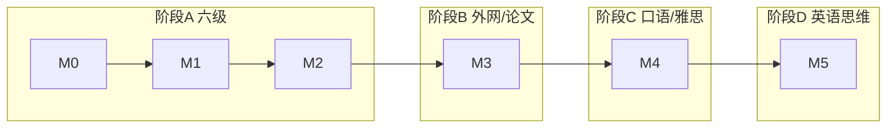
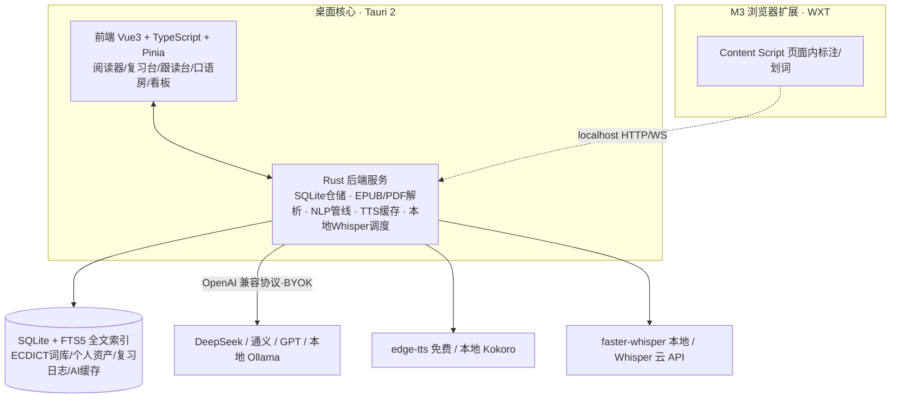
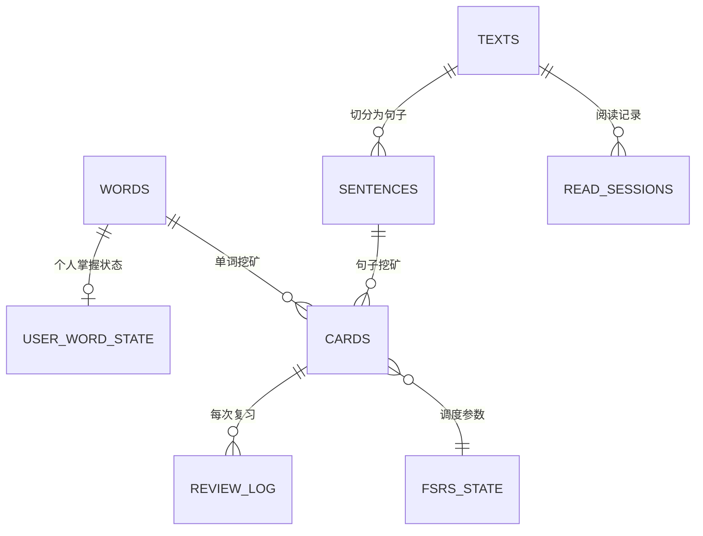

# 个人英语能力进阶系统 · 项目方案（v0.1 草案）

> 目标：做一个**本地优先、阶段解锁**的个人英语学习产品，把「六级备考 → 脱离翻译读外网/论文 → 口语交流/雅思 → 英语思维」串成一条持续上升的路径，而不是一堆互不连通的工具。
>
> 文档定位：供评审决策 + 后续 Vibe Coding 的开发蓝图。看完后需要你拍板的决策点集中在第 14 节。

---

## 0. 一页速览（TL;DR）

- **核心判断**：GitHub 上不缺单点工具（阅读器、背单词、字幕挖矿、AI 口语都有成熟开源项目），缺的是**一个统一的"个人语言资产库"把输入、复习、输出全部打通，并按你的四阶段目标逐步撤掉中文拐杖**。本产品的差异化就在这里，而不是再抄一个阅读器。
- **产品形态**：本地优先桌面应用（Tauri 2 + Vue 3 + Rust + SQLite），二期加一个浏览器扩展做外网页面原位标注；LLM/TTS/STT 全部 BYOK（自带 Key）或本地模型，数据不出本机。
- **技术底座全部有成熟开源件**：ECDICT（77 万词条、自带四六级/雅思标签和词形还原表）、ts-fsrs（新一代间隔重复算法，比 Anki 老算法少 20~30% 复习量）、edge-tts（免费神经网络朗读）、faster-whisper（本地语音识别）。
- **开发节奏**：6 个里程碑，M0~M2（约 2.5 个月）先做出能直接服务六级备考的最小闭环；之后每阶段对应你的一个真实能力目标，**不为用不到的功能提前买单**。
- **第一性原理**：语言能力 = 在**略高于当前水平**的真实材料中反复遇到 + 低成本捕获 + 科学间隔复现 + 被迫输出。产品只做一件事：把这条循环的摩擦降到最低，并让"拐杖"随能力增长自动消失。

---

## 1. 需求拆解：你的四级目标阶梯

| 阶段 | 目标 | 能力验收标志（可量化） | 词汇量参照（词族） | 对应产品模块 |
|---|---|---|---|---|
| **A 现在** | 通过/刷高六级 | 六级真题阅读生词率 <3%，听力能抓主干，考纲词掌握率 ≥90% | 约 B1+→B2 | 考纲词库、真题精读、SRS、听力 |
| **B 下一步** | 不依赖翻译器读外网、读英文论文 | 外刊/论文已知词覆盖率 ≥95%，每百词查词 ≤2 次，阅读速度 ≥150 wpm | B2 → C1（约 4k~8k） | 浏览器扩展、PDF/论文模式、学术词表（AWL） |
| **C 再进一步** | 能交流 + 雅思 | 能就熟悉话题连续说 2 分钟；AI 模考稳定在目标 band；写作能自查搭配/语法 | C1 | 影子跟读、AI 口语房、雅思模考、写作批改 |
| **D 终极** | 用英语思维理解 | 读听不再脑内翻译；查词默认英英；能直接用英语复述/释义（paraprase） | C1+ | 单语模式、拐杖消退引擎、复述训练 |

关键设计含义：

1. **四个阶段不是四个 App，而是同一套数据在不同"模式"下的呈现**——阶段 A 存下的词，到阶段 B 读论文时继续复用并决定页面上哪些词高亮。
2. 阶段 D 不是新功能堆出来的，而是**前面积累 + 系统逐步关闭中文支持**的结果，所以"拐杖消退"必须从第一天就埋进数据模型（见 2.5）。

---

## 2. 学习科学依据（产品设计五原则）

### 2.1 可理解输入 i+1 与词汇覆盖率

- Krashen 的可理解输入假说：语言来自**略高于当前水平（i+1）**的真实材料，过难（查词崩溃）和过易（没有新词）都低效。
- 二语词汇研究的经验门槛：文本中**已知词覆盖 95%** 才能基本读懂、**98%** 才能享受式泛读。
- **产品落点**：每篇材料导入时先跑"难度引擎"——分词、词形还原、对照你的个人词库算出**已知词覆盖率**和 CEFR 预估等级，按 i+1 推荐材料；阅读时只高亮你"该学但还不会"的词，而不是满屏生词。

### 2.2 间隔重复：直接用 FSRS，不用 Anki 老算法

- Anki 传统 SM-2 算法（1987）每张卡只有一个"难度系数"，存在 ease hell（系数越调越低、复习堆积）等已知缺陷。
- FSRS（2022 年起开源）用 D/S/R 三参数记忆模型（难度 Difficulty、稳定度 Stability、可提取率 Retrievability）拟合**你个人的**复习历史；基于 5 亿+ 条 Anki 复习记录的基准，同等记忆保持率下**少做 20~30% 的复习**，在超过 99% 的牌组上预测比 SM-2 准；Anki 自 23.10 版起已把 FSRS 设为默认。
- **产品落点**：直接集成 `ts-fsrs`（JS/TS 实现，拾语等项目已验证），卡片到期日、稳定度、难度全部本地计算，不依赖任何服务。

### 2.3 Sentence Mining（句子挖矿）

- 孤立背单词效率低，**在真实语境中捕获"生词 + 原句 + 出处"**做成卡片（Anki 生态和 VocabSieve、Lute、Lector 全部采用此模式）。
- **产品落点**：阅读/视听中一键把生词或整句存入资产库，卡片自动带：原句、句子中其他词的释义跳转、来源文章位置（可跳回原文语境）、TTS 发音。后续复习卡片由真实句子生成，而不是手动抄单词。

### 2.4 可理解输出 + 影子跟读

- Swain 可理解输出假说：只输入不够，**被迫产出**（说、写）才能暴露中介语缺口。
- 影子跟读（Shadowing）：滞后原声 0.3~0.5 秒几乎同步复述，大脑来不及做中译英，直接建立"声音→意义"回路，是通向"英语思维"最被验证的训练法之一；成熟方案是每天 15~20 分钟、1~2 分钟片段、同段重复 5~10 遍并录音对比。
- **产品落点**：逐句循环播放器（AB 复读、延迟跟读、录音波形对比、Whisper 转写差异标注）；AI 口语房负责自由输出和雅思结构化输出。

### 2.5 拐杖消退（本产品最核心的差异化设计）

从"靠中文"到"英语思维"是一个**支持等级逐级下调**的过程，产品提供全局可切换、且系统建议自动下调的 4 档拐杖：

| 拐杖等级 | 查词显示 | 翻译 | 适用阶段 |
|---|---|---|---|
| L1 全支撑 | 中文释义为主 + 音标 + 例句翻译 | 整句/整段 AI 翻译随手可得 | A 六级 |
| L2 弱支撑 | 先英文释义，中文折叠需点击 | 每段最多一次机翻 | B 早期 |
| L3 英英模式 | 仅英英释义 + 同义词/搭配 | 无整段翻译，只解释句子结构 | B 后期 / C |
| L4 推断模式 | 不直接给释义，给词根/上下文线索/例句，逼你先猜 | 无 | D |

同时记录**拐杖依赖度指标**（每百词查中文次数、机翻调用次数），它应随时间单调下降——这是"英语思维"唯一可量化的代理指标。

---

## 3. GitHub 现有项目调研

### 3.1 项目地图（按学习环节分类）

| 类别 | 代表项目 | 形态/技术栈 | 值得借鉴 | 局限（为什么不能直接用它） |
|---|---|---|---|---|
| **精读桌面端** | **拾语 Shiyu** | Tauri 2 + Vue3 + Rust + SQLite；ts-fsrs；DeepSeek/OpenAI 兼容流式；EPUB/OCR/思维导图；edge-tts | 与本产品架构最接近的"参考实现"：本地库、AI 划词、句子成分彩色标注、FSRS、EPUB 导入、TTS 三级缓存，全部已跑通 | 只有阅读+复习，无考试体系、无外网扩展、无口语听力、无拐杖消退 |
| **学术文献阅读** | **IntelliRead** | Rust/Axum + React/Vite | 定位英文论文/技术文档，高亮/笔记/标签沉淀为学习资产的思路 | Web 服务化部署偏重，功能仍在早期 |
| **网页原位标注** | **WordWise / VocabMeld** | Chrome 扩展（content script + pdf.js offscreen 抽取） | 任意网页自动识别生词并行内标注中文，把日常浏览变被动学习；PDF.js 抽取方案可复用 | 只有"标注"一层，复习/资产库薄弱 |
| **泛读器（LingQ 系）** | **Lector / Lute / LWT / LinguaCafe** | 自托管 Web（Docker + SQLite/MySQL），点词查义→存词→复习→导 Anki | "导入文本→点词→存卡→复习"经典闭环；本地词典免 API Key；Lector 支持本地大模型 | 部署运维重，UI/工作流为西语/日语等多语设计，对中国学生考试/论文场景不贴合 |
| **句子挖矿** | **VocabSieve** | Python 桌面端，Anki 伴侣 | 从视频/文本/EPUB/字幕低摩擦造卡并双向同步 Anki 的完整工作流 | 定位是 Anki 附属品，自身无学习闭环 |
| **字幕/视频沉浸** | **asbplayer** | 浏览器播放器 + Chrome 扩展 | 字幕逐句导航、流式字幕、多媒体卡片，是后期听力/视频模式的范本 | 只解决视频字幕 |
| **全能课程平台** | **FreeLingo** | FastAPI + Next.js16 + PostgreSQL + Redis + Docker；Ollama/Kokoro/faster-whisper | CEFR A1-C2 课程树、定级测试→周计划、LLM 生成阅读/听力题、AI tutor 记忆（tool calling）、WebSocket 实时语音对话、XP/能力值/通关测 | 面向多用户 SaaS，Postgres+Redis+Docker 对单人本地产品过重；课程是"生成式教学"，不是"真实材料沉浸"，路线不同 |
| **AI 口语/雅思** | **kerokero** | 本地脚本：IELTS Part2 题卡→60s 准备→录音→Whisper 转写→AI 打分（band + 改进）→存档 | **雅思口语模考闭环的最小可行形态**，流程可以直接照搬 | 单机脚本，无产品化、无长期数据 |
| **发音评测** | **Speaklify** | Whisper + MFA 强制对齐 + 多模型集成，按 CEFR 六维打分 | 发音/语法/流利度多维评分思路 | 工程重（MFA 对齐），后期再考虑 |
| **AI 陪聊** | ChatterPal / BabelDuck / mcp-server-pronunciation | LLM + 语音输入输出 | 低心理负担开口、流式对话、本地私有化 | 单点工具，无材料/词库联动 |
| **词库/分级数据** | **ECDICT、vocab-analyzer** | 开源词典数据（CSV/SQLite） | 见第 8 节，是整个难度引擎的地基 | 只是数据，不是产品 |

### 3.2 五种典型架构模式（调研结论）

1. **本地桌面单体**（拾语/OpenKoto/VocabSieve）：Tauri/Electron + 嵌入式 SQLite，数据全本地、隐私好、零部署——**单人自用产品的最优解**。
2. **自托管 Web 单体**（Lector/Lute/LWT）：Docker 一把梭，跨设备方便但有运维负担。
3. **浏览器扩展 + 本地端口**（asbplayer/WordWise + AnkiConnect 模式）：扩展负责页面内交互，通过 localhost HTTP 与本地核心通信——**外网阅读的标准答案**，无需上架商店也能自用。
4. **多租户 SaaS 平台**（FreeLingo）：前后端分离 + PG/Redis，适合做产品给别人用，对个人学习是过度设计。
5. **本地 AI 管线**（Whisper/Kokoro/Ollama）：TTS/STT/LLM 全部可离线，云端 API 只是可选项——成本与隐私都可控。

### 3.3 对本项目的结论

- **架构抄模式 1 + 模式 3**：桌面核心（拾语已验证 Tauri+Vue+Rust+SQLite+ts-fsrs 路线）+ 二期浏览器扩展走 localhost 通信。
- **学习闭环抄 sentence-mining 流派**（Lector/Lute/VocabSieve 验证了十年）。
- **口语模考抄 kerokero 的流程**，课程化/多用户那套 FreeLingo 模式**不抄**。
- 不重造 Anki：卡片格式与 Anki 兼容、可导出，但内置复习器用 FSRS。

---

## 4. 产品定位与差异化

**一句话定位**：面向你个人的"英语能力成长操作系统"——真实材料输入为中心，个人语言资产库为内核，FSRS 为记忆引擎，拐杖随阶段自动消退。

与现有工具的差异：

| 维度 | 现有开源工具的普遍做法 | 本产品 |
|---|---|---|
| 数据 | 阅读器、背单词、口语各管一段，数据不通 | **统一语言资产库**：词/句/文/音/复习状态一处存储，处处复用 |
| 选材 | 材料难度靠感觉 | 导入即定级（覆盖率+CEFR），按 i+1 推荐 |
| 路径 | 功能平铺，学什么全靠自觉 | **阶段解锁**：功能与你的考试/学术/雅思目标绑定，带通关标准 |
| 中文依赖 | 要么全中文释义、要么纯原文 | **4 档拐杖 + 依赖度量化**，系统性逼近英语思维 |
| 部署 | SaaS 订阅或自托管折腾 | 本地优先、BYOK、离线可用 |

---

## 5. 核心学习闭环（每天怎么用）



每日理想耗时 30~45 分钟：15 分钟读/听真实材料（挖矿）+ 10 分钟清 FSRS 到期卡 + 10~15 分钟跟读/口语。产品用"到期卡数量 + 一个连续记录"维持节奏，不做重型游戏化。

---

## 6. 功能模块设计

### M1 语言资产内核（一切的地基）
- 本地 SQLite：词库（ECDICT 导入）、个人词状态、文本、句子、卡片、复习日志、AI 缓存。
- 词形还原：gave→give、studies→study，基于 ECDICT 的 lemma/exchange 数据（BNC 亿词级语料生成，准确率 95%+，优于规则词干提取的约 70%）。
- 卡片类型：单词卡、句子卡、挖空卡（cloze）、听写卡，同一张卡在不同掌握度自动升级考法。

### M2 阅读器与难度引擎
- 导入：粘贴文本/URL、TXT/Markdown、EPUB（按章节）、二期 PDF（pdf.js，论文模式）。
- 难度引擎输出：总词数、形符/类符、生词清单、**已知词覆盖率**、CEFR 预估、Flesch 易读度参考、i+1 匹配度评分。
- 阅读视图：按个人词状态三色高亮（已掌握/学习中/生词）；划词弹窗（音标、按当前拐杖等级显示释义、TTS、词根、加入资产库）；长难句 AI 成分标注（流式、结果缓存以省 token）。

### M3 SRS 复习台
- ts-fsrs 调度，4 级评分（忘记/困难/良好/容易）+ 全键盘操作。
- 复习方式递进：看词回想 → 看句填词（cloze）→ 听发音拼写（听写）→ 主动产出（用该词造句，AI 判对错）。
- 到期预测曲线、今日队列、漏卡补救。

### M4 六级备考模块（阶段 A）
- ECDICT 自带 `cet4/cet6/ielts/toefl/gre` 考纲标签，一键生成考纲词牌组，按考频排序。
- 真题模式：导入真题阅读 → 同阅读器闭环 → 错题/生词绑定题源；听力真题音频逐句精听。
- 考纲掌握度仪表盘：考纲词覆盖率、各题型训练量。

### M5 外网浏览器扩展（阶段 B，二期）
- WXT/Plasmo 框架的 Chrome 扩展：页面内原位标注生词（复用核心的词状态），划词即存卡。
- 通过 localhost 端口与桌面核心同步（AnkiConnect 同款成熟模式），无需云账号。
- 阅读后自动汇总"本次浏览收获 X 词 Y 句"。

### M6 论文/学术模式（阶段 B）
- PDF 双栏阅读器：左原文右笔记；按论文结构（Abstract→Conclusion）导航。
- AWL 学术词表（analyze/contrast/evaluate/factor/indicate…）专项高亮与牌组；学术搭配（collocation）库。
- 段落级 AI 骨架梳理（论点/论据/转折），但默认不给全文翻译（贯彻拐杖原则）。

### M7 听力 & 影子跟读台（阶段 C）
- 导入音频/视频/字幕，逐句切分；AB 复读、无级调速、逐句隐藏/显示文本。
- 跟读流程内置：盲听→看文本→同步读→延迟 0.5s 影子跟读→录音对比→脱稿复述，每段记录完成度。
- Whisper 转写你的跟读，与原文做差异标注（漏词/错音/连读）。

### M8 AI 口语房 & 雅思模考（阶段 C）
- 两种模式：①自由对话（可选 CEFR 难度、话题，LLM 扮演对话者，TTS 出声、STT 识别你的回答）；②雅思模考（照搬 kerokero 流程：Part1/2/3 题卡 → 准备计时 → 录音 → 转写 → 按雅思四项评分标准（流利度/词汇/语法/发音）给 band 与改写建议，存档追踪曲线）。
- 错误点（语法错误、词伙误用）一键回流成复习卡。

### M9 写作批改（阶段 C）
- 提交作文 → LLM 按雅思写作四项标准评分 + 逐句批注 + 地道改写 + 搭配错误标注，错误同样入资产库。

### M10 成长看板 & 拐杖消退引擎（贯穿全程）
- 词汇：按 CEFR 频段/考纲统计已掌握词族增长曲线。
- 阅读：累计阅读量、平均覆盖率趋势、阅读速度（wpm）、**每百词查词次数（核心北极星指标）**。
- 复习：FSRS 保持率、到期负担预测。
- 输出：跟读完成时长、口语流利度（语速、停顿、AI band 趋势）。
- 阶段门：给出解锁下一阶段的明确条件（例：六级词掌握 ≥90% + 连续 4 周每周泛读 ≥3 篇且覆盖率 ≥95% → 建议进入 L2 拐杖并解锁论文模式）。

---

## 7. 阶段路线图（开发里程碑 × 你的能力目标）

| 里程碑 | 周期（业余估算） | 交付内容 | 服务于 | 完成定义（DoD） |
|---|---|---|---|---|
| **M0 地基** | 第 1~2 周 | Tauri+Vue 脚手架；SQLite schema 与迁移；ECDICT 导入；粘贴文本的最简阅读器 + 点词查义 | 开发本身 | 导入一篇文章，点任意变形词能查到原型释义 |
| **M1 阅读闭环** | 第 3~6 周 | 难度引擎、三色高亮、划词入库、ts-fsrs 复习台、文本库（txt/epub）、基础看板 | 阶段 A | 读文章→挖矿→次日复习到期卡，全链路跑通 |
| **M2 六级+AI** | 第 7~10 周 | 考纲牌组、真题导入、AI 长难句拆解/造卡（BYOK）、TTS、PDF 导入 | **阶段 A：六级** | 能完全用它替代"单词 App + 真题精读笔记" |
| **M3 外网+论文** | 第 3~4 月 | 浏览器扩展 + localhost 同步；PDF 论文模式、AWL 学术词表 | **阶段 B：脱翻译阅读** | 日常刷外网直接在页内挖矿；读得下完整一篇论文 |
| **M4 听口** | 第 5~6 月 | 跟读台、Whisper 接入、AI 口语房、雅思模考、写作批改 | **阶段 C：交流/雅思** | 每周 3 次跟读 + 2 次口语模考，band 趋势可查 |
| **M5 内化** | 第 7 月起 | L3/L4 拐杖、英英模式、复述训练、全链路打磨与数据导出 | **阶段 D：英语思维** | 查词依赖度曲线持续下降，能脱中文读完一本原版书 |



原则：**M2 做完之前不碰任何听口功能**，避免半成品堆积；每个里程碑结束都得到一个"每天愿意打开"的版本。

---

## 8. 技术架构

### 8.1 架构图



### 8.2 技术选型表（含选型理由与备选）

| 层 | 推荐选型 | 理由 | 备选/备注 |
|---|---|---|---|
| 桌面壳 | **Tauri 2** | 拾语已验证同栈；安装包小、Rust 侧适合本地重活；系统 WebView 免打包 Chromium | Electron（若你更熟 Node 生态） |
| 前端 | **Vue 3 + TS + Vite + Pinia** | 拾语同款，资料多；个人开发响应式上手快 | React 亦可，组件生态更大，看你熟哪个 |
| 本地库 | **SQLite（rusqlite）+ FTS5** | 单文件、零运维、全文检索满足"搜遍所有生词/原句" | 不引入 Postgres/Redis（单人场景是负担） |
| SRS | **ts-fsrs** | FSRS 现代算法，纯 TS、有 Rust 版 | 绝不自己手写调度算法 |
| 词典数据 | **ECDICT**（MIT 开源） | 77 万+词条；音标/英释/中译/词频/BNC+COCA 词频；**自带 cet4/cet6/ielts/toefl/gre 标签**；附 lemma.en.txt 词形还原表（84,487 词组） | 英英释义可再补 WordNet/Wiktionary |
| 英文 NLP | 分词用 compromise/wink-nlp（JS）或 Rust 侧做；词形还原优先查 ECDICT 数据表 | 数据驱动还原准确率 > 规则词干算法 | spaCy 放 Python sidecar 仅在后期需要句法树时 |
| 难度分级 | 自算覆盖率 + CEFR 词表标签 + Flesch-Kincaid 易读度 | 三种信号融合，比单一公式靠谱 | 参考 vocab-analyzer 的 7 级 CEFR 分类实现 |
| LLM | **BYOK，OpenAI 兼容协议**；国内默认 DeepSeek（便宜），支持 Ollama 本地 | 一套接口多家切换；AI 结果全部哈希缓存，重复请求零成本 | 结构化 JSON 输出用于造卡/评分 |
| TTS | edge-tts（免费神经网络音色，三级缓存） | 零成本、音质够学习用 | 离线场景换 Kokoro（本地） |
| STT | faster-whisper（本地，CTranslate2 提速）或 Whisper API | 跟读对比、口语转写；CPU 可用 small.en，有显卡上 large-v3-turbo | M4 才需要，不提前引入 |
| 浏览器扩展 | **WXT**（现代扩展框架，一套代码多浏览器） | 内容脚本注入 + localhost 通信 | Plasmo |
| 文档解析 | epub-rs / pdf.js（PDF 走前端 pdf.js 或 pdfium） | 拾语已验证 epub+html2md 链路 | OCR（PP-StructureV3）仅在需要截图书页时 |
| 数据互通 | JSON 全量导入导出；可选 AnkiConnect 导出 | 不被自己产品锁死 | — |

**为什么不上 FreeLingo 那种前后端分离 + Docker 架构**：它是多用户 SaaS，个人学习用 Postgres/Redis/容器纯属自找麻烦；本地单体迭代速度快一个数量级，等真要给别人用再拆服务不迟。

---

## 9. 数据模型设计（SQLite 核心表）



核心表字段（草案）：

- `words`：lemma（主键）、pos、phonetic、en_def、zh_def、cefr、tags（cet6/ielts/awl…）、bnc_freq、coca_freq、exchange
- `user_word_state`：lemma、status（new/learning/known/mastered）、encounter_count、first_seen_at、last_seen_text_id
- `texts`：id、source_type（url/epub/pdf/paste/exam）、title、author、url、raw_path、cefr_est、coverage、word_count、imported_at
- `sentences`：id、text_id、idx、original、zh_translation（可空）、audio_path、parse_json（AI 句法标注缓存）
- `cards`：id、card_type（word/cloze/dictation/sentence/production）、ref_lemma、ref_sentence_id、front、back、source_text_id
- `fsrs_state`：card_id、due、stability、difficulty、elapsed_days、scheduled_days、reps、lapses、last_review_at
- `review_log`：id、card_id、rating、elapsed_ms、reviewed_at（FSRS 参数优化与个人记忆分析的原始数据）
- `speaking_sessions / shadowing_sessions / writing_sessions`：题目、音频/文本路径、转写、AI 评分 JSON、created_at
- `ai_cache`：prompt_hash、model、response、created_at（省钱关键）
- `settings`：support_level（L1~L4）、llm 配置、每日复习目标等

设计要点：**所有掌握度判断都走 user_word_state 一张表**，阅读高亮、难度定级、牌组生成、看板全部读它，保证全产品口径一致。

---

## 10. 关键技术难点与解法

| 难点 | 解法 |
|---|---|
| 变形词查不到（gave/went/studies） | 不依赖规则词干器，优先查 ECDICT lemma/exchange 表；未命中再回退 lemmatizer；导入时离线批量预处理 |
| 覆盖率/定级不准 | 三信号融合（个人词状态 + ECDICT 的 CEFR/考纲标签 + 传统易读度公式），并允许用户手动改文章等级作为校准样本 |
| LLM 调用贵、慢、不稳定 | 能本地查的绝不调 LLM（词典/词形/复习调度全离线）；AI 只做句法拆解、自由评分这类真需要的事；结果哈希缓存；流式输出；多供应商一键切换 + Ollama 兜底 |
| 扩展与桌面端通信 | 本地 HTTP/WS 服务（127.0.0.1），token 校验防本机其他页面滥用，AnkiConnect 已验证十年 |
| PDF 论文排版复杂 | pdf.js 抽取文本流 + 双栏视图；扫描版后期再上 OCR，不进首版 |
| 发音评分工程过重 | 首版只做"Whisper 转写 vs 原文差异 + LLM 印象分"，MFA 音素强制对齐放到很后期或不做 |
| 坚持不下去 | 每日闭环压到 30 分钟内；到期卡量可见可控；连续记录与阶段门给正反馈；但不做复杂积分商城 |

---

## 11. 建议的工程目录结构

```
english-os/
├── src/                      # Vue3 前端
│   ├── views/                # 阅读器/复习台/词库/跟读/口语/看板/设置
│   ├── components/
│   ├── stores/               # Pinia
│   ├── services/             # llm / tts / srs / nlp 的前端封装
│   └── utils/
├── src-tauri/src/
│   ├── commands/             # Tauri command（给前端调用）
│   ├── repositories/         # 数据访问层
│   ├── nlp/                  # 分词、词形还原、覆盖率/定级
│   ├── importers/            # txt/epub/pdf/url
│   ├── ai/                   # LLM 客户端、prompt、缓存
│   ├── media/                # tts / whisper 调度
│   ├── models.rs / db.rs / migrations/
├── data/
│   └── ecdict/               # ECDICT 词典数据与导入脚本
├── extension/                # M3 浏览器扩展（WXT）
└── docs/
```

---

## 12. 验收指标体系（怎么证明你真的在进步）

| 维度 | 指标 | 数据来源 |
|---|---|---|
| 词汇 | 已掌握词族数（按 CEFR 频段/考纲分桶）、考纲覆盖率 | user_word_state |
| 阅读 | 已知词覆盖率趋势、每百词查词次数（↓）、wpm（↑）、累计阅读篇数/词数 | read_sessions |
| 记忆 | FSRS 目标保持率（默认 90%）达成度、日均到期卡量 | review_log |
| 听力口语 | 跟读完成时长、转写准确率、AI 雅思 band 趋势、平均语速与停顿次数 | shadowing/speaking_sessions |
| 写作 | 历次作文分数、错误类型分布与复发率 | writing_sessions |
| **英语思维（北极星）** | **拐杖依赖度**：中文释义展开率、机翻调用次数，按周统计应单调下降 | 全局埋点 |

阶段门示例（写入产品，达标才提示解锁）：

- A→B：六级词掌握 ≥90%；近 4 周泛读 12 篇且平均覆盖率 ≥95%。
- B→C：能以 ≤2 次查词/百词读完论文；wpm ≥150；拐杖稳定在 L2 及以下。
- C→D：连续 4 周 L3 模式阅读；口语可脱稿复述 2 分钟材料主旨；近 8 周机翻调用趋近于 0。

---

## 13. 风险与对策

| 风险 | 对策 |
|---|---|
| 范围蔓延，做成第二个"什么都有但都半成品"的 FreeLingo | 严格按里程碑，M2 前不碰听口；每阶段必须先达到 DoD |
| 单人开发周期估计乐观 | M0/M1 刻意做小，2~6 周内拿到正反馈；UI 用成熟组件库（如 shadcn 对应生态/Naive UI）不手搓 |
| 过度依赖 AI 反而削弱"脱翻译"目标 | AI 功能全部受拐杖等级约束，L3/L4 下自动关闭整段翻译 |
| LLM 供应商变动/涨价 | OpenAI 兼容协议抽象一层，DeepSeek/通义/Ollama 可换；核心能力不依赖在线 |
| 数据丢失（几年的学习资产） | SQLite 单文件自动备份 + 版本化 JSON 导出；数据格式自描述、可脱离本软件读取 |
| 开源协议合规 | ECDICT、ts-fsrs 等均为宽松开源协议（MIT），保留 LICENSE；如参考拾语代码需遵守其 MIT |

---

## 14. MVP 定义与待你拍板的决策点

**MVP（M0+M1，约 6 周）只做一件事**：把文章喂进去 → 自动定级高亮 → 划词挖矿 → FSRS 复习，形成每日闭环。它做完，六级阅读精读就已经可以跑起来。

需要你确认的 4 个决策：

1. **前端栈**：推荐 Vue 3（有拾语这个同栈参考实现，抄作业最快）；若你更熟 React 也可以，生态更大但需要自己翻译参考实现。
2. **LLM 选择**：是否有 DeepSeek/OpenAI/通义的 Key？还是希望首版完全离线（AI 句法拆解功能后置，改用本地 Ollama）？
3. **材料来源**：六级真题材料你手头是什么格式（PDF/纸质拍照/网页）？这决定 M2 导入器优先级。
4. **开发方式**：确认方案后，我可以直接在本目录初始化 M0 工程骨架（Tauri+Vue+SQLite+ECDICT 导入脚本），还是你想先只做一个纯 Web 原型（浏览器里跑、不装 Rust 工具链，最快看到界面）？

---

## 15. 参考资料（调研来源）

**精读/泛读/挖矿类**
- 拾语 Shiyu（Tauri2+Vue3+Rust，FSRS/EPUB/AI 划词）：https://github.com/amluckydave/shiyu
- IntelliRead（Rust/Axum+React，外语文献阅读）：https://github.com/huishingcheung/IntelliRead
- WordWise（网页生词行内标注扩展）：https://github.com/breeze-r/wordwise
- VocabMeld（沉浸式语言学习扩展）：https://github.com/Youkies/VocabMeld
- Lector（自托管 LingQ 替代，SQLite/Anki 双向）：https://github.com/heuwels/lector
- LWT（经典自托管阅读学习）：https://github.com/HugoFara/lwt
- VocabSieve（句子挖矿→Anki）：https://github.com/FreeLanguageTools/vocabsieve
- asbplayer（字幕沉浸式学习）：https://github.com/asbplayer/asbplayer
- Awesome Language Learning（工具全景清单）：https://github.com/Vuizur/awesome-language-learning

**全能平台 / 口语类**
- FreeLingo（CEFR 课程+AI tutor+实时语音，FastAPI+Next.js）：https://github.com/artcc/freelingo
- kerokero（雅思 Part2 模考闭环）：https://github.com/DELAxGithub/kerokero
- Speaklify（Whisper+MFA，CEFR 六维口语评分）：https://github.com/batinium/Speaklify

**记忆算法**
- Anki 官方 FAQ：SM-2 与 FSRS：https://faqs.ankiweb.net/what-spaced-repetition-algorithm
- FSRS-5 算法说明（DSR 模型）：https://www.diane.app/en/outils/fsrs
- FSRS vs SM-2 对比与基准：https://deepwiki.com/open-spaced-repetition/fsrs-optimizer/7.3-comparison-with-sm-2

**词库与分级数据**
- ECDICT（开源英汉词典、考纲标签、lemma 还原表）：https://github.com/skywind3000/ECDICT
- vocab-analyzer（CEFR 7 级词汇分析）：https://github.com/ttieli/vocab-analyzer

**学习路径与方法**
- CEFR 词汇量参照（B1/B2/C1 词族数）：https://www.engquiz.pro/blog/cefr/b1-to-b2-roadmap
- 六级真题词频/考纲词统计：https://english-exam.lazynote.cn/exam-words/
- 影子跟读完整方法：https://shadowingenglish.com/shadowing-technique-guide
