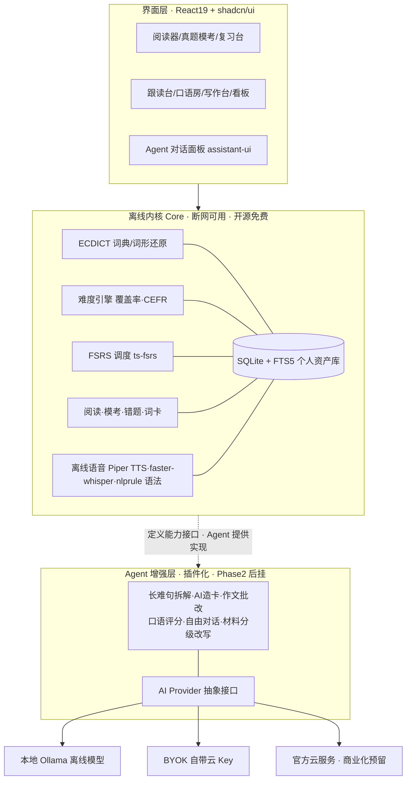
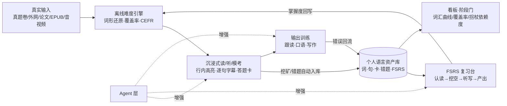
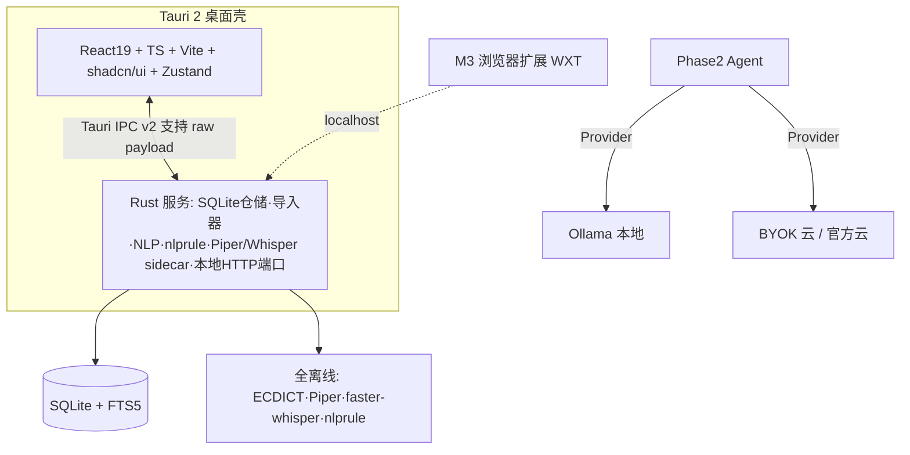
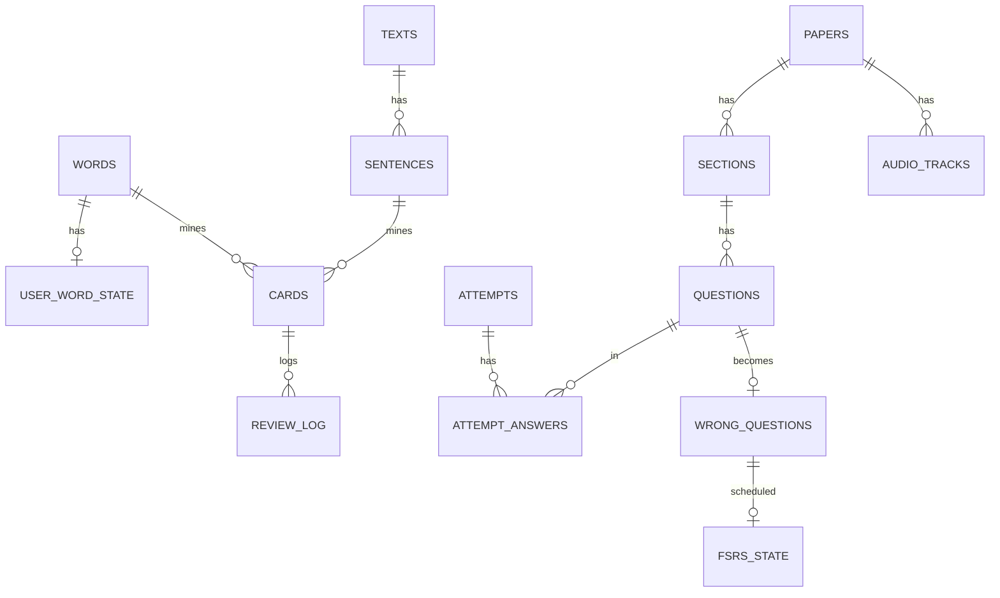

# 个人英语能力进阶系统 · 项目方案（v0.2）

> **v0.2 相对 v0.1 的变更**
> 1. 确立 **「离线内核（Core）+ 可插拔 Agent 层」双层架构**：第一期全部功能离线可用、不依赖任何 Key；Agent 能力作为后挂插件，成为差异化与商业化护城河。
> 2. **前端选型给出结论**：React 19 + TypeScript + shadcn/ui（附与 Vue/Svelte 的对比依据）。
> 3. 新增 **真题与内容资源策略**：你手上没有真题，方案给出离线题库获取、统一试卷 Schema 与导入器设计（拆解了 ExamCrafts 的考试交互）。
> 4. 新增 **商业化与开源合规**章节（open-core 模式、收费点、版权边界）。
> 5. 路线图重排为「Phase 1 全离线 → Phase 2 Agent」两大期。

---

## 0. 一页速览（TL;DR）

- **产品**：本地优先的个人英语成长系统，一条链路走完「六级 → 脱翻译读外网/论文 → 口语/雅思 → 英语思维」。
- **架构主张（本版核心）**：
  - **离线内核 Core**：词典、词形还原、难度定级、FSRS 记忆调度、阅读/真题模考/错题本/复习、离线语音（Piper 本地 TTS、faster-whisper 本地识别）——**断网 100% 可用，数据不出本机**。
  - **Agent 增强层**：长难句拆解、作文/翻译批改、口语评分、自由对话、材料分级改写等 LLM 能力，通过统一 Provider 接口后挂，支持「本地 Ollama / 自带云 Key（BYOK）/ 未来官方云」三种实现。
- **为什么这样分层就是护城河**：市面产品（含 ExamCrafts）都是联网 SaaS、只做考试一段；本产品靠①离线隐私、②跨阶段一条链路、③**越用越厚的个人掌握度数据**形成迁移成本，Agent 再基于这份私有数据做别人做不到的个性化。商业化走 open-core：内核免费获客，官方云 Agent/同步/资源包订阅收费。
- **前端结论**：React 19 + TS + Vite + Tailwind v4 + shadcn/ui + Zustand（2026 年 Tauri 事实标准栈，最适合 AI 辅助编程，后期 Agent 对话界面有 assistant-ui 可直接用）。
- **真题不愁**：用开源的四六级真题 Markdown/JSON + 听力字幕做本地导入；产品只定义格式与导入器、不内置版权内容（商业化合规）。
- **节奏**：Phase 1（约 6 个月，里程碑 M0–M4）交付全离线产品，M2 结束即可完整服务六级；Phase 2 才加 Agent。

---

## 1. 目标阶梯（产品的主线不变）

| 阶段 | 目标 | 可量化验收标志 | CEFR/词汇参照 | 产品模块 |
|---|---|---|---|---|
| A 现在 | 六级 | 考纲词掌握 ≥90%，真题阅读生词率 <3%，整套模考流程闭环 | B1+→B2 | 考纲词库、真题模考、错题本、SRS、精听 |
| B | 脱翻译读外网/论文 | 已知词覆盖率 ≥95%，每百词查词 ≤2 次，≥150 wpm | B2→C1（4k~8k 词族） | 浏览器扩展、论文/PDF 模式、AWL 学术词 |
| C | 交流 + 雅思 | 连续说 2 分钟，AI 模考稳定在目标 band | C1 | 跟读、AI 口语房、雅思模考、写作批改 |
| D | 英语思维 | 读听不脑内翻译、默认英英释义、直接 paraphrase | C1+ | 单语模式、拐杖消退、复述训练 |

四个阶段共用**一份个人语言资产库**，阶段切换只是模式与"拐杖等级"变化，不换 App、不丢数据。

---

## 2. 学习科学五原则（设计依据，沿用）

1. **可理解输入 i+1**：材料导入即算"已知词覆盖率"（95% 基本读懂、98% 享受泛读），只高亮该学的词，按 i+1 推荐材料。
2. **间隔重复用 FSRS**：三参数记忆模型（D/S/R）拟合个人历史，同等保持率比 Anki 的 SM-2 少 20~30% 复习量，Anki 23.10 起已默认 FSRS；直接用 `ts-fsrs`，本地计算。
3. **Sentence Mining 句子挖矿**：生词连同原句、出处、发音一键成卡，拒绝孤立背词。
4. **可理解输出 + 影子跟读**：逐句复读、延迟 0.3~0.5s 跟读（大脑来不及翻译，直接建立英语回路）、录音对比；说/写输出暴露缺口。
5. **拐杖消退（差异化核心）**：全局 4 档支持等级 L1 中文为主 → L2 中文折叠 → L3 英英模式 → L4 推断模式；用"每百词查中文次数/机翻次数"作为**英语思维的量化代理指标**，要求单调下降。

---

## 3. 竞品与开源调研

### 3.1 GitHub 开源项目地图（结论沿用，精简版）

| 环节 | 代表项目 | 技术形态 | 借鉴点 |
|---|---|---|---|
| 精读桌面 | 拾语 Shiyu | Tauri2+Vue3+Rust+SQLite，ts-fsrs，EPUB/OCR/TTS | 最接近的参考实现：本地库、AI 划词、句子成分标注、FSRS、EPUB |
| 学术阅读 | IntelliRead | Rust/Axum+React | 论文场景的高亮/笔记资产化 |
| 网页标注 | WordWise/VocabMeld | Chrome 扩展+pdf.js | 任意网页行内标注生词 |
| 泛读器 | Lector/Lute/LWT | 自托管 Web，SQLite | 导入→点词→存卡→复习经典闭环 |
| 句子挖矿 | VocabSieve | Python+Anki | 低摩擦造卡工作流 |
| 字幕沉浸 | asbplayer | 浏览器+扩展 | 逐句字幕导航、多媒体卡 |
| 全能平台 | FreeLingo | FastAPI+Next.js+PG+Redis | CEFR 课程树/定级/AI tutor 流程参考；**多用户 SaaS 架构不抄（过重）** |
| 雅思口语 | kerokero | 题卡→录音→Whisper→AI 打 band | 雅思模考最小闭环 |
| 词库数据 | ECDICT | MIT 开源数据 | 77 万词条、考纲标签、lemma 还原表，是离线内核的地基 |

### 3.2 ExamCrafts 专题拆解（考试模块的直接参照）

ExamCrafts（examcrafts.com）是免费的**四六级在线模考网站**，导航为：首页 / 科目 / 错题本 / 生词本 / 笔记本 / 知识盆。其设计恰好验证并补全了我们的考试模块：

**值得直接吸收的交互设计**

1. **整卷模考**：按"2025 年 6 月真题第 1 套"组织；左侧做题区、**右侧固定答题卡**（听力 1–25、阅读 26–55、写作、翻译分段），顶部倒计时，实时显示得分进度（如 126/710）。
2. **听力字幕同步**：音频逐句播放、字幕实时跟随；可"隐藏原文 / 隐藏中文"；点任意词即查翻译并一键入生词本——**这正是拐杖 L1→L4 在考试场景的雏形**。
3. **做题→解析闭环**：提交后选项标红/标绿，给出"原文 + 翻译 + 解析"，答错自动进错题本，可加笔记。
4. **错题本**：左侧多维筛选（考试类型 CET4/6、题类 听力/阅读/词汇、掌握状态 未掌握/已掌握、排序 最近错题/最常错），显示总数与已掌握率；听力错题关联原音频，可重做并切换掌握状态。
5. **写作/翻译批改**：提交后给整体评价、参考范文/译文、逐句要点（这部分属 Agent 层，离线版只做答题与存档，评分后置）。
6. 响应式网页、免费、社区化运营（公众号 + 反馈邮箱）。

**它的短板 = 我们的机会**：纯联网、只有四六级考试这一段、无个人词汇掌握度沉淀、无外刊/论文/口语/雅思后续路径、无离线与隐私。

### 3.3 五种架构模式的取舍

本地桌面单体（采用）、浏览器扩展+本地端口（M3 采用）、自托管 Web（不采用）、多租户 SaaS（不采用）、本地 AI 管线（Agent 层采用 Ollama/Whisper）。**结论：桌面本地核心 + 扩展外延 + Agent 后挂，不做服务端重型架构。**

---

## 4. 双层架构：离线内核 + 可插拔 Agent 层（v0.2 核心）

### 4.1 架构图



### 4.2 能力边界：什么必须离线做、什么才需要 Agent

| 能力 | 离线内核实现（Phase 1） | Agent 增强（Phase 2） |
|---|---|---|
| 查词/词形还原 | ECDICT 数据表（95%+ 准确率） | — |
| 难度定级/覆盖率 | 个人词状态 + CEFR 标签 + Flesch 公式 | LLM 复评校准（可选） |
| 记忆复习 | ts-fsrs 纯算法 | — |
| 阅读高亮/挖矿 | 规则实现 | 长难句成分树、同义改写 |
| 真题客观题 | 自动判分、解析展示、错题归档 | 主观题（写作/翻译）评分 |
| 语法检查 | **nlprule（Rust，LanguageTool 规则，离线）** 查拼写/基础语法 | LLM 深度润色、词伙修正 |
| 听力/跟读 | 本地音频、字幕轴、录音、波形对比、**本地 Whisper 转写比对** | 发音/流利度综合打分 |
| 词卡 | 挖空/听写由模板生成 | AI 造句、语境化例句、近义辨析 |
| 材料获取 | 本地导入器（txt/md/epub/pdf/试卷包） | URL 抓取后 LLM 清洗/改写为 i+1 |
| 规划 | 规则化阶段门 | 个性化学习教练 Agent |

**设计纪律**：Core 对每类 AI 能力先定义接口（`SentenceParser`、`WritingScorer`、`CardGenerator`、`SpeakingScorer`…），离线时给规则实现或明确"未启用"占位；Agent 层只是注入 LLM 实现。这样**先离线跑通、后无缝增强**，且 Agent 关掉产品依然完整。

### 4.3 AI Provider 抽象（为商业化预留的关键设计）

统一一套接口，三种可切换后端，配置存本地：

- **Local**：Ollama / llama.cpp sidecar，真正零联网、零成本，适合隐私场景（英文任务小模型即可，如 Qwen 小尺寸/Llama 系）。
- **BYOK**：用户填 DeepSeek/OpenAI/通义等兼容 Key（你已有 Key，自用走这条，最省）。
- **Managed（后期）**：官方托管模型 + 账号体系，免部署、跨端同步，作为付费点。

所有 Agent 输出按"输入哈希 + 模型版本"缓存进 SQLite，重复请求零成本；流式返回；prompt 模板版本化，便于迭代与评测。

### 4.4 离线语音方案（避免误以为 edge-tts 是离线的）

| 组件 | 离线默认 | 联网增强 |
|---|---|---|
| TTS 朗读 | **Piper**（神经网络、CPU 实时、英文自然，体积小）；追求更高质可换 **Kokoro-82M** 本地 | edge-tts（在线、音色多）/云 TTS |
| 语音识别 | **faster-whisper** 本地（CPU 用 small.en，有显卡用 large-v3-turbo） | Whisper 云 API |
| 语法检查 | **nlprule**（Rust 离线规则） | LLM 批改 |

---

## 5. 核心学习闭环（含考试闭环）



每日 30–45 分钟：15 分钟输入（模考/阅读/精听）+ 10 分钟清到期卡 + 10–15 分钟跟读/输出。

---

## 6. 功能模块（标注 [Core 离线] / [Agent]）

### 6.1 语言资产内核 [Core]
SQLite 单文件；ECDICT 导入；词形还原走数据表；统一 `user_word_state` 供全产品读取，保证高亮/定级/牌组/看板口径一致。卡型递进：单词→句子→挖空→听写→造句。

### 6.2 阅读器与难度引擎 [Core，长难句树为 Agent]
导入 txt/md/EPUB/PDF/URL 抓取结果；输出总词数、生词清单、覆盖率、CEFR 预估、易读度、i+1 匹配分；三色高亮；划词弹窗按当前拐杖等级显示；离线 TTS 朗读。

### 6.3 SRS 复习台 [Core]
ts-fsrs、4 级评分、全键盘；到期预测；卡型随掌握度升级。

### 6.4 考试/真题模块 [Core 判分与归档；主观题评分 Agent]（吸收 ExamCrafts）

- **试卷库**：按 年份.月份/第N套/四六级 组织套卷；整卷模考带倒计时与右侧答题卡（710 分制、分段：听力/阅读/写作/翻译）。
- **听力模式**：逐句字幕同步、AB 复读、隐藏原文/隐藏中文（接拐杖等级）、点词入生词本。
- **做题闭环**：选项作答 → 提交判分（客观题离线自动判）→ 原文/翻译/解析 → 错题自动归档 + 笔记。
- **错题本**：按考试类型/题类/掌握状态/错误频次多维筛选，显示掌握率；**错题本身挂 FSRS 调度重做**（比 ExamCrafts 更强：错题会按遗忘曲线回来找你）。
- **写作/翻译**：离线留存答题与范文对照；[Agent] 上线后给分档、逐句批改、参考范文。
- **考纲词**：ECDICT 的 cet4/cet6 标签一键生成牌组，按考频排序；真题中遇到的考纲词自动标注"真题出现过 X 次"。

### 6.5 外网浏览器扩展 [Core 能力的外延，M3]
WXT 框架，页面原位标注（读本地词状态），划词挖矿经 localhost 同步进核心（AnkiConnect 同款本地端口模式，无需账号/服务器）。

### 6.6 论文/学术模式 [Core，骨架梳理 Agent]
PDF 双栏、按论文结构导航；AWL 学术词表高亮与牌组、搭配库；默认不给全文翻译（贯彻拐杖）。

### 6.7 听力 & 影子跟读台 [Core 全离线]
音视频/字幕导入逐句切分；无级变速、AB 复读；内置"盲听→看文本→同步读→延迟跟读→录音对比→脱稿复述"流程；本地 Whisper 转写与原文做差异标注。

### 6.8 AI 口语房 & 雅思模考 [Agent]
自由对话 + 雅思 Part1/2/3 模考（题卡→计时准备→录音→本地 Whisper 转写→LLM 按四项标准打 band 与建议），错误回流成卡。

### 6.9 写作批改 [Agent + Core 基础语法]
离线 nlprule 先过拼写/基础语法；Agent 给雅思四项评分、逐句批注、地道改写。

### 6.10 看板与拐杖消退 [Core]
词汇增长（按 CEFR/考纲分桶）、覆盖率趋势、wpm、**每百词查词次数（北极星）**、FSRS 保持率、跟读时长、口语 band 趋势；阶段门达标才建议降拐杖/解锁下一阶段。

---

## 7. 真题与内容资源策略（你没有真题的解法）

### 7.1 离线可获取的公开资源（已调研到）

| 资源 | 内容 | 协议/形态 | 用途 |
|---|---|---|---|
| english-exem-md | 四六级历年真题 **Markdown 纯文本** | GPL-2.0 | 阅读/写作/翻译文本导入主源 |
| English-CET6-Walkman | 星火**六级听力音频+字幕**，2016.6–2023.6 | GPL-3.0 | 精听字幕轴 |
| astrbot CET6 题库 | `CET6_*.json`、`listening_questions_v3.json` 结构化题 | 开源仓库 | 试卷 Schema 设计参考 |
| 懒笔记 english-exam | 四级 2015–2025 共 73 套、49 套配音频，句子/单词级数据 | 网站 | 题量与结构参照（不爬来商用） |
| uvooc-spider | 四六级真题爬虫（MIT） | 工具 | 仅作个人抓取技术参考 |
| ECDICT | 词典+考纲标签+lemma | MIT（可商用） | 词库地基 |

### 7.2 统一试卷 Schema（本地导入标准）

产品不绑定任何单一来源，定义一套开放 JSON，所有资源经"导入器"转换后入库：

```
PaperPaper { id, exam: CET4|CET6|IELTS, year, month, set_no, total_score:710, time_limit_min }
├─ Section { type: listening|reading|writing|translation, instruction, audio_ref }
│   └─ Question { no, subtype, stem, options[A-D], answer, analysis{en,zh},
│                 knowledge_tags[], audio_cue{start,end}, source_ref }
├─ AudioTrack { path, cues[{start,end,text,speaker}] }   // 逐句字幕
└─ ResourcePack 元信息 { 来源, 许可证, 导入时间 }
```

导入器分三类：① Markdown 真题解析器（规则切题）；② 音频 + SRT/JSON 字幕对齐器；③ 用户自扫描 PDF/图片（OCR 后置，先不做）。**导入一次，永久离线使用。**

### 7.3 版权与商业化红线

- 真题版权归属考试机构与出版社，**商业发行版不内置任何真题/音频**；产品只提供导入器与开放 Schema，内容由用户自行导入（个人学习使用合规）。
- GPL-2.0/3.0 的数据集**不打包进商业发行物、不并入产品代码仓库**，仅作为"用户可自行下载的资源包格式"存在，避免 GPL 传染。
- 未来商业化的内容生意应走"授权题库 / 用户共创上传 / 公开样题"，而不是搬运。

---

## 8. 前端技术选型（结论 + 依据）

### 8.1 结论：React 19 + TypeScript + Vite + Tailwind v4 + shadcn/ui + Zustand + React Router

### 8.2 候选对比（针对"单人 + AI 辅助编程 + 长期商业化"场景）

| 维度 | **React 19（推荐）** | Vue 3 | Svelte/SvelteKit |
|---|---|---|---|
| Tauri 适配 | 框架无关，IPC 用 hook/service 封装即可 | 同样支持，Composition API 封装 | 支持，运行时最轻 |
| AI 生成代码质量 | **训练语料最多，AI 写得最稳** | 良好 | 一般（语料少） |
| UI 组件 | **shadcn/ui 事实标准**，源码进仓库、AI 可直接读写改；ExamCrafts 级精致 UI 最快 | Naive UI/Element Plus 成熟但设计感弱 | shadcn-svelte 生态较小 |
| 关键生态 | 虚拟列表、pdf.js 封装、wavesurfer、图表、**assistant-ui（Agent 对话，11k★/MIT）** 最全 | 够⽤但深度库偏少 | 少 |
| 参考项目 | FreeLingo、大量 Tauri 2026 模板（React19+shadcn+Zustand 是清一色标配） | 拾语（可抄其 Rust 后端，前端无关） | 少 |
| 性能 | 配合虚拟列表/React Compiler 足够 | 好 | 最好（编译时） |
| 商业化招人/社区 | 池最大 | 国内友好 | 小 |
| 学习成本 | 中（但主要由 AI 写，影响小） | 低 | 低 |

**决策理由**：本项目以 Vibe Coding 为主，框架手写量不大，真正决定速度的是"AI 生成质量 + 现成组件深度"，React + shadcn 占优；且 Phase 2 的 Agent 对话面板可直接用 assistant-ui。拾语的价值在 **Rust 侧架构与学习流程设计，与前端框架无关**，照样参考。

### 8.3 前端配套清单

- 构建：Vite；语言：TypeScript 严格模式；路由：React Router。
- 状态：Zustand（轻，适合 IPC 数据）；服务端状态无需 TanStack Query（本地无服务端）。
- UI：Tailwind CSS v4 + shadcn/ui（Radix 底座）+ Lucide 图标。
- 专项：TanStack Virtual（阅读器上万 token 虚拟化）、wavesurfer.js（音频波形/字幕）、pdf.js（论文/试卷）、ECharts/Recharts（看板）、assistant-ui（Phase 2 Agent）。
- 质量：Vitest + Testing Library，Biome/Oxlint。

---

## 9. 技术架构与选型总表



| 层 | 选型 | 说明 |
|---|---|---|
| 桌面壳 | Tauri 2 | 系统 WebView、包小、Rust 做本地重活；v2 IPC 支持原始大负载 |
| 前端 | React 19 + TS + shadcn/ui（见第 8 节） | — |
| 数据库 | SQLite + FTS5 | 单文件、全文检索、自动备份与 JSON 导出 |
| SRS | ts-fsrs | 不自写算法 |
| 词典/NLP | ECDICT + 数据表词形还原；难度公式自研 | 离线 |
| 语法 | nlprule（Rust） | 离线基础语法/拼写 |
| TTS | Piper（默认离线）/ Kokoro（高质离线）/ edge-tts（在线增强） | — |
| STT | faster-whisper 本地 / Whisper API | 跟读与口语，M4 引入 |
| LLM | Provider 抽象：Ollama / OpenAI 兼容 BYOK / 官方云 | Phase 2，结果缓存 |
| 扩展 | WXT | M3 |
| 解析 | epub-rs、pdf.js、Markdown/试卷解析器（自研） | — |

---

## 10. 数据模型（SQLite，在 v0.1 基础上补考试域）



- 语言域：`words / user_word_state / texts / sentences / cards / fsrs_state / review_log`（同 v0.1）。
- **考试域（新增）**：
  - `papers`(id, exam, year, month, set_no, total_score, time_limit_min)
  - `sections`(id, paper_id, type, instruction, order_idx)
  - `questions`(id, section_id, no, subtype, stem, options_json, answer, analysis_en, analysis_zh, tags_json, audio_start, audio_end)
  - `audio_tracks`(id, paper_id, path, cues_json)
  - `attempts`(id, paper_id, started_at, finished_at, score, mode 模考/练习)
  - `attempt_answers`(attempt_id, question_id, chosen, is_correct, elapsed_s)
  - `wrong_questions`(question_id, wrong_count, last_wrong_at, status 未掌握/已掌握, note, **挂 fsrs_state 定时重做**)
- Agent 域（Phase 2）：`ai_provider_config / ai_cache(prompt_hash, model, response) / agent_sessions / agent_events`。
- 全局：`settings(support_level L1–L4, tts_provider, daily_goal…)`。

---

## 11. 商业化与护城河

### 11.1 三层价值与收费设计（open-core）

| 层 | 内容 | 商业策略 |
|---|---|---|
| 内核 Core | 全部离线学习功能、本地数据 | **永久免费**（可选 MIT 或 AGPL），最大化获客与口碑 |
| BYOK Agent | 自带 Key / 本地 Ollama 调 Agent 能力 | 免费，留住开发者与进阶用户、形成社区 |
| **Managed 云（收入点）** | 官方托管模型（免装 Ollama/免买 Key）、**跨端云同步**、官方授权题库/资源市场、AI 学习教练、备考计划、团队/班级版 | 订阅 + 资源包；这是 ExamCrafts 们没做的"长期能力资产"生意 |

### 11.2 护城河从哪来（为什么别人抄了界面也追不上）

1. **数据迁移成本**：个人掌握度画像、FSRS 历史、错题、阅读记录越用越厚，是用户带不走、竞品没有的私有资产；Agent 的个性化正建立在它之上。
2. **全阶段一条链路**：考试→外刊→论文→雅思→思维，竞品都只占一段（ExamCrafts 只有考试，拾语只有阅读）。
3. **离线 + 隐私**：本地优先、断网可用、学习数据不上云，区别于所有联网订阅产品。
4. **拐杖消退方法论**：把"英语思维"变成可量化、可运营的成长体系，是产品理念层的差异。

### 11.3 开源协议与合规

- 依赖协议先清一遍：ECDICT、ts-fsrs、shadcn/ui、assistant-ui、nlprule、WXT 均为宽松协议（MIT/Apache），可商用。
- GPL 真题数据集**只做用户侧导入、不随产品分发**。
- 若要防止他人闭源白嫖：内核用 **AGPL-3.0 + 商业双授权**（FreeLingo 即此模式）；若想最大化传播则用 MIT，靠服务收费。建议商业化方向确定前先用 AGPL。

---

## 12. 路线图（重排：先全离线，后 Agent）

### Phase 1：全离线产品（不碰任何在线 Key）

| 里程碑 | 周期（业余） | 交付 | DoD |
|---|---|---|---|
| M0 地基 | 1–2 周 | Tauri2+React19+shadcn 骨架；SQLite 迁移；ECDICT 导入；最简文本阅读器+点词 | 变形词可查到原型 |
| M1 阅读闭环 | 3–6 周 | 难度引擎、三色高亮、挖矿、ts-fsrs 复习台、txt/md/epub、基础看板、Piper 离线朗读 | 读→挖→次日复习全链路通 |
| M2 考试闭环 | 7–10 周 | 试卷 Schema+Markdown/字幕导入器；整卷模考（答题卡/计时）、听力逐句同步、解析、**错题本挂 FSRS**、考纲牌组、nlprule | **不联网完成整套六级备考闭环** |
| M3 外网+论文 | 3–4 月 | WXT 扩展+localhost 同步；PDF 论文模式、AWL | 网页原位挖矿、读完完整论文 |
| M4 听口离线 | 5–6 月 | 跟读台、faster-whisper 本地转写对比、录音波形 | 全离线精听/跟读闭环 |

### Phase 2：Agent 增强与商业化

| 里程碑 | 交付 |
|---|---|
| MA1 Agent 基座 | Provider 抽象（Ollama/BYOK）、缓存、流式、assistant-ui 面板；首批能力：长难句树、AI 造卡/例句、写作翻译批改 |
| MA2 口语 Agent | 雅思模考打 band、自由对话、口语错误回流 |
| MA3 个性化 Agent | 基于个人资产的学习教练、材料 i+1 改写、阶段门动态规划 |
| MB 商业化 | 官方云 Provider、账号与跨端同步、授权资源市场、订阅；开源 Release 与社区运营 |

纪律：**M2 完成前不写一行 Agent 代码**，确保离线产品独立成立——这本身就是对"护城河"的验证。

---

## 13. 风险与对策

| 风险 | 对策 |
|---|---|
| 离线功能做不全又忍不住提前接 AI | 能力接口先行、规则实现兜底；M2 前冻结 Agent |
| 真题导入器解析准确率（各家 Markdown 格式不一） | 定义标准 Schema + 逐源写适配器，先人工校对 5 套跑通；解析器可单测 |
| 本地 Whisper/Piper 增加安装体积 | sidecar 按需下载模型/语音包，首包保持轻量 |
| 范围蔓延 | 严格里程碑 DoD；UI 全部用 shadcn 不手搓 |
| 商业化版权 | 不发行真题内容；GPL 数据不打包；走授权/共创 |
| 数据丢失 | SQLite 自动备份 + 自描述 JSON 导出 |
| 本地小模型英文能力不足 | Provider 可随时切 BYOK；离线模型只承担轻任务，重评测走云 |

---

## 14. MVP 定义与待拍板

**MVP = M0+M1（约 6 周，全离线）**：文章导入→离线定级高亮→划词挖矿→FSRS 复习，零网络、零 Key 跑通每日闭环；随后 M2 立刻接上六级考试闭环。

仍需你确认：

1. **前端按 React 19 + shadcn/ui 定案？**（若你更熟 Vue 也可换，但会失去 AI 生成与组件生态优势；我的明确建议是 React。）
2. **离线 TTS 选 Piper（小、够用）还是直接上 Kokoro（音质更好、包更大）做默认？** 建议 Piper 默认、Kokoro 可选。
3. **内核开源协议**：AGPL（防白嫖，推荐，若考虑商业化）还是 MIT（最大传播）？
4. 确认后我可以直接在本目录初始化 **M0 工程骨架**（Tauri2+React+SQLite 迁移+ECDICT 导入脚本+试卷 Schema 示例），还是先出一版**纯浏览器 Web 原型**（不装 Rust 工具链，先看界面与交互）？

---

## 15. 参考资料

**考试产品参照**
- ExamCrafts（四六级在线模考：答题卡/字幕同步/错题本/AI 批改）：https://examcrafts.com/

**真题/资源（仅个人导入，注意 GPL 不随产品分发）**
- 四六级真题 Markdown 版：https://github.com/wamich/english-exem-md
- 星火六级听力音频+字幕 2016.6–2023.6：https://github.com/DURUII/English-CET6-Walkman
- CET6 结构化 JSON 题库参考：https://github.com/202704948-design/astrbot_plugin_cet6
- 懒笔记四六级真题库（题量/结构参照）：https://english-exam.lazynote.cn/cet4/

**开源学习项目**
- 拾语 Shiyu：https://github.com/amluckydave/shiyu
- IntelliRead：https://github.com/huishingcheung/IntelliRead
- WordWise：https://github.com/breeze-r/wordwise
- Lector：https://github.com/heuwels/lector
- VocabSieve：https://github.com/FreeLanguageTools/vocabsieve
- asbplayer：https://github.com/asbplayer/asbplayer
- FreeLingo（AGPL+商业双授权范例）：https://github.com/artcc/freelingo
- kerokero（雅思口语闭环）：https://github.com/DELAxGithub/kerokero

**底层数据/算法/语音**
- ECDICT：https://github.com/skywind3000/ECDICT
- Anki 算法 FAQ（SM-2/FSRS）：https://faqs.ankiweb.net/what-spaced-repetition-algorithm
- FSRS-5 DSR 模型：https://www.diane.app/en/outils/fsrs
- nlprule（Rust 离线语法检查）：https://github.com/bminixhofer/nlprule
- Piper TTS：https://github.com/rhasspy/piper
- faster-whisper：https://github.com/SYSTRAN/faster-whisper

**前端/Tauri**
- Tauri 2 跨端综述（框架无关、IPC raw payload）：https://vanja.io/tauri-2-new-default/
- Tauri+React19+shadcn 模板：https://github.com/dannysmith/tauri-template ；https://github.com/kitlib/tauri-app-template
- shadcn 生态与 AI 编程适配（assistant-ui 等）：https://www.untitledui.com/blog/vibe-coding-libraries
