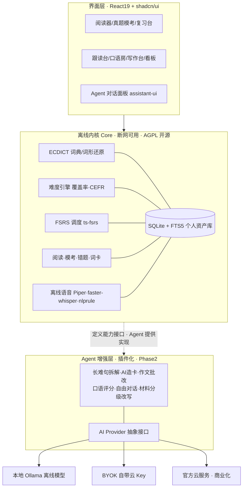
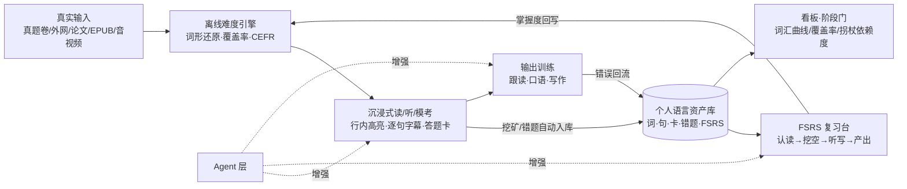
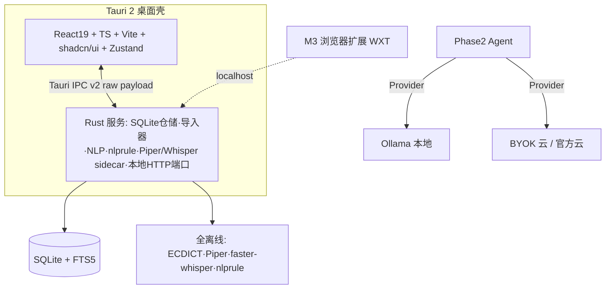
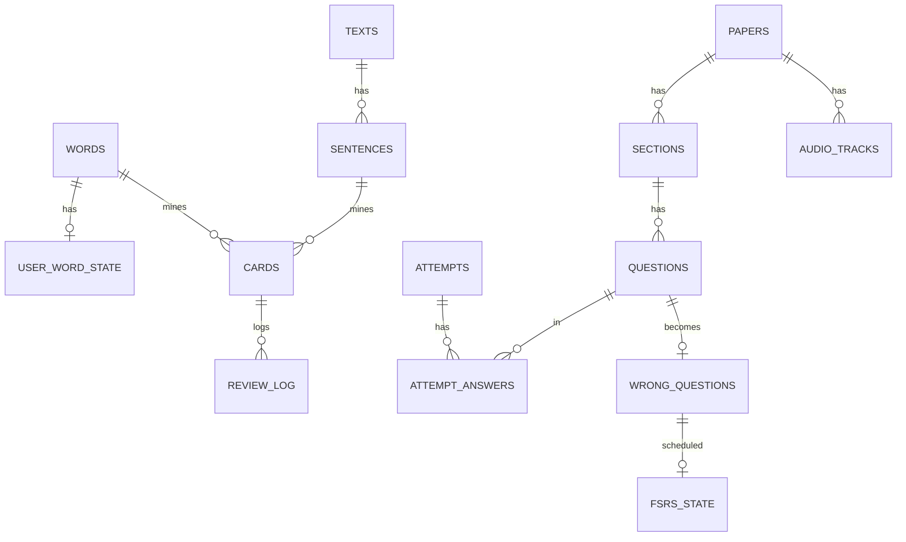

# 个人英语能力进阶系统 · 项目方案（v1.0 定稿）

> 本版为**定稿**：技术选型与商业策略已锁定，作为后续开发的唯一依据；变更需在文末「变更记录」中留痕。
>
> **定稿决策记录（2026-09-11 锁定）**
>
> | # | 决策项 | 结论 |
> |---|---|---|
> | 1 | 前端栈 | **React 19 + TypeScript + Vite + Tailwind v4 + shadcn/ui + Zustand + React Router** |
> | 2 | 离线 TTS | **Piper 为默认离线语音，Kokoro-82M 为可选高质量包**；edge-tts/云 TTS 仅作联网增强 |
> | 3 | 开源协议 | **内核 AGPL-3.0 + 商业双授权（open-core）** |
> | 4 | 启动方式 | 定稿后**暂不开工**；M0 采用 Tauri 工程骨架（非纯 Web 原型），启动待正式指令 |
>
> 版本沿革：v0.1 初版调研与蓝图 → v0.2 双层架构/真题策略/前端论证 → **v1.0 选型定稿**。

---

## 0. 一页速览（TL;DR）

- **产品**：本地优先的个人英语成长系统，一条链路走完「六级 → 脱翻译读外网/论文 → 口语/雅思 → 英语思维」。
- **架构**：**离线内核 Core（断网 100% 可用、数据不出本机）+ 可插拔 Agent 增强层（Phase 2 后挂）**。
  - Core：ECDICT 词典/词形还原、难度定级、ts-fsrs 记忆调度、阅读/真题模考/错题本/复习、Piper 离线 TTS、faster-whisper 本地识别、nlprule 离线语法。
  - Agent：长难句拆解、AI 造卡、作文/翻译批改、口语评分、自由对话、材料 i+1 改写；统一 Provider 抽象，支持本地 Ollama / BYOK 云 Key / 未来官方云。
- **护城河**：①离线+隐私；②考试→外刊→论文→雅思→思维全阶段一条链路；③越用越厚、竞品拿不到的个人掌握度数据（Agent 个性化建立其上）。
- **商业化**：open-core——内核 AGPL 永久免费获客，BYOK 免费留开发者，官方云（托管模型/跨端同步/授权题库/AI 教练）订阅收费。
- **真题**：不内置版权内容；定义开放试卷 Schema + 本地导入器，消费公开的 Markdown/JSON 真题与听力字幕，导入后永久离线使用。
- **节奏**：Phase 1（M0–M4，约 6 个月）交付全离线产品，**M2 结束即可完整服务六级**；Phase 2（MA1–MA3、MB）再上 Agent 与商业化。纪律：M2 完成前不写 Agent 代码。

---

## 1. 目标阶梯（产品主线）

| 阶段 | 目标 | 可量化验收标志 | CEFR/词汇参照 | 产品模块 |
|---|---|---|---|---|
| A 现在 | 六级 | 考纲词掌握 ≥90%，真题阅读生词率 <3%，整套模考闭环 | B1+→B2 | 考纲词库、真题模考、错题本、SRS、精听 |
| B | 脱翻译读外网/论文 | 已知词覆盖率 ≥95%，每百词查词 ≤2 次，≥150 wpm | B2→C1（4k~8k 词族） | 浏览器扩展、论文/PDF 模式、AWL 学术词 |
| C | 交流 + 雅思 | 连续说 2 分钟，AI 模考稳定在目标 band | C1 | 跟读、AI 口语房、雅思模考、写作批改 |
| D | 英语思维 | 读听不脑内翻译、默认英英释义、直接 paraphrase | C1+ | 单语模式、拐杖消退、复述训练 |

四阶段共用**一份个人语言资产库**；阶段切换只是模式与拐杖等级变化，不换 App、不丢数据。

---

## 2. 学习科学五原则（设计依据）

1. **可理解输入 i+1**：材料导入即算"已知词覆盖率"（95% 基本读懂、98% 享受泛读），只高亮该学的词，按 i+1 推荐材料。
2. **间隔重复用 FSRS**：三参数记忆模型（D/S/R）拟合个人历史，同等保持率比 Anki 的 SM-2 少 20~30% 复习量，Anki 23.10 起已默认 FSRS；集成 `ts-fsrs`，纯本地计算。
3. **Sentence Mining 句子挖矿**：生词连同原句、出处、发音一键成卡，拒绝孤立背词。
4. **可理解输出 + 影子跟读**：逐句复读、延迟 0.3~0.5s 跟读（大脑来不及翻译，直接建立英语回路）、录音对比；说/写输出暴露缺口。
5. **拐杖消退（差异化核心）**：全局 4 档支持等级 L1 中文为主 → L2 中文折叠 → L3 英英模式 → L4 推断模式；以"每百词查中文次数/机翻次数"作为**英语思维的量化代理指标**，要求单调下降。

---

## 3. 竞品与开源调研结论

### 3.1 开源项目地图

| 环节 | 代表项目 | 技术形态 | 借鉴点 |
|---|---|---|---|
| 精读桌面 | 拾语 Shiyu | Tauri2+Vue3+Rust+SQLite，ts-fsrs，EPUB/OCR/TTS | 最接近的参考实现：本地库、划词、句子成分标注、FSRS、EPUB（参考其 Rust 侧，前端不沿用） |
| 学术阅读 | IntelliRead | Rust/Axum+React | 论文场景的高亮/笔记资产化 |
| 网页标注 | WordWise/VocabMeld | Chrome 扩展+pdf.js | 任意网页行内标注生词 |
| 泛读器 | Lector/Lute/LWT | 自托管 Web，SQLite | 导入→点词→存卡→复习经典闭环 |
| 句子挖矿 | VocabSieve | Python+Anki | 低摩擦造卡工作流 |
| 字幕沉浸 | asbplayer | 浏览器+扩展 | 逐句字幕导航、多媒体卡 |
| 全能平台 | FreeLingo | FastAPI+Next.js+PG+Redis，AGPL+商业双授权 | CEFR 课程树/AI tutor 流程与**授权模式**参考；SaaS 重架构不抄 |
| 雅思口语 | kerokero | 题卡→录音→Whisper→AI 打 band | 雅思模考最小闭环 |
| 词库数据 | ECDICT（MIT） | 开源数据 | 77 万词条、考纲标签、lemma 还原表，离线内基地基 |

### 3.2 ExamCrafts 拆解（考试模块交互基准）

免费四六级在线模考站（首页/科目/错题本/生词本/笔记本/知识盆），吸收其设计：

1. **整卷模考**：按"年份.月份/第 N 套"组织；左做题、**右侧固定答题卡**（听力 1–25、阅读 26–55、写作、翻译分段），顶部倒计时，实时得分进度（/710）。
2. **听力字幕同步**：逐句播放、字幕跟随；可隐藏原文/中文；点词即查并入生词本——即拐杖 L1→L4 在考试场景的雏形。
3. **做题→解析闭环**：提交后选项标红/标绿，给原文+翻译+解析，答错自动进错题本、可加笔记。
4. **错题本**：按考试类型/题类/掌握状态/错误频次多维筛选，显示总数与掌握率，听力错题关联原音频。
5. **写作/翻译批改**：整体评价+参考范文+逐句要点（属 Agent 层，离线版只答题存档，评分后置）。

其短板即本产品机会：纯联网、只覆盖考试一段、无个人掌握度沉淀、无后续外刊/论文/口语/雅思路径、无离线隐私。本产品额外做到：**错题挂 FSRS，按遗忘曲线自动回来重做**。

### 3.3 架构模式取舍

采用「本地桌面单体 + 浏览器扩展（本地端口）+ 本地 AI 管线」；不采用自托管 Web 与多租户 SaaS 重架构。

---

## 4. 双层架构：离线内核 + 可插拔 Agent 层

### 4.1 架构图



### 4.2 能力边界

| 能力 | 离线内核（Phase 1） | Agent 增强（Phase 2） |
|---|---|---|
| 查词/词形还原 | ECDICT 数据表（95%+ 准确率） | — |
| 难度定级/覆盖率 | 个人词状态+CEFR 标签+Flesch | LLM 复评校准（可选） |
| 记忆复习 | ts-fsrs 纯算法 | — |
| 阅读高亮/挖矿 | 规则实现 | 长难句成分树、同义改写 |
| 真题客观题 | 自动判分、解析、错题归档 | 主观题（写作/翻译）评分 |
| 语法检查 | nlprule（Rust 离线规则） | LLM 深度润色、词伙修正 |
| 听力/跟读 | 本地音频、字幕轴、录音、波形对比、本地 Whisper 比对 | 发音/流利度综合打分 |
| 词卡 | 模板生成挖空/听写 | AI 造句、语境例句、近义辨析 |
| 材料获取 | 本地导入器（txt/md/epub/pdf/试卷包） | URL 抓取后 LLM 清洗/改写为 i+1 |
| 规划 | 规则化阶段门 | 个性化学习教练 Agent |

**设计纪律**：Core 先定义能力接口（`SentenceParser / WritingScorer / CardGenerator / SpeakingScorer`…），离线给规则实现或"未启用"占位，Agent 仅注入 LLM 实现；Agent 关闭时产品依然完整。

### 4.3 AI Provider 抽象（商业化预留）

统一接口、三后端可切、配置存本地：**Local（Ollama/llama.cpp sidecar，零联网零成本）→ BYOK（DeepSeek/OpenAI/通义兼容 Key，自用最省）→ Managed（官方托管+账号，付费点）**。所有 Agent 输出按"输入哈希+模型版本"缓存进 SQLite，重复请求零成本；流式返回；prompt 模板版本化以便迭代评测。

### 4.4 离线语音（已定方案）

| 组件 | 离线默认（定稿） | 联网增强 |
|---|---|---|
| TTS | **Piper（默认，CPU 实时、包小、英文自然）；Kokoro-82M（可选高质量包，按需下载）** | edge-tts / 云 TTS |
| STT | **faster-whisper 本地**（CPU 用 small.en，有显卡用 large-v3-turbo） | Whisper 云 API |
| 语法 | **nlprule（Rust 离线）** | LLM 批改 |

模型/语音包按需下载，保持首包轻量。

---

## 5. 核心学习闭环



每日 30–45 分钟：15 分钟输入（模考/阅读/精听）+ 10 分钟清到期卡 + 10–15 分钟跟读/输出。

---

## 6. 功能模块（[Core 离线] / [Agent] 标注）

- **6.1 语言资产内核 [Core]**：SQLite 单文件；ECDICT 导入；数据表词形还原；统一 `user_word_state` 供全产品读取；卡型递进：单词→句子→挖空→听写→造句。
- **6.2 阅读器与难度引擎 [Core；长难句树 Agent]**：txt/md/EPUB/PDF/URL 抓取结果导入；输出总词数、生词清单、覆盖率、CEFR 预估、易读度、i+1 匹配分；三色高亮；划词弹窗随拐杖等级变化；Piper 朗读。
- **6.3 SRS 复习台 [Core]**：ts-fsrs、4 级评分、全键盘、到期预测、卡型随掌握度升级。
- **6.4 考试/真题模块 [Core 判分归档；主观题评分 Agent]**：
  - 试卷库按 年.月/套次/四六级 组织；整卷模考带倒计时与右侧答题卡（710 分制、分段）。
  - 听力逐句字幕同步、AB 复读、隐藏原文/中文（接拐杖等级）、点词入生词本。
  - 作答→客观题离线判分→原文/翻译/解析→错题自动归档+笔记。
  - 错题本多维筛选，**错题挂 FSRS 定时重做**。
  - 写作/翻译离线留存与范文对照；[Agent] 上线后给分档、逐句批改、参考范文。
  - ECDICT 的 cet4/cet6 标签一键生成考纲牌组并按考频排序；真题词标注"真题出现 X 次"。
- **6.5 外网浏览器扩展 [Core 外延，M3]**：WXT 框架，页面原位标注读本地词状态，划词挖矿经 localhost 同步核心（AnkiConnect 同款本地端口，无账号无服务器）。
- **6.6 论文/学术模式 [Core；骨架梳理 Agent]**：PDF 双栏、按论文结构导航；AWL 学术词高亮与牌组、搭配库；默认不给全文翻译。
- **6.7 听力 & 影子跟读台 [Core 全离线]**：音视频/字幕逐句切分；无级变速、AB 复读；内置"盲听→看文本→同步读→延迟跟读→录音对比→脱稿复述"；本地 Whisper 转写与原文差异标注。
- **6.8 AI 口语房 & 雅思模考 [Agent]**：自由对话 + 雅思 Part1/2/3 模考（题卡→计时→录音→本地 Whisper 转写→LLM 按四项标准打 band 与建议），错误回流成卡。
- **6.9 写作批改 [Agent + Core 基础语法]**：nlprule 先过拼写/基础语法；Agent 给雅思四项评分、逐句批注、地道改写。
- **6.10 看板与拐杖消退 [Core]**：词汇增长（CEFR/考纲分桶）、覆盖率趋势、wpm、**每百词查词次数（北极星）**、FSRS 保持率、跟读时长、口语 band 趋势；阶段门达标才建议降拐杖/解锁下一阶段。

---

## 7. 真题与内容资源策略

### 7.1 公开离线资源

| 资源 | 内容 | 协议 | 用途 |
|---|---|---|---|
| english-exem-md | 四六级历年真题 Markdown 纯文本 | GPL-2.0 | 阅读/写作/翻译文本主源 |
| English-CET6-Walkman | 星火六级听力音频+字幕 2016.6–2023.6 | GPL-3.0 | 精听字幕轴 |
| astrbot CET6 题库 | `CET6_*.json`、`listening_questions_v3.json` | 开源 | 试卷 Schema 参考 |
| 懒笔记 english-exam | 四级 2015–2025 共 73 套、49 套配音频 | 网站 | 题量/结构参照（不爬来商用） |
| ECDICT | 词典+考纲标签+lemma | MIT（可商用） | 词库地基 |

### 7.2 统一试卷 Schema（本地导入标准）

```
Paper { id, exam: CET4|CET6|IELTS, year, month, set_no, total_score:710, time_limit_min }
├─ Section { type: listening|reading|writing|translation, instruction, audio_ref, order_idx }
│   └─ Question { no, subtype, stem, options[A-D], answer, analysis{en,zh},
│                 knowledge_tags[], audio_cue{start,end}, source_ref }
├─ AudioTrack { path, cues[{start,end,text,speaker}] }
└─ ResourcePack 元信息 { 来源, 许可证, 导入时间 }
```

导入器：① Markdown 真题规则解析器；② 音频+SRT/JSON 字幕对齐器；③ 自扫描 PDF/图片 OCR（后置）。导入一次，永久离线。

### 7.3 版权红线（商业化必须遵守）

- 真题版权归考试机构/出版社，**商业发行版不内置任何真题/音频**，只提供导入器与开放 Schema，内容由用户自行导入（个人学习合规）。
- GPL-2.0/3.0 数据集**不打包进发行物、不并入产品代码仓库**，仅作为用户可自行下载的资源包格式，避免 GPL 传染（产品自身代码为 AGPL，与数据分离）。
- 内容商业化走"授权题库 / 用户共创上传 / 公开样题"，不搬运。

---

## 8. 前端技术栈（定稿）

**React 19 + TypeScript（严格模式）+ Vite + Tailwind CSS v4 + shadcn/ui（Radix 底座）+ Zustand + React Router + Lucide。**

定稿依据（备查）：Tauri 对前端框架无关；2026 年 Tauri 主流模板事实标准为 React19+shadcn+Zustand；shadcn 组件源码进仓库、最适合 AI 辅助读写改；React 在虚拟列表/pdf/波形/图表及 Agent 对话（assistant-ui，MIT）生态最全；商业化后社区与招人池最大。Vue 学习曲线更低但组件深度与 AI 生成质量不及，Svelte 生态过小，均不采用。拾语的参考价值在 Rust 侧与学习流程，与前端无关。

专项库（按需引入）：

| 用途 | 选型 |
|---|---|
| 阅读器海量 token | TanStack Virtual |
| 音频波形/字幕 | wavesurfer.js |
| PDF（论文/试卷） | pdf.js |
| 看板图表 | ECharts 或 Recharts |
| Phase2 Agent 对话 | assistant-ui |
| 质量 | Vitest + Testing Library、Biome/Oxlint |
| 本地无服务端 | 不引入 TanStack Query |

---

## 9. 技术架构总表



| 层 | 选型（定稿） |
|---|---|
| 桌面壳 | Tauri 2（系统 WebView、包小、Rust 本地重活、v2 IPC 原始大负载） |
| 前端 | React 19 + TS + shadcn/ui（见第 8 节） |
| 数据库 | SQLite + FTS5（单文件、全文检索、自动备份、JSON 导出） |
| SRS | ts-fsrs（不自写算法） |
| 词典/NLP | ECDICT + 数据表词形还原；覆盖率/易读度自研 |
| 语法 | nlprule（Rust 离线） |
| TTS | Piper 默认 / Kokoro 可选 / edge-tts 联网增强 |
| STT | faster-whisper 本地 / Whisper API（M4 引入） |
| LLM | Provider 抽象：Ollama / OpenAI 兼容 BYOK / 官方云（Phase 2，结果缓存） |
| 扩展 | WXT（M3） |
| 解析 | epub-rs、pdf.js、自研 Markdown/试卷解析器 |

---

## 10. 数据模型（SQLite）



- **语言域**：`words`(lemma PK, pos, phonetic, en_def, zh_def, cefr, tags, bnc_freq, coca_freq, exchange)；`user_word_state`(lemma, status, encounter_count, first/last_seen)；`texts`；`sentences`(original, zh_translation, audio_path, parse_json)；`cards`(card_type, ref_lemma, ref_sentence_id, front, back, source_text_id)；`fsrs_state`(due, stability, difficulty, elapsed/scheduled_days, reps, lapses)；`review_log`(rating, elapsed_ms, reviewed_at)。
- **考试域**：`papers`(exam, year, month, set_no, total_score, time_limit_min)；`sections`(type, instruction, order_idx)；`questions`(no, subtype, stem, options_json, answer, analysis_en/zh, tags_json, audio_start/end)；`audio_tracks`(path, cues_json)；`attempts`(mode 模考/练习, started/finished_at, score)；`attempt_answers`(chosen, is_correct, elapsed_s)；`wrong_questions`(wrong_count, last_wrong_at, status, note) **挂 fsrs_state 定时重做**。
- **Agent 域（Phase 2）**：`ai_provider_config`、`ai_cache`(prompt_hash, model, response)、`agent_sessions`、`agent_events`。
- **全局**：`settings`(support_level L1–L4、tts_provider、daily_goal…)。

口径纪律：所有掌握度判断只走 `user_word_state` 一张表，阅读高亮/定级/牌组/看板统一读取。

---

## 11. 商业化、护城河与开源协议（定稿）

### 11.1 open-core 三层

| 层 | 内容 | 策略 |
|---|---|---|
| 内核 Core | 全部离线学习功能、本地数据 | **AGPL-3.0 永久免费**，最大化获客口碑 |
| BYOK Agent | 自带 Key / 本地 Ollama 调 Agent | 免费，留开发者与进阶用户、建社区 |
| Managed 云（收入点） | 官方托管模型（免装/免 Key）、跨端云同步、授权题库/资源市场、AI 学习教练、班级/团队版 | 订阅 + 资源包 |

### 11.2 护城河

1. **数据迁移成本**：个人掌握度画像、FSRS 历史、错题、阅读记录越用越厚，竞品没有、用户带不走；Agent 个性化建立其上。
2. **全阶段一条链路**：考试→外刊→论文→雅思→思维，竞品只占一段。
3. **离线 + 隐私**：本地优先、断网可用、数据不上云。
4. **拐杖消退方法论**：把"英语思维"做成可量化、可运营的成长体系。

### 11.3 协议合规（定稿 AGPL-3.0 + 商业双授权）

- 产品内核 **AGPL-3.0**：防止他人闭源白嫖（网络服务同样触发开源义务）；商业闭源/白标须另购商业授权（FreeLingo 同模式）。
- 依赖清点：ECDICT、ts-fsrs、shadcn/ui、assistant-ui、nlprule、WXT、Piper、faster-whisper 均为 MIT/Apache/宽松协议，可商用；引入任何新依赖前先过协议。
- GPL 真题数据只做用户侧导入，不分发、不入库（见 7.3）。

---

## 12. 路线图

### Phase 1：全离线产品（不碰在线 Key）

| 里程碑 | 周期（业余） | 交付 | DoD |
|---|---|---|---|
| M0 地基 | 1–2 周 | Tauri2+React19+shadcn 骨架；SQLite 迁移；ECDICT 导入；最简文本阅读器+点词 | 变形词可查到原型 |
| M1 阅读闭环 | 3–6 周 | 难度引擎、三色高亮、挖矿、ts-fsrs 复习台、txt/md/epub、基础看板、Piper 朗读 | 读→挖→次日复习全链路通 |
| M2 考试闭环 | 7–10 周 | 试卷 Schema+Markdown/字幕导入器；整卷模考（答题卡/计时）、听力逐句同步、解析、错题本挂 FSRS、考纲牌组、nlprule | **不联网完成整套六级备考闭环** |
| M3 外网+论文 | 3–4 月 | WXT 扩展+localhost 同步；PDF 论文模式、AWL | 网页原位挖矿、读完完整论文 |
| M4 听口离线 | 5–6 月 | 跟读台、faster-whisper 本地转写对比、录音波形 | 全离线精听/跟读闭环 |

### Phase 2：Agent 增强与商业化

| 里程碑 | 交付 |
|---|---|
| MA1 Agent 基座 | Provider 抽象（Ollama/BYOK）、缓存、流式、assistant-ui 面板；长难句树、AI 造卡/例句、写作翻译批改 |
| MA2 口语 Agent | 雅思模考打 band、自由对话、口语错误回流 |
| MA3 个性化 Agent | 基于个人资产的学习教练、材料 i+1 改写、阶段门动态规划 |
| MB 商业化 | 官方云 Provider、账号与跨端同步、授权资源市场、订阅；开源 Release 与社区运营 |

**纪律：M2 完成前不写一行 Agent 代码**，以全离线产品独立成立来验证护城河。

---

## 13. 风险与对策

| 风险 | 对策 |
|---|---|
| 离线没做全又提前接 AI | 能力接口先行、规则兜底；M2 前冻结 Agent |
| 真题多源格式不一、解析不稳 | 标准 Schema + 逐源适配器，先人工校对 5 套跑通，解析器单测覆盖 |
| 本地 Whisper/Piper 增大体积 | sidecar 与模型/语音包按需下载，首包保持轻 |
| 范围蔓延 | 严守里程碑 DoD；UI 一律用 shadcn 不手搓 |
| 商业化版权 | 不发行真题；GPL 数据不打包；走授权/共创 |
| 数据丢失 | SQLite 自动备份 + 自描述 JSON 导出 |
| 本地小模型英文能力不足 | Provider 随时切 BYOK；本地模型只承担轻任务 |
| AGPL 与依赖冲突 | 引入依赖前过协议清单，GPL/AGPL 库不入内核 |

---

## 14. M0 开工前准备清单（本次不开工，仅备料）

环境（Windows）：

1. 安装 Rust stable 工具链（rustup）、Node.js 20 LTS、pnpm；Tauri 在 Windows 需 VS C++ Build Tools 与 WebView2（Win10/11 一般自带）。
2. 拉取 ECDICT 数据（ecdict.csv / lemma.en.txt），准备导入脚本的输入文件。
3. 选定并下载 Piper 英文语音包（如 en_US-lessac-medium）做默认朗读验证。
4. 收集 3–5 套公开 Markdown 真题 + 1 份听力字幕，作为 M2 之前的导入器测试夹具（仅本地，不入库分发）。

M0 范围（待发令后执行）：`Tauri2 + React19 + shadcn/ui` 工程骨架 → SQLite 与迁移 → ECDICT 导入 → 粘贴文本阅读器 + 点词查原型 → 最小词表；验收：导入一篇文章，点任意变形词能查到原型释义。

---

## 15. 参考资料

**考试产品参照**
- ExamCrafts：https://examcrafts.com/

**真题/资源（仅个人导入，GPL 不随产品分发）**
- 四六级真题 Markdown：https://github.com/wamich/english-exem-md
- 星火六级听力音频+字幕：https://github.com/DURUII/English-CET6-Walkman
- CET6 结构化 JSON 参考：https://github.com/202704948-design/astrbot_plugin_cet6
- 懒笔记题库（结构参照）：https://english-exam.lazynote.cn/cet4/

**开源学习项目**
- 拾语 Shiyu：https://github.com/amluckydave/shiyu
- IntelliRead：https://github.com/huishingcheung/IntelliRead
- WordWise：https://github.com/breeze-r/wordwise
- Lector：https://github.com/heuwels/lector
- VocabSieve：https://github.com/FreeLanguageTools/vocabsieve
- asbplayer：https://github.com/asbplayer/asbplayer
- FreeLingo（AGPL+商业双授权范例）：https://github.com/artcc/freelingo
- kerokero（雅思口语闭环）：https://github.com/DELAxGithub/kerokero

**底层数据/算法/语音/语法**
- ECDICT：https://github.com/skywind3000/ECDICT
- Anki 算法 FAQ（SM-2/FSRS）：https://faqs.ankiweb.net/what-spaced-repetition-algorithm
- FSRS-5 DSR 模型：https://www.diane.app/en/outils/fsrs
- nlprule（离线语法）：https://github.com/bminixhofer/nlprule
- Piper TTS：https://github.com/rhasspy/piper
- faster-whisper：https://github.com/SYSTRAN/faster-whisper

**前端/Tauri**
- Tauri 2 综述：https://vanja.io/tauri-2-new-default/
- Tauri+React19+shadcn 模板：https://github.com/dannysmith/tauri-template ；https://github.com/kitlib/tauri-app-template
- shadcn 生态与 AI 编程适配：https://www.untitledui.com/blog/vibe-coding-libraries

---

## 变更记录

| 版本 | 日期 | 变更 |
|---|---|---|
| v0.1 | 2026-09-11 | 初版：目标阶梯、学习科学、GitHub 调研、蓝图与路线图 |
| v0.2 | 2026-09-11 | 双层架构（离线 Core + Agent）、ExamCrafts 拆解与真题策略、前端选型论证、商业化章节 |
| **v1.0** | 2026-09-11 | **定稿：锁定 React19+shadcn/ui、Piper/Kokoro、AGPL 双授权；补 M0 备料清单；去除全部待选项** |
