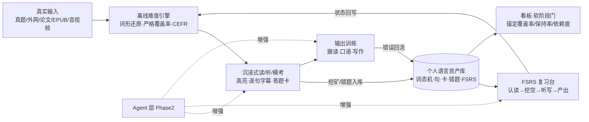
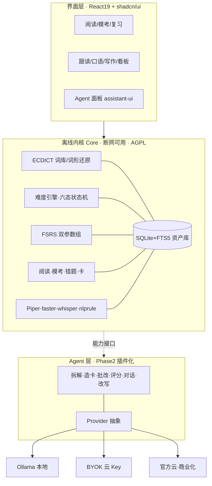
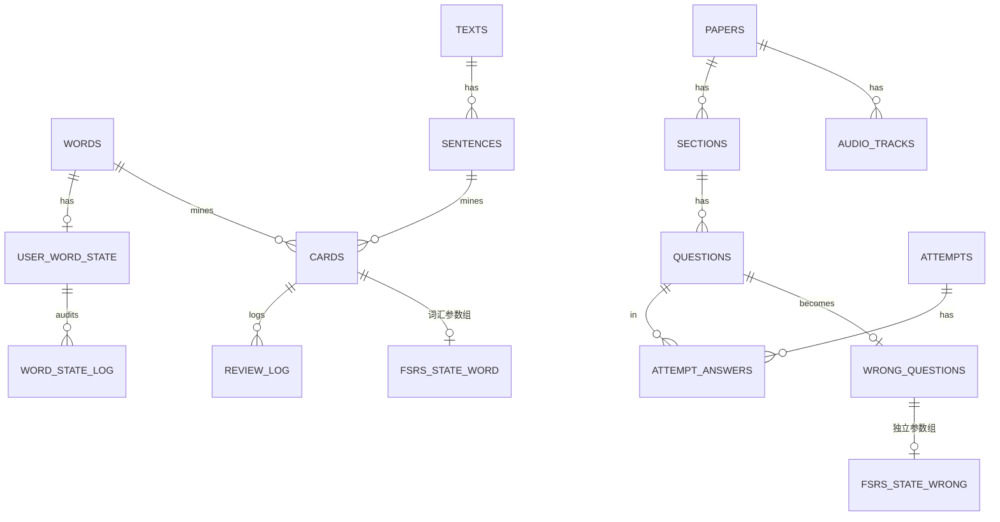

# 个人英语能力进阶系统 · 项目方案（v1.1）

> **本版定位**：技术选型维持锁定（即"技术定稿"），但补上 v1.0 缺失的**产品前提层**。起因是一份外部评审指出"方案锁死了技术，却没验证产品成立的前提"。该评审方法论成立，但误把产品看成"六级备考 App"——**六级只是本产品四阶段主线的阶段 A**。v1.1 把评审的有效意见**迁移到完整目标链**（六级 → 外网/论文脱翻译 → 口语/雅思 → 英语思维）上重新作答。
>
> **v1.1 相对 v1.0 的变化**：①新增第一部分「产品前提」（0 号用户、真正的对手、为什么不是现有 App 组合+通用 AI、形态论证、内容获取真实解法）；②新增「掌握度（已知词）状态机」——全产品口径地基；③北极星指标改为难度恒定的锚定覆盖率；④阶段门由硬解锁改为软建议；⑤路线图统一以"周"计、加超时砍项序与用户侧 DoD；⑥商业化加前置验证；⑦补 FSRS 拟合阈值、错题独立参数组、数字出处等技术细节；⑧新增第六部分《未决前提与验证计划》。

### 对外部评审意见的逐条裁决

| # | 评审意见 | 裁决 | v1.1 的处理（迁移到四阶段主线后） |
|---|---|---|---|
| 1 | 0 号用户/痛点证据缺失 | **采纳** | 答案明确：**0 号用户就是作者本人，自用优先**；外部用户是自用跑通后的期权，不是前提（第 1 节） |
| 2 | 竞品找错，应正面回答"为何不用现有 App+通用 AI" | **采纳并迁移** | 补全**四阶段**真实对手对照表与五条正面回答；但"隐私打动六级考生"不采纳为 C 端主张——它是自用需求与学术/高阶人群卖点（第 2、3 节） |
| 3 | 真题"用户自行导入"是绕开矛盾 | **采纳** | 给出"拖文件夹/粘链接 30 秒入库"的体验目标、资源包机制、新题适配器方案；版权红线保留但不再是全部答案（第 5、11 节） |
| 4 | 移动端是形态级风险 | **部分采纳** | 核心场景是桌面深度输入（论文/外刊/整卷），给范围声明；碎片复习用 **Anki 牌组导出**零成本过渡，并设形态重估触发条件（第 4 节） |
| 5 | 查词次数指标惩罚读难材料 | **采纳** | 主指标改为**固定锚定文本覆盖率**；查词/机翻次数只在同难度档内作辅助（第 15 节） |
| 6 | "已知词"无判定口径 | **完全采纳（最重要）** | 新增掌握度六态状态机与覆盖率口径（第 7 节） |
| 7 | 阶段门硬锁有挫败风险 | **采纳** | 一律改为"准备度建议+差距展示"，**永不硬锁内容**（第 8 节） |
| 8 | 路线图乐观、单位混乱、缺砍项与用户 DoD | **采纳** | 统一以周计（按每周 8–10h 业余）、每里程碑标超时砍项、M2 加"连续 14 天真实自用"DoD（第 17 节） |
| 9 | 商业化是愿望、渠道错位 | **采纳** | MB 前插 MV 市场验证里程碑；渠道按人群分层；明示"官方云是第二个项目"（第 18 节） |
| 10 | FSRS 小样本拟合更差 | **采纳** | 默认参数起步，review_log ≥500 条再开个人拟合（第 16 节） |
| 11 | 词形还原"95%"无出处 | **采纳** | 改为 M0 真实文章未命中抽样统计 + 兜底交互（第 16 节） |
| 12 | "少 20–30% 复习量"要标源 | **采纳** | 标 open-spaced-repetition 官方 wiki 与 KDD'22 论文（第 16 节） |
| 13 | 错题与单词共用 FSRS 语义错误 | **采纳** | 错题独立 FSRS 参数组（第 14、16 节） |
| — | "Agent 后置有时间窗口风险" | **部分采纳** | 差异化押资产层不押模型，模型越强后置越省力；但前提是 Phase 1 把资产层做厚（第 3 节） |

---

## 0. 一页速览

- **产品本质**：不是六级 App，而是贯穿「六级 → 外网/论文 → 口语/雅思 → 英语思维」的**个人语言资产系统**——一份掌握度数据贯穿四个阶段，AI 只是资产之上可替换的处理器。
- **0 号用户**：作者本人，自用优先；先证明对自己每天有用，外部商业化是期权。
- **架构**：离线内核 Core（断网可用）+ 可插拔 Agent 层（Phase 2）。技术栈定稿：Tauri 2 + React 19 + TS + shadcn/ui + SQLite + ts-fsrs + ECDICT + Piper/faster-whisper/nlprule；内核 AGPL-3.0 + 商业双授权。
- **v1.1 最重要的产品决策**：掌握度六态状态机（unseen→seen→learning→familiar→known→mastered）与"严格覆盖率"口径，它是难度引擎、高亮、选材、阶段门的共同地基。
- **节奏**：Phase 1（M0–M4，第 1–30 周，全离线）；M2（第 11 周末）达成"不联网完成整套六级备考闭环 + 连续 14 天真实自用"；Phase 2 才上 Agent。
- **开工纪律不变**：本轮只定方案，不写代码。

---

# 第一部分 产品前提（先于技术）

## 1. 0 号用户与使用主线（写死）

- **0 号用户 = 作者本人**，与既有项目一致采用"自用优先"打法：先解决自己的真实学习，外部用户访谈与商业化在自用闭环跑通之后。
- **主线是四年能力阶梯，六级只是入口**：阶段 A（当前，六级）→ B（不依赖翻译读外网/英文论文）→ C（交流 + 雅思）→ D（英语思维）。**任何只在 A 成立、到 B/C/D 失效的设计都不做**（例如只做题库、只做机翻、只做考试打卡）。
- **现有流程的痛点假设（H1–H5，待 2 周自用日志自证，见第 20 节）**：
  - H1 背词与阅读割裂：背过的词在原文里认不出；阅读查的词不会自动进入复习。
  - H2 工具数据互不相通：词典、听力、题库、AI 对话各自为政，每升一个阶段换一套工具、资产清零。
  - H3 通用 AI 是"一次性问答"：它不知道我已经会哪些词、不会在遗忘点把内容推回来、无法对整篇材料做覆盖率级别的选材。
  - H4 现有产品靠"即时中文/机翻"提留存，方向上强化中文依赖，没有系统性"撤拐"路径，与阶段 D 目标相悖。
  - H5 六级整卷模考、精听、错题重做、生词沉淀分散在多个工具，摩擦大。
- **自证成本极低**：自己就是用户，M0 期间用现有工具组合正常学习并记录每次摩擦（工具切换/数据搬运/重复查词），日志即需求证据，不需要外部访谈即可推进；外部访谈留给商业化验证。

## 2. 真正的对手：四阶段现有方案对照

评审指出 v1.0 只调研了 GitHub 小项目。补上用户**实际在用、不会轻易卸载**的产品，按完整主线列：

| 阶段 | 用户现在用什么 | 它们的断点（本产品的切入点） |
|---|---|---|
| A 六级 | 不背单词/墨墨（背词）、ExamCrafts/星火/粉笔（题库模考）、每日英语听力（精听）、通用 AI（讲解） | 词与题互不相通；错题不按遗忘曲线回来；**考完即弃，无法延续到 B** |
| B 外网/论文 | 欧路词典（查词生词本）、沉浸式翻译（网页机翻）、Kimi/ChatGPT（读论文）、LingQ | 机翻越强越依赖（与 D 相悖）；生词本无 FSRS 或与 A 阶段词库不通；AI 无状态、无选材能力 |
| C 口语/雅思 | ELSA/Speak（发音）、雅思哥（题库）、Cambly/外教、ChatGPT 语音/豆包（陪练） | 无个人错误档案；评分无长期曲线；练的内容与输入素材、生词资产无关 |
| D 英语思维 | **无专门产品**，普遍停在"继续依赖中文" | 这是现有方案的空白带，也是本产品的终局差异 |
| 跨阶段底座 | Anki（强 SRS，但要自己造卡、无阅读/听力环境、移动端正经体验靠 AnkiDroid）；通用大模型（无状态、无记忆调度） | Anki 是"卡片盒"不是"学习系统"；大模型是"顾问"不是"成长档案" |

## 3. 正面回答：为什么不是"现有 App 组合 + 通用 AI"

1. **资产层 vs 问答层**：本产品的内核是"个人语言资产库 + 记忆调度器"（每个词的掌握状态、每次接触的语境、错题、复习历史）。通用 AI 是**无状态问答器**——不知道你会哪些词、不会在你将忘时主动推回、无法计算材料覆盖率做 i+1 选材。AI 可以被替换（Provider 三选一），资产无法被替代。
2. **跨阶段连续性**：组合方案每升一阶段就换工具、资产清零；本产品一份 `user_word_state` 从六级贯穿到论文与雅思，A 阶段存的词在 B 阶段决定网页高亮。
3. **撤拐方向相反**：商业 App 的留存依赖"即时给中文/一键机翻"，与"最终脱离翻译"的目标结构性冲突；本产品以拐杖依赖度下降为设计目标。
4. **闭环而非功能点**：选材→输入→挖矿→FSRS→输出→错误回流，必须在同一数据模型上自动运转；拼凑工具无法自动回流（这正是 H1/H2 的根因）。
5. **离线/隐私的正确定位**：承认评审——六级考生对隐私几乎无感，**不拿它当 C 端考生主卖点**；它首先是作者自用需求，其次是研究生/学术/高阶人群（读敏感文献、不愿上传语料）的卖点。

**关于"Agent 后置、通用 AI 又强一代"的时间窗口**：本产品的差异化押在**资产与闭环**，不押 AI 能力本身。模型越强，Phase 2 的 Agent 越容易做、成本越低（换 Provider 即可），所以后置是"不赌模型"而非贻误战机——**但成立前提是 Phase 1 必须把资产层做厚**，若 Phase 1 只做了一堆功能界面而没有可信的掌握度数据，该论点失效。这也是第 7 节状态机被提到最高优先级的原因。

## 4. 形态论证：为什么桌面优先成立，手机怎么办

- **核心场景天然在桌面**：读外刊网站、读 PDF 论文、整卷模考、长文精读都是电脑重度场景；手机主要承担"碎片复习/精听"，是辅助而非主战场。
- **范围声明（Phase 1）**：只做 Tauri 桌面端；**不做原生 App、不做账号与云同步**（同步随商业化在 MB 才出现）。
- **手机碎片场景的低成本过渡（不推翻架构）**：
  1. M1 起支持**导出 Anki 牌组（含 TTS 音频）**，手机用 AnkiDroid/AnkiMobile 清到期卡，复习记录回导后同步 FSRS 状态——等于白借 Anki 十年移动端积累，开发量极小；
  2. M3 之后再评估 Tauri Mobile（React 代码可复用）或局域网只读 PWA；
  3. 不做独立移动后端。
- **形态重估触发条件**：若自用日志显示自己超过 50% 的学习时间发生在手机上，则暂停桌面新功能，优先评估 Tauri Mobile（列入第 20 节验证项）。

## 5. 考试/学习内容的真实解法（不止于版权红线）

评审指出"用户要打开就有最新题，自行导入是摩擦"。正面解法：

- **体验目标**：拖入一个文件夹（PDF+音频+字幕）或粘贴一个 URL，**30 秒内**生成可学/可模考内容；导入器记住同一来源的解析规则，第二套同源材料 10 秒入库。
- **资源包机制**：定义 `.erpack` 单文件（zip：试卷/文本 JSON + 音频 + 字幕 + 来源与许可元信息），可本地备份、可私下迁移；为未来社区共创留格式，但 Phase 1 不建分享平台。
- **新题问题（公开听力源止于 2023.6）**：适配器架构下新增"2024–2026 来源"只是再写一个 parser，不碰核心；写作/翻译等主观题本无音频墙；Phase 2 还可用 Agent 生成仿真卷。**追求的不是"内置最新题"，而是"任何来源 30 秒入库"的能力**——这比追着买题库更耐久，也天然合规。
- **版权红线（保留）**：个人导入合规；商业发行版不内置真题/音频；GPL 数据集不打包进发行物、不并入代码仓库；未来社区分享只允许上传用户有权传播的内容并设下架机制。

---

# 第二部分 学习设计

## 6. 学习科学五原则

1. **可理解输入 i+1**：导入即算已知词覆盖率（95% 基本读懂、98% 享受泛读），按 i+1 推荐，只高亮该学的词。
2. **间隔重复用 FSRS**：同保持率下比 Anki 默认 SM-2 少约 20–30% 复习量（open-spaced-repetition 官方基于仿真的结论；KDD'22 论文在 2048 万条真实复习上 log-loss 0.35 vs SM-2 的 0.45），用 `ts-fsrs` 本地调度，参数策略见第 16 节。
3. **Sentence Mining 句子挖矿**：生词连同原句、出处、发音一键成卡。
4. **可理解输出 + 影子跟读**：逐句复读、延迟 0.3–0.5s 跟读、录音对比，压缩脑内翻译。
5. **拐杖消退**：L1 中文为主 → L2 中文折叠 → L3 英英 → L4 推断；依赖度只在同难度档内比较（第 15 节）。

## 7. 掌握度判定规则："已知词"状态机（v1.1 核心新增）

`user_word_state.status` 是难度引擎、三色高亮、覆盖率、i+1 推荐、阶段门的共同地基，必须先于功能定死。

### 7.1 六态定义与迁移

| 状态 | 进入条件 | 是否计入"已知" |
|---|---|---|
| `unseen` | 词库有但个人材料从未出现 | 否 |
| `seen` | 在材料中出现（`encounter_count++`），用户未主动操作 | 否（见过≠认识） |
| `learning` | 划词挖矿 / 手动标生词 / 错题命中 → **同时建 FSRS 卡** | 否 |
| `familiar` | FSRS 卡毕业（跨过 learning steps）且累计 ≥2 次成功复习；或阅读中用户显式点"我认识" | 宽口径计入 |
| `known` | 进入长期调度后**连续 3 次 good/easy 且无 lapse**（稳定度 S 达到阈值，阈值 M1 后用自有数据校准） | **是（严格口径）** |
| `mastered` | 在产出型卡型（听写/造句）通过；或 known 后又在 ≥3 篇不同材料被动命中且零查词 | **是** |

**降级路径**：任何复习评 Again、或已 known 的词在新材料中被主动查词 → 回退 `learning` 并记一次 lapse。
**"猜出来没查"怎么算**：不做隐式乐观判定——不查词只维持原状态；阅读器在每个词的轻交互里提供"认识 / 不认识"显式按钮，由用户推进，避免把"猜对"误记成"掌握"。
**审计**：所有状态变更写 `word_state_log(lemma, from, to, trigger, ref, at)`，供调参与看板回溯。

### 7.2 覆盖率口径（全产品统一，写死）

- **严格覆盖率（默认，用于选材与阶段门）**=（known + mastered 的 token 数）/ 总 token 数，token 先经词形还原归并到 lemma。
- **宽口径（仅参考展示）**=（+familiar）/ 总数。两个值都显示，**所有自动决策只用严格值**。
- 阈值类参数（S 阈值、连续成功次数）先给默认值，M1 后依据个人数据校准并记录变更。

## 8. 拐杖消退与"软阶段门"

- 4 档拐杖 L1–L4 定义不变（中文为主 / 中文折叠 / 英英 / 推断），作用于查词弹窗、字幕、翻译等一切"支撑性 UI"。
- **阶段门改为软建议（采纳评审 #7）**：系统只展示"准备度 % + 差距清单 + 建议动作"，**永不硬锁任何模块**，用户可随时进入任意阶段与拐杖档；数据达标时才弹"建议降拐/进阶"，可忽略。
- 例：A→B 的建议条件为"六级词掌握 ≥90%、近 4 周泛读 12 篇且严格覆盖率均值 ≥95%"，未满足也能进，只显示差距。

## 9. 核心学习闭环

每日 30–45 分钟：15 分钟输入 + 10 分钟清到期卡（不在电脑前用 Anki 手机导出）+ 10–15 分钟输出。

---

# 第三部分 功能与内容

## 10. 功能模块（[Core 离线] / [Agent]）

- **10.1 资产内核 [Core]**：SQLite；ECDICT 导入；词形还原（数据表优先、规则回退）；六态状态机；卡型递进 单词→句子→挖空→听写→造句。
- **10.2 阅读器与难度引擎 [Core；长难句树 Agent]**：txt/md/EPUB/PDF/URL；输出严格/宽覆盖率、CEFR、易读度、i+1 匹配分；三色高亮（known 弱化、learning 标色、unseen/familiar 区分）；划词弹窗随拐杖档变化；Piper 朗读；词上"认识/不认识"轻按钮。
- **10.3 SRS 复习台 [Core]**：ts-fsrs、4 级评分、全键盘；**词汇与错题两套独立参数组**（第 16 节）；支持导出 Anki 牌组供手机复习并回导记录。
- **10.4 考试模块 [Core 判分归档；主观题评分 Agent]**：整卷模考（右侧 710 分答题卡、计时）；听力逐句字幕同步/AB 复读/隐藏原文中文；客观题离线判分→原文/翻译/解析→错题自动归档；错题本多维筛选并**按独立 FSRS 参数组定时重做**；考纲词牌组（ECDICT cet 标签+考频+真题出现次数）；写作/翻译离线留存与范文对照，评分留 Agent。
- **10.5 外网阅读 [Core 外延]**：M3 前期用 **URL 抓取/粘贴导入**在桌面阅读器覆盖外网场景；后段再做 WXT 浏览器扩展，经 localhost 同步（无账号）。
- **10.6 论文/学术模式 [Core；骨架梳理 Agent]**：PDF 双栏、论文结构导航、AWL 学术词、搭配库；默认不给全文翻译。
- **10.7 听力 & 影子跟读台 [Core 全离线]**：逐句切分、无级变速、AB 复读、六步跟读流程、本地 Whisper 转写差异比对。
- **10.8 AI 口语房 & 雅思模考 [Agent]**：自由对话 + 雅思 Part1/2/3 模考（题卡→计时→录音→本地转写→LLM 按四项打 band），错误回流。
- **10.9 写作 [Core 基础语法 + Agent 批改]**：nlprule 先过拼写/基础语法；Agent 评分、批注、改写。
- **10.10 看板 [Core]**：锚定覆盖率主曲线、保持率、wpm（按难度档分层）、依赖度（同档比较）、软阶段门。

## 11. 真题与资源策略

- 公开离线资源：四六级真题 Markdown（GPL-2.0）、星火六级听力音频+字幕 2016.6–2023.6（GPL-3.0）、结构化 JSON 题库参考、ECDICT（MIT）。
- 统一试卷 Schema（`Paper → Section → Question`，`AudioTrack.cues` 逐句字幕，ResourcePack 元信息）同 v1.0；导入器三类：Markdown 规则解析、音频+SRT/JSON 对齐、OCR（后置）。
- 落地顺序：先手工把 3–5 套解析到 100% 正确 → 抽出规则写成适配器 → 以"30 秒入库"为验收体验；新来源=新适配器，不动核心。
- 版权：见第 5 节红线。

---

# 第四部分 技术定稿（维持锁定）

## 12. 双层架构

Core 先定义能力接口（`SentenceParser/WritingScorer/CardGenerator/SpeakingScorer`），离线给规则实现或"未启用"占位，Agent 仅注入 LLM 实现；Agent 关闭产品完整。Provider 三后端（Local/BYOK/Managed），输出按"输入哈希+模型版本"缓存、流式返回、prompt 版本化。

## 13. 技术栈（锁定）

| 层 | 选型 |
|---|---|
| 桌面壳 | Tauri 2（v2 IPC 原始大负载） |
| 前端 | React 19 + TS 严格模式 + Vite + Tailwind v4 + shadcn/ui（Radix）+ Zustand + React Router + Lucide |
| 前端专项 | TanStack Virtual（海量 token）、wavesurfer.js（音频字幕）、pdf.js、ECharts/Recharts、assistant-ui（Phase2）、Vitest |
| 数据库 | SQLite + FTS5（单文件、自动备份、JSON 导出） |
| SRS | ts-fsrs |
| 词典/NLP | ECDICT + 数据表词形还原 + 自研覆盖率/易读度 |
| 语法/语音 | nlprule（离线语法）；Piper 默认 TTS、Kokoro 可选；faster-whisper 本地 STT（M4） |
| LLM | Provider 抽象：Ollama / OpenAI 兼容 BYOK / 官方云（Phase2） |
| 扩展 | WXT（M3 后段） |
| 协议 | 内核 AGPL-3.0 + 商业双授权；依赖先过协议（ECDICT/ts-fsrs/shadcn/nlprule/Piper/Whisper 均宽松许可） |

## 14. 数据模型要点

- 语言域：`words / user_word_state(status 六态, encounter_count…) / word_state_log / texts / sentences / cards / review_log`。
- FSRS 状态**分两组**：`fsrs_state_word`（词汇卡）与 `fsrs_state_wrong`（错题），参数与毕业规则独立。
- 考试域：`papers / sections / questions / audio_tracks(cues_json) / attempts / attempt_answers / wrong_questions(wrong_count,last_wrong_at,status,note)`。
- Agent 域（Phase2）：`ai_provider_config / ai_cache / agent_sessions / agent_events`。
- 全局：`settings(support_level, tts_provider, daily_goal, fsrs_preset_word, fsrs_preset_wrong…)`。

## 15. 指标体系（修正北极星）

| 层级 | 指标 | 口径 |
|---|---|---|
| **主北极星** | **锚定文本严格覆盖率** | 冻结一套锚卷（B2 外刊 1、C1 论文节选 1、六级真题 1，永不更换），每 2 周复测；难度恒定，曲线变化=真实成长 |
| 辅助（**仅同 CEFR 档内比较，禁止跨档**） | 每百词查词次数、中文展开率、机翻调用次数 | 材料变难时这些值天然上升，不做跨难度考核 |
| 过程 | FSRS 保持率、wpm（按档分层）、累计阅读量、跟读时长、口语 band 趋势、错题重做通过率 | 看板标注"跨难度不可比" |
| 阶段门 | 准备度 % + 差距清单 | 只建议不锁定 |

## 16. FSRS 与 NLP 的使用策略（补技术细节）

1. **默认参数先行**：前期直接用 FSRS 默认参数；`review_log` 累计 **≥500 条**（对齐 py-fsrs optimizer 的 512 下限、Anki 24.04 的 400 门槛）后再开个人拟合，之后每当日志量翻倍重拟一次；小样本坚持默认，避免过拟合。
2. **错题独立参数组**：错题语义是"重做验证"而非单词记忆——初始间隔更短、**连续 2 次独立做对即毕业移除**，D/S/R 不与词汇卡共享。
3. **词形还原不写死准确率**：ECDICT 数据表优先、规则回退；**M0 验收加"真实外刊未命中抽样"**：统计未命中 token 占比与失败类型（短语动词/专名/合成词/屈折），未命中走"整句划词+手动建卡"兜底，未命中率纳入看板长期监控。
4. **数字出处**：FSRS 少 20–30% 复习量——open-spaced-repetition 官方 wiki《ABC of FSRS》（注明基于仿真）；预测精度——KDD'22 论文 *A Stochastic Shortest Path Algorithm for Optimizing Spaced Repetition Scheduling*（DOI 10.1145/3534678.3539081）。

---

# 第五部分 计划与商业化

## 17. 路线图（统一以"周"计；按每周 8–10 小时业余投入）

### Phase 1：全离线产品（不碰在线 Key）

| 里程碑 | 周次 | 交付 | DoD（含用户侧验收） | 超时先砍什么 |
|---|---|---|---|---|
| M0 地基 | 1–2 | Tauri2+React19+shadcn 骨架、SQLite 迁移、ECDICT 导入、最简阅读器+点词 | ①变形词查到原型；②**真实外刊 1 篇未命中抽样报告** | 砍 UI 美化，保链路 |
| M1 阅读闭环 | 3–6 | 六态状态机、难度引擎、高亮、挖矿、ts-fsrs 复习台、txt/md/epub、Piper、**Anki 导出/回导**、基础看板 | 读→挖→次日复习全链路通；**作者本人连续 7 天日常使用** | 砍 epub（先 txt/md）、砍看板图表 |
| M2 考试闭环 | 7–11 | 试卷 Schema+导入器、整卷模考、听力字幕同步、解析、错题本（独立 FSRS 组）、考纲牌组、nlprule | ①不联网完成整套六级闭环；②**0 号用户连续 14 天真实备考使用** | 先砍写作/翻译范文对照美化与 OCR，保模考+错题+词 |
| M3 外网+论文 | 12–22 | URL/粘贴导入先行；WXT 扩展后段；PDF 论文模式、AWL | 网页材料 30 秒入库；读完一整篇论文 | **砍序：论文模式 → 浏览器扩展**（URL 导入可过渡） |
| M4 跟读台 | 23–30 | 逐句播放器、faster-whisper 本地对比、录音波形 | 全离线精听/跟读闭环 | **全局第一砍序位**（可用现有播放器+手动对比临时替代） |

**总砍项优先级（资源不足时从先往后砍）**：M4 跟读台 → M3 论文模式 → 浏览器扩展；核心闭环（阅读→挖矿→FSRS→状态回写）永不砍。

### Phase 2：Agent 与商业化

| 里程碑 | 交付 |
|---|---|
| MA1 Agent 基座 | Provider 抽象（Ollama/BYOK）、缓存/流式/assistant-ui；长难句树、AI 造卡、写作翻译批改 |
| MA2 口语 Agent | 雅思模考打 band、自由对话、错误回流 |
| MA3 个性化 Agent | 基于个人资产的教练、材料 i+1 改写、动态阶段建议 |
| **MV 市场验证（前置于 MB）** | 5–10 名目标用户付费意愿访谈 + 单页 landing 预售/候补；达标才允许投入云服务 |
| MB 商业化 | 官方云 Provider、账号与跨端同步、授权资源市场、订阅 |

纪律：M2 完成且通过 14 天自用验收前，不写 Agent 代码。

## 18. 商业化（期权，不是前提）

- **定位**：先有 0 号用户的长期自用证据，商业化是验证后的期权；**官方云本质是"第二个项目"**（账号、运维、同步、内容合规），MV 未验证前不启动，本地/BYOK 版可长期独立存活。
- **open-core 三层**：AGPL 内核永久免费 → BYOK/本地 Agent 免费留开发者 → Managed 云（免部署模型、跨端同步、授权资源包、AI 教练）订阅。
- **客群迁移（回应"只盯六级"的错位）**：不止六级考生——**研究生读文献、雅思备考、学术英语人群**的付费能力与留存都更高，且正好落在 B/C 阶段主线上。
- **渠道分层（不同人群不同打法）**：GitHub/技术社区（开源口碑，AGPL 自然触达）；知乎/B 站长内容（学术、考研、读论文）；小红书/B 站（雅思、口语、备考）；不混用。
- **MV 通过标准（建议）**：访谈中 ≥30% 表达明确付费意愿，或 landing 页在零投放小范围分享后拿到首批预定；不达标则继续打磨自用版，不启动云。

## 19. 风险与对策

| 风险 | 对策 |
|---|---|
| 前提错了（自用痛点不成立） | 第 20 节验证清单先行，2 周日志证伪；成本极低 |
| 提前接 AI、离线不完整 | 能力接口先行、规则兜底；M2 前冻结 Agent |
| 已知词口径不准导致全链路失真 | 六态机+审计日志，M1 后用自有数据校准阈值 |
| 真题多源解析不稳 | 标准 Schema+逐源适配器，先手工校对 5 套，解析器单测 |
| 本地模型/语音增大体积 | sidecar 与模型按需下载，首包保持轻 |
| 单人排期膨胀 | 统一周估时、砍项序、用户侧 DoD 卡住"看起来通但不好用" |
| 范围蔓延至移动/云 | Phase1 范围声明；手机只走 Anki 导出；云等 MV |
| 版权/协议 | 不发行真题、GPL 数据不打包、新依赖先过协议 |

---

# 第六部分 未决前提与验证计划

## 20. 验证清单（每项：怎么验 / 通过标准 / 不通过怎么办）

| 前提假设 | 验证方式 | 通过标准 | 不通过的回退 |
|---|---|---|---|
| H1–H5 痛点真实 | M0–M1 期间记 2 周学习摩擦日志（用现有工具组合） | 每个 H 至少被真实摩擦记录 3 次以上 | 删掉对应模块，只保留被验证的闭环 |
| 六态状态机口径合理 | M1 用 5–10 篇真实材料跑高亮，人工抽检 100 个词的状态是否符合直觉 | 抽检一致率 ≥90% | 调整状态阈值/增加显式确认交互 |
| 锚定覆盖率能反映成长 | 每 2 周测锚卷，持续 3 个月 | 曲线单调上升且与主观感受一致 | 更换/扩充锚卷，重设基线 |
| 桌面形态够用 | 统计 2 周内学习发生的设备分布 | 桌面占比 ≥70% | 触发 Tauri Mobile 评估（第 4 节） |
| "30 秒入库"体验 | 用 3 个不同来源材料掐表导入 | 同源第二份 ≤30 秒且解析零人工修 | 补适配器；个别源降级为半自动模板 |
| Anki 导出能替代手机端 | M1 后实际用手机 AnkiDroid 清卡 2 周并回导 | 回导后 FSRS 状态无丢失、无重复卡 | 提前评估只读 PWA |
| 付费意愿（远期） | MV：5–10 访谈 + landing 预售 | ≥30% 明确意愿或首批预定 | 不启动官方云，维持本地/BYOK |
| Agent 后置不影响价值 | M2 完成后评估：纯离线版是否已显著优于现有工具组合 | 14 天自用中"想换回旧组合"的次数趋零 | 把 MA1 部分能力（如长难句）前移 |

---

## 21. M0 开工前备料（本轮不开工，仅备料）

1. Windows 环境：Rust stable（rustup）、Node 20 LTS、pnpm、VS C++ Build Tools、WebView2。
2. ECDICT 数据（ecdict.csv、lemma.en.txt）。
3. Piper 英文语音包（en_US-lessac-medium）。
4. 3–5 套公开 Markdown 真题 + 1 份听力字幕（本地测试夹具，不分发）。
5. 新建 `学习摩擦日志.md`，M0 第一天开始记录（第 20 节 H1–H5）。

M0 范围（待发令）：Tauri2+React19+shadcn 骨架 → SQLite/迁移 → ECDICT 导入 → 粘贴文本阅读器+点词查原型 → 未命中抽样报告；最小词表。

## 22. 参考资料

- ExamCrafts：https://examcrafts.com/
- 真题 Markdown：https://github.com/wamich/english-exem-md ；星火六级听力：https://github.com/DURUII/English-CET6-Walkman ；CET6 JSON 参考：https://github.com/202704948-design/astrbot_plugin_cet6
- 拾语：https://github.com/amluckydave/shiyu ；IntelliRead：https://github.com/huishingcheung/IntelliRead ；WordWise：https://github.com/breeze-r/wordwise ；Lector：https://github.com/heuwels/lector ；VocabSieve：https://github.com/FreeLanguageTools/vocabsieve ；asbplayer：https://github.com/asbplayer/asbplayer ；FreeLingo：https://github.com/artcc/freelingo ；kerokero：https://github.com/DELAxGithub/kerokero
- ECDICT：https://github.com/skywind3000/ECDICT
- FSRS 官方 wiki《ABC of FSRS》（20–30%，仿真）：https://github.com/open-spaced-repetition/fsrs4anki/wiki/ABC-of-FSRS
- FSRS 拟合门槛（Anki 400/旧版 1000；py-fsrs 512）：https://faqs.ankiweb.net/frequently-asked-questions-about-fsrs.html ；https://deepwiki.com/open-spaced-repetition/py-fsrs/6-optimization
- KDD'22 FSRS 论文：DOI 10.1145/3534678.3539081
- nlprule：https://github.com/bminixhofer/nlprule ；Piper：https://github.com/rhasspy/piper ；faster-whisper：https://github.com/SYSTRAN/faster-whisper
- Tauri+React19+shadcn 模板：https://github.com/dannysmith/tauri-template ；https://github.com/kitlib/tauri-app-template

## 变更记录

| 版本 | 日期 | 变更 |
|---|---|---|
| v0.1 | 2026-09-11 | 初版调研与蓝图 |
| v0.2 | 2026-09-11 | 双层架构、真题策略、前端论证、商业化 |
| v1.0 | 2026-09-11 | 技术选型定稿 |
| **v1.1** | 2026-09-11 | **迁移外部评审：补产品前提（0 号用户/全链路对手/形态/内容体验）、已知词六态状态机、锚定覆盖率、软阶段门、路线图砍项与用户 DoD、商业化前置验证、FSRS 细节与出处；"定稿"收窄为"技术定稿"** |
