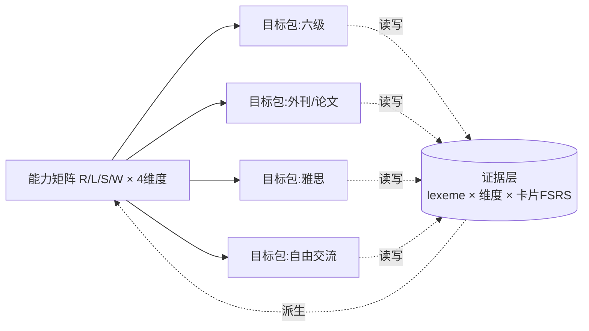
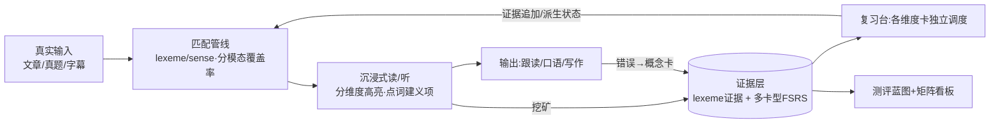
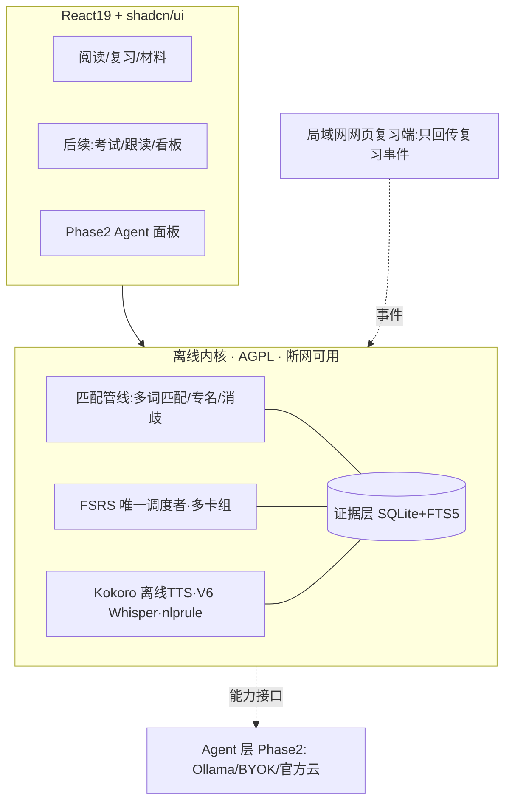
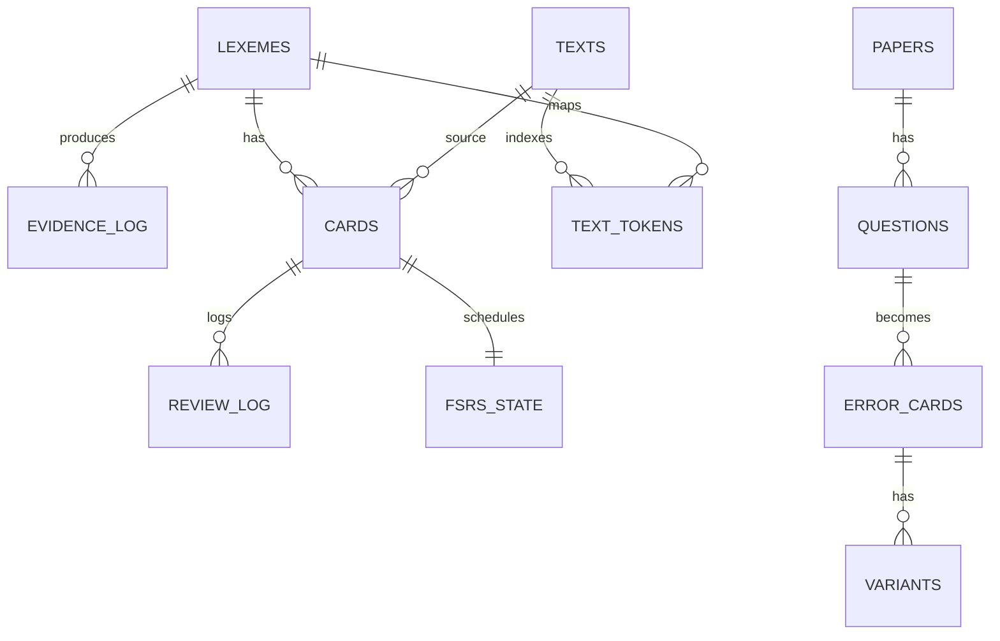
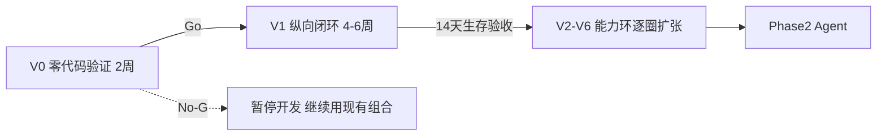

# 个人英语能力底座 · 项目方案（v1.2）

> **v1.2 的根本调整**：保留"个人语言资产系统"的核心判断，但把产品从"四阶段大一统 App"收缩为**可积累、可迁移、可验证的语言能力底座**。触发原因是第二轮评审指出：①A→B→C→D 混合了考试/场景/技能/认知状态四类概念，不构成严格先后；②词级单一状态机是建模错误——FSRS 调度的是一张具体记忆卡，不是一个词的全部能力；③固定锚文测评有练习效应和循环论证；④验证必须前移到写代码之前；⑤首版必须压成一个纵向闭环。
>
> 本版重写第 7（掌握度模型）、15（指标）、17（路线）、20（验证），并同步修正技术细节（FSRS 拟合节奏、调度权唯一性、TTS 许可）。"技术定稿"改称**"首版默认技术栈"**，保留替换条件。

### 第二轮评审裁决表

| # | 评审意见 | 裁决 | v1.2 处理 |
|---|---|---|---|
| 1 | 四阶段阶梯混合四类概念 | **采纳** | 改为**能力矩阵**（R/L/S/W × 资产/速度/准确度/依赖度），六级/论文/雅思降级为"目标包"（第 2 节） |
| 2 | 六态状态机不能做唯一事实源 | **采纳（本版最核心改动）** | 改为**证据层 + 派生状态**：lexeme/sense 为单位，分技能维度存证据，卡片是独立记忆项，六态仅为 UI 投影（第 7 节） |
| 3 | 固定锚定文本有练习效应+循环证明 | **采纳** | 冻结**测评蓝图**（难度/领域/长度规格）而非文章，每次用未见平行文本；主指标改为"陌生同级材料独立理解分"，覆盖率退回诊断位（第 16 节） |
| 4 | 验证必须前移到 M0 之前 | **采纳** | 新增 **V0：两周零代码验证**，提高 Go/No-Go 门槛（第 20 节） |
| 5 | 首版压成纵向闭环 | **采纳** | V1 只做"粘贴→点词→成卡→次日复习→回写→新文重评"，其余全部后置（第 10 节） |
| 6 | FSRS 512 不是跨实现硬下限 | **采纳** | 改为 512/1024/2048 经验重拟节奏，注明版本差异（第 17 节） |
| 7 | Anki 双向同步被低估 | **采纳** | **本产品为唯一调度者**；移动端=只回传事件的极简网页端；Anki 仅单向导出（第 5、17 节） |
| 8 | Piper 归档转 GPL | **核实属实** | 默认 TTS 换 **Kokoro-82M（Apache-2.0 权重+MIT 运行时）**，Piper 仅旧 MIT 冻结版备选（第 14、17 节） |
| 9 | 错题套 FSRS 会背答案 | **采纳** | 错误原因→概念卡（FSRS）+变式题；原题只按 1/3/7 天重做（第 11 节） |
| 10 | "英语思维"要操作化 | **采纳** | 拆成 5 个可测指标，挂在矩阵"中文依赖度"行（第 2 节） |
| 11 | 市场验证别同时铺三类人群 | **采纳** | MV 只选一个滩头：科研读文献人群；付费证据升级为预付款/真实留存（第 19 节） |
| 12 | "技术定稿"改"默认栈+替换条件" | **采纳** | 第 14 节给替换条件表 |

---

## 0. 一页速览

- **产品是什么**：一个本地优先的**语言能力底座**——按 lexeme（词/短语/义项）积累**分技能证据**，用 FSRS 调度具体记忆卡，所有学习场景（考试、外刊、论文、雅思、交流）都读写同一份能力数据；AI 是后挂的可替换处理器。
- **底层模型**：能力矩阵（读/听/说/写 × 资产/速度/准确度/中文依赖）+ 证据层掌握度（分维度证据、派生展示状态），取代线性阶梯和词级六态。
- **怎么做**：先 **V0（两周零代码验证）**，过门槛后做 **V1 纵向闭环**（粘贴→点词→成卡→次日复习→回写→陌生新文重评），连续自用 14 天存活后，再按"能力环"逐圈扩张；Agent 是 Phase 2。
- **首版默认技术栈（非锁死）**：Tauri 2 + React 19 + TS + shadcn/ui + SQLite + ts-fsrs + ECDICT + Kokoro-82M（离线 TTS）；内核 AGPL-3.0 + 商业双授权。
- **本轮只出方案，不写代码。**

---

# 第一部分 产品本体

## 1. 0 号用户与产品边界

- **0 号用户 = 作者本人，自用优先**；外部商业化是自用验证后的期权。学习目标链保留：眼下六级，随后脱翻译读外网/论文，再到口语与雅思，最终接近英语思维——但它们在模型里不再是线性四阶段（见第 2 节）。
- **产品边界一句话**：做"可积累、可迁移、可验证的语言能力底座"，不做"什么都有的大一统备考 App"。任何无法沉淀为长期能力证据的功能（一次性刷题快感、纯机翻浏览）优先级最低。

## 2. 能力矩阵：替代"四阶段阶梯"

### 2.1 为什么改

原 A→B→C→D 把四种不同概念排成了先后：A 是考试目标、B 是阅读场景、C 是技能+另一门考试、D 是认知状态。事实上读/听/说/写**并行发展**，"英语思维"也不是走完前三步才出现的终点，而是贯穿全程、逐步增强的状态。

### 2.2 矩阵结构

| 技能 ＼ 维度 | 词汇/短语资产 | 理解/反应速度 | 输出准确度 | 中文依赖度 |
|---|---|---|---|---|
| **阅读 R** | 认读词汇量、搭配储备 | wpm、长句解析速度 | —（输入技能） | 查词/中文展开率 |
| **听力 L** | 听辨词汇量、音变识别 | 跟听速度、句中反应延迟 | — | 字幕/原文依赖率 |
| **口语 S** | 主动可调用词块 | 听问到开口启动延迟 | 语法/搭配/发音评分 | 脑内中译英频率（自评） |
| **写作 W** | 主动可写词块 | 成稿速度 | 语法/搭配/连贯评分 | 中文构思痕迹（自评） |

- 每个格子有**独立证据与水平估计**；允许"阅读 C1、口语 B1"这种真实不均衡状态存在并可见。
- **目标包（Goal Packs）**：六级 / 外刊论文 / 雅思 / 自由交流 = 对矩阵格子的**目标配置 + 专属材料与题型**（六级听力题型、雅思口写评分量规、学术 AWL 词表），全部读写同一份证据。目标包只决定训练权重与材料源，**不锁定功能顺序、不做硬门槛**。

### 2.3 "英语思维（D）"操作化——它是横切状态，不是阶段

用 5 个可测指标刻画，随时间追踪：①英英释义使用率（英英展开/全部查词）；②英文复述质量（retell 量规分数曲线）；③听问到开口的启动延迟（秒，越短越接近直感）；④中文辅助调用率（每 session 中文展开+机翻次数，仅同难度比较）；⑤影子跟读延迟稳定性。它们落在矩阵"中文依赖度"行，任何阶段都可观测。

## 3. 真正的对手与"为什么不是现有组合+通用 AI"（结论沿用 v1.1）

| 场景 | 现有方案 | 断点 |
|---|---|---|
| 六级 | 不背单词/墨墨、ExamCrafts/星火、每日英语听力、通用 AI | 词与题不通、错题不回炉、考完资产作废 |
| 外刊/论文 | 欧路词典、沉浸式翻译、Kimi/ChatGPT、LingQ | 机翻强化依赖；生词无分技能状态；AI 无记忆、不做选材 |
| 口语/雅思 | ELSA/Speak、雅思哥、Cambly、AI 语音 | 无个人错误档案与长期曲线，与输入资产无关 |
| 英语思维 | 无专门产品 | 空白带 |
| 底座 | Anki（卡片盒，无学习环境）、通用大模型（无状态顾问） | 都不是"能力底座" |

五条正面回答：①**资产层 vs 问答层**——通用 AI 不知道你会什么、不会按遗忘点推回、做不了覆盖率选材；②跨场景连续性——一份证据贯穿所有目标包；③撤拐方向相反——商业产品靠即时中文留存，本产品以依赖度下降为目标；④闭环自动回流；⑤离线隐私是自用与科研人群卖点，不拿它对考生讲故事。模型越强 Agent 越便宜，差异化押证据资产不押模型能力。

## 4. 形态与调度权

- **桌面优先**：读外刊/论文、整卷、长文是电脑深度场景。Phase 1 不做原生 App、不做云账号。
- **调度权唯一（修正）**：本产品是 FSRS 的**唯一调度者**。不做 Anki 双向同步（双向写需要稳定 GUID、幂等事件、冲突解决与"唯一调度所有者"，单人项目不值得）。
  - 移动端过渡：M 阶段后期做**极简局域网网页复习端**（只读拉取到期卡、回传"复习事件"，调度计算仍在桌面核心）；
  - 对 Anki 只支持**单向导出** .apkg（离开本产品时用），不回导、不双写。
- 形态重估触发：自用记录显示手机学习占比 >50% 时，优先评估 Tauri Mobile。

## 5. 内容获取策略（沿用，强调体验目标）

- 目标体验：拖文件夹/粘链接 **30 秒入库**；同源第二份 10 秒。`.erpack` 单文件资源包（内容 JSON+音频+字幕+来源许可）可本地备份。
- 新题/新来源 = 新增一个解析适配器，不动核心；Agent 期可生成仿真卷。
- 红线：发行版不内置版权真题；GPL 数据集不打包、不并入仓库；社区共创留到商业化且设下架机制。

---

# 第二部分 学习模型（本版重写）

## 6. 学习科学原则（校准表述）

1. **可理解输入 i+1**：按分技能覆盖率辅助选材；注意 95%/98% 只是**选材参考**——研究表明词汇覆盖率只是理解的因素之一，主题知识、语篇结构同样重要，不能把覆盖率当能力等号（参考 Cambridge *Studies in SLA* 词汇覆盖率与理解综述，见参考资料）。
2. **间隔重复 FSRS**：调度对象是**一张张具体记忆卡**；同保持率下比 SM-2 少约 20–30% 复习量（open-spaced-repetition 官方 wiki，基于仿真；KDD'22 论文，DOI 10.1145/3534678.3539081）。
3. **句子挖矿**：卡必须带真实语境与出处。
4. **可理解输出 + 影子跟读**：分技能补齐"会认不会用"。
5. **拐杖消退**：L1 中文为主→L2 中文折叠→L3 英英→L4 推断；只软建议不硬锁。

## 7. 证据层掌握度模型（替代词级六态状态机，v1.2 核心）

### 7.1 为什么词级单一状态是错的

同一个词可能：阅读认识但听力听不出；选择题会但主动说不出；知道常见义但不懂当前语境义；单词会但搭配/句法不会。因此：
- **FSRS 调度的是一张卡（具体记忆项），不是一个词的全部能力**；
- `known/mastered` 不能直接挂在 lemma 上，更不能用"连续三次 Good"宣布整词掌握；
- 六态可以保留，但只是**证据计算出的 UI 投影**，不是数据库里的唯一真相。

### 7.2 基本单位：lexeme（词/短语/义项）

`lexeme = lemma + 词性 POS + 义项 sense`
- 多义词分义项：`bank/n/金融` ≠ `bank/n/河岸`；
- 短语动词与固定搭配是**独立 lexeme**：`give_up` ≠ `give`（避免"每个词都认识但短语不懂"）；
- 匹配管线（阅读/听力文本统一走）：

未命中分类要分别统计（第 16 节覆盖率诊断），不能一股脑算"生词率"。

### 7.3 证据维度（每个 lexeme 一组，只追加事件）

| 证据维度 | 含义 | 主要来源 |
|---|---|---|
| `reading_recognition` | 文本中认读 | 阅读命中、认读卡 |
| `listening_recognition` | 听音辨义 | 字幕/音频语境、听辨卡 |
| `meaning_recall` | 义→词主动回想 | 回想卡 |
| `spelling` | 听音/看义拼写正确 | 听写卡 |
| `production` | 说/写中正确使用（含搭配） | 口语/写作卡与 Agent 批改 |
| `context_diversity` | 出现过的**不同来源文本数**（分散度，区别于裸频次） | 所有输入 |

每条证据记录：时间、来源文本/题号、关联卡片 id、结果、置信度；全部可审计（`evidence_log`）。

### 7.4 卡片 = 独立记忆项（各自 FSRS）

| 卡型 | 训练维度 | 正面→背面 |
|---|---|---|
| r_recog | reading_recognition | 语境句中挖空/高亮词 → 义 |
| l_recog | listening_recognition | 播放发音 → 义 |
| recall | meaning_recall | 释义 → 词 |
| cloze | reading+搭配 | 真实句挖空（含搭配空） |
| spelling | spelling | 发音 → 拼写 |
| collocation | production(词块) | 搭配残缺 → 完整词块 |
| production | production | 用词造句/复述（Agent 或自评） |

**每张卡有独立的 FSRS D/S/R**；一个 lexeme 同时拥有多张不同维度的卡、各自调度。

### 7.5 派生状态：六态是投影

- UI 状态（unseen/seen/learning/familiar/known/mastered）由证据**实时计算（可缓存）**，并**分维度展示**（明确显示"阅读会、听力不会"）；用户手动覆盖本身也记为一条证据。
- 派生规则（默认值，V1 后用个人数据校准）：
  - `learning`：存在未毕业的卡；
  - 某维度 `known`：该维度对应卡进入长期调度且最近 3 次无 lapse；
  - lexeme 整体 `known`：reading 维度 known 且 context_diversity≥2；
  - `mastered`：≥2 个维度 known、context_diversity≥3、且 production 至少 1 次成功（目标越高要求越多）。
- **查词不降级（修正）**：已 known 的词被查，先判断是否遇到**新义项/搭配**——是则新建 lexeme 并记 `sense_miss`，不动旧义项；只有同一义项的认读卡失败，才降该维度。
- "三篇材料零查词"不再作为 mastered 证据（可能是材料太简单），必须有多维度卡的成功证据。

### 7.6 分模态覆盖率

- **阅读覆盖率**只统计 reading_recognition 证据；**听力材料覆盖率**只统计 listening_recognition 证据——"看得懂听不懂"在数字上必须可见。
- 覆盖率输出分解：真生词、短语未命中、专名、数字各占多少；专名与数字不计入生词负担。

## 8. 拐杖消退与软门控

L1–L4 作用于一切支撑性 UI；阶段/目标包之间只给"准备度%+差距清单"建议，**永不硬锁**；用户可随时切换拐杖档与目标包。

## 9. 核心闭环（更新为证据回写）

---

# 第三部分 首版产品（做减法）

## 10. V1 纵向闭环：第一版唯一要做的东西

> **粘贴一篇文章（六级阅读/外刊）→ 匹配管线标注 → 点生词（选定义项）→ 自动建两张卡（r_recog + cloze）→ 次日 FSRS 复习 → 证据回写 → 在第二篇陌生文章中重新评估（旧词重现、阅读覆盖率变化）。**

**V1 明确不做**：整卷模考、PDF 双栏论文、Whisper 跟读、写作语法、多来源自动解析、完整看板、错题 FSRS、移动端、Agent、多卡型（只做认读+挖空两种）。

**V1 生存验收（不达标不扩张）**：
1. 作者本人连续 14 天每天跑通闭环；
2. 到期卡完成率 ≥90%；
3. 第二篇陌生文章中能看到"已学词重现"与覆盖率变化的真实数据；
4. 期间"想换回旧工具组合"的次数趋零。

## 11. 后续能力环（V1 存活后逐圈扩张，每圈都有独立生存验收）

| 圈 | 内容 | 前置 |
|---|---|---|
| V2 材料与词库 | txt/epub 导入、考纲词牌组（ECDICT cet 标签）、最小看板、更多卡型（recall/spelling） | V1 存活 |
| V3 考试模式 | 试卷解析器、整卷模考（答题卡/计时/字幕同步）、**错题新方案** | V2 |
| V4 外网 | URL 抓取导入 → WXT 浏览器扩展（localhost） | V2 |
| V5 论文 | PDF、AWL 学术词、搭配库 | V4 |
| V6 听口 | l_recog 卡、跟读台、faster-whisper 本地转写、局域网网页复习端 | V3 |
| Phase 2 | Agent：Provider 抽象、长难句、批改、口语评分、材料改写 | V3 之后按需 |

**错题新方案（替代"错题套 FSRS"）**：错题 → 标错误原因（词汇/句法/题型技巧/辨音/粗心）→ 针对原因生成**概念卡**进 FSRS + 配**变式题**（同源不同题，防背答案）；**原题只按 1/3/7 天重做一轮**，通过即归档，不进长期 FSRS。

## 12. 考试模块设计要点（V3，吸收 ExamCrafts）

整卷+右侧 710 分答题卡+计时；听力逐句字幕、隐藏原文/中文接拐杖档；客观题离线判分→解析→错题流程（见上）；错题本多维筛选；写作/翻译离线留存、Agent 期评分。

---

# 第四部分 技术（首版默认栈，非锁死）

## 13. 双层架构（不变）

## 14. 默认技术栈与替换条件

| 层 | 默认选型 | 替换条件（触发即评估替代） |
|---|---|---|
| 桌面壳 | Tauri 2 | WebView2 兼容性问题频发 → 评估 Electron |
| 前端 | React 19 + TS + Vite + Tailwind v4 + shadcn/ui + Zustand | —（已论证，保持） |
| 专项库 | TanStack Virtual、wavesurfer、pdf.js、ECharts、assistant-ui(P2) | 按能力环引入，不提前装 |
| 存储 | SQLite + FTS5，单文件+自动备份+JSON 导出 | — |
| SRS | ts-fsrs，**本产品唯一调度** | — |
| 词典/NLP | ECDICT（MIT）+ 自写多词匹配/消歧；搭配库后续补 | ECDICT 义项/搭配不足 → 补 Wiktionary/开放搭配数据 |
| **TTS** | **Kokoro-82M（权重 Apache-2.0、kokoro-onnx MIT、量化约 80MB）** | G2P 组件若被迫引入 GPL（espeak-ng/phonemizer）则换 MIT 的 misaki 路径；音质不达标再用 edge-tts 联网增强。**不跟 piper1-gpl（GPL-3.0）**；Piper 旧 MIT 冻结版仅离线备选 |
| STT | faster-whisper 本地（V6） | CPU 体验差 → Whisper API |
| 语法 | nlprule 离线（规则，维护偏停滞） | 覆盖不足 → 规则只做高频错，其余交 Agent |
| LLM | Provider：Ollama/BYOK/官方云（Phase 2） | — |
| 协议 | 内核 AGPL-3.0 + 商业双授权；新依赖先过协议 | — |

## 15. 数据模型（证据层）

- `lexemes`(id, lemma, pos, sense, phrase_tokens_json, is_proper, cefr, tags, bnc/coca_freq)
- `evidence_log`(lexeme_id, dimension[r/l/recall/spelling/production/diversity], result, confidence, source_type, source_ref, card_id, created_at)——**只追加**
- `cards`(lexeme_id, card_type, front, back, source_text_id)；`fsrs_state`(card_id, due, stability, difficulty, reps, lapses…)——**每卡独立**
- `texts / text_tokens`(text_id, idx, raw, lexeme_id, match_type[word/phrase/proper/number/unknown])——支撑重现分析与覆盖率分解
- 考试域：`papers/sections/questions/attempts/attempt_answers`；`error_cards`(question_id, reason, concept_card_id→cards) + `variants` + 原题 1/3/7 重做计划字段
- 派生状态不入库为真相，只缓存 `derived_cache`（可随时由 evidence_log 重建）
- Agent 域（P2）：ai_provider_config/ai_cache/agent_sessions

## 16. 测评蓝图与指标体系（替代固定锚文）

### 16.1 为什么不冻结文章

同一篇文章反复测有**练习效应**（记住了文章而非能力提升）；且覆盖率来自系统自己的判定，会形成"判 known→覆盖率升→宣布进步"的**循环论证**。

### 16.2 冻结蓝图，不冻结文本

- 测评蓝图 = 规格：{CEFR 档、领域、长度区间、题型、题量}；为每档准备**多套未见平行文本**（题库持续扩充，被测者没读过）。
- 每两周一次：抽一套新平行文本 + 客观理解题（离线题库；Agent 期可生成）+ 摘要自评量规，限时完成。

### 16.3 指标分层

| 层级 | 指标 | 说明 |
|---|---|---|
| **主指标** | **陌生同级材料独立理解分** = 理解题正确率（外部证据，破循环）为主，叠加 wpm、依赖动作 | 材料每次未见、难度由蓝图恒定 |
| 诊断 | 分模态词汇覆盖率（含真生词/短语/专名/数字分解） | 只用于选材与找短板，**不单独宣布能力**；95/98 仅选材参考 |
| 过程 | FSRS 保持率、各维度卡数量与毕业率、context_diversity 分布、阅读量 | — |
| 依赖（同难度内比较） | 每百词查词、中文展开、机翻次数；英语思维 5 指标（第 2.3） | 禁止跨难度比较 |
| 矩阵看板 | R/L/S/W × 4 维格子的水平与证据量 | 直接展示不均衡 |

## 17. FSRS 使用与同步策略（技术修正）

1. **参数拟合节奏（不写死硬下限）**：起步用 FSRS 默认参数；按约 **512 / 1024 / 2048 条复习记录**的节奏重拟个人参数（Anki 24.04 需 ≥400 条、24.06+ 已无统一最低条数而按数据量决定优化哪些参数；小样本坚持默认，避免过拟合）。
2. **唯一调度者**：调度只在桌面核心发生；网页端/其他入口只回传复习事件（rating+时间戳），由核心统一计算 due。
3. **Anki 只出不进**：单向导出 .apkg，不做双向 FSRS 写入。
4. 出处规范：20–30% 复习量结论标注 open-spaced-repetition 官方 wiki（仿真）与 KDD'22 论文。

---

# 第五部分 验证、计划与商业化

## 18. 总体推进结构

## 19. V0：开工前的两周零代码验证（前移到一切开发之前）

**目的**：避免"边开发边证明自己该开发"的确认偏差。期间不写产品代码，只用现有工具正常学习 + 表格/纸笔。

1. **基线测量（每天记）**：学习时长、工具切换次数、单篇制卡耗时、复习完成率。
2. **摩擦日志（每次摩擦记）**：环节、耗时、严重度（1–3）、是否导致学习中断、当前工具、自动化后预计减少的步骤。
3. **纸面闭环（Wizard-of-Oz）**：用表格手工模拟统一闭环——收词登记 → 人工安排次日复习 → 第二篇文章人工统计"旧词重现率"，验证这个机制本身是否有价值。
4. **Go 门槛（四条全过才开工，替代旧的"出现 3 次"弱标准）**：
   - 每周因工具割裂稳定损失时间达到实测阈值（V0 结束用数据定，参考 ≥60 分钟/周）；
   - 至少 1 次摩擦直接导致学习中断或放弃；
   - 纸面闭环验证"旧词在陌生新文重现"确实发生且明显有用；
   - 明知要投入开发，两周后仍强烈想解决（防冲动）。
5. **产出**：《V0 验证报告》（基线+摩擦统计+纸面闭环结果+Go/No-Go 结论）；No-Go 则不开发。

## 20. 路线图与砍项（统一以周计，按每周 8–10 小时业余投入）

| 阶段 | 周次 | 内容 | 验收 | 超时先砍 |
|---|---|---|---|---|
| V0 | 第 -2~0 周 | 零代码验证 | 四条 Go 门槛 | —（不通过直接停） |
| V1 | 第 1–6 周 | 纵向闭环（匹配管线+两型卡+FSRS+证据回写+新文重评） | 连续 14 天自用生存验收 | 砍 cloze 只留认读；砍美化 |
| V2 | 第 7–12 周 | txt/epub、考纲牌组、更多卡型、最小看板 | 日常材料全部可导入 | epub→只留 txt/md |
| V3 | 第 13–20 周 | 考试模式+错题新方案 | 不联网完成六级闭环+14 天自用 | 写作范文对照、OCR |
| V4 | 第 21–28 周 | URL 导入→扩展 | 外网材料 30 秒入库 | 扩展本身（URL 导入可替代） |
| V5 | 第 29–34 周 | PDF 论文模式+AWL | 读完一整篇论文 | 双栏美化 |
| V6 | 第 35–42 周 | 听口证据、跟读、Whisper、网页复习端 | 全离线精听闭环 | **全局第一砍序位** |
| P2 | 其后 | Agent MA1–MA3、MV、MB | 见第 21 节 | — |

**总砍序**：V6 听口 → V5 论文 → V4 扩展；纵向闭环与证据层永不砍。所有时间估算以 V0/V1 门控为前提，门不过则后续重排。

## 21. 商业化（收敛为单一滩头）

- open-core 三层不变：AGPL 内核免费 → BYOK/本地 Agent 免费 → 官方云订阅（托管模型、跨端同步、授权资源、AI 教练）。官方云是"第二个项目"，验证前不启动。
- **MV 只选一个滩头人群：研究生/科研人员读英文文献**（桌面原生、付费力强、隐私敏感、与自用 B 阶段路径重合）；六级、雅思人群暂不并行，避免三线作战。
- **付费证据升级**："30% 口头愿意"不算证据；要求满足其一：定金/预付款候补、持续导入真实材料、30 天真实留存。
- 渠道：GitHub（开源口碑）+ 知乎/B 站（科研读文献长内容），单点打透再扩。

## 22. 风险与对策

| 风险 | 对策 |
|---|---|
| 前提不成立 | V0 四条门槛，No-Go 不开发 |
| 证据模型过度工程 | V1 只实现 r_recog/cloze 两型卡与两个维度，其余维度留接口不实现 |
| 派生状态与直觉不符 | evidence_log 可审计、可手动覆盖，V1 抽 100 词人工校验一致率 ≥90% |
| 多词匹配/消歧复杂 | 最长匹配+专名/数字兜底，未命中分类统计，不追求一次做对 |
| 单人排期膨胀 | 门控推进、砍项序、14 天生存验收 |
| 许可踩坑 | Kokoro 的 G2P 组件逐个核许可；GPL 数据/库不打包；依赖准入清单 |
| 提前接 AI | V3 前冻结 Agent，能力接口先行 |

---

## 23. 开工前备料（V0 期间即可做，不写产品代码）

1. 建《V0 学习摩擦日志》与基线表（每日 5 分钟记录）。
2. 备 ECDICT 数据（ecdict.csv、lemma.en.txt）、3–5 篇不同难度文章作为纸面闭环材料。
3. 环境备而不装项目：Rust stable、Node 20 LTS、pnpm（V0 判定 Go 后再装齐）。
4. 核实 Kokoro 运行时与其 G2P 依赖的具体许可清单。

## 24. 参考资料

- 词汇覆盖率与理解关系（覆盖率非能力等号）：https://www.cambridge.org/core/journals/studies-in-second-language-acquisition/article/lexical-coverage-in-l1-and-l2-viewing-comprehension/DFCA6605076705D5762C98F286D16B27
- FSRS 官方 wiki（20–30%，仿真）：https://github.com/open-spaced-repetition/fsrs4anki/wiki/ABC-of-FSRS
- FSRS 拟合门槛与版本差异：https://github.com/open-spaced-repetition/fsrs4anki/blob/main/docs/tutorial.md ；https://faqs.ankiweb.net/frequently-asked-questions-about-fsrs.html
- KDD'22 FSRS 论文：DOI 10.1145/3534678.3539081
- Anki 导出/调度说明（单向导出依据）：https://docs.ankiweb.net/exporting.html
- TTS 许可：Piper 归档说明 https://github.com/rhasspy/piper ；新主线 GPL-3.0 https://github.com/OHF-Voice/piper1-gpl ；Kokoro-onnx（MIT+Apache-2.0 权重）https://github.com/ai-llms/kokoro-onnx
- ECDICT：https://github.com/skywind3000/ECDICT ；nlprule：https://github.com/bminixhofer/nlprule ；faster-whisper：https://github.com/SYSTRAN/faster-whisper
- 产品参照：ExamCrafts https://examcrafts.com/ ；拾语 https://github.com/amluckydave/shiyu ；Lector https://github.com/heuwels/lector ；VocabSieve https://github.com/FreeLanguageTools/vocabsieve ；FreeLingo https://github.com/artcc/freelingo ；kerokero https://github.com/DELAxGithub/kerokero

## 变更记录

| 版本 | 日期 | 变更 |
|---|---|---|
| v0.1–v1.0 | 2026-09-11 | 调研→双层架构→技术定稿 |
| v1.1 | 2026-09-11 | 补产品前提、词级六态、锚定指标、软门控、砍项 |
| **v1.2** | 2026-09-12 | **能力矩阵替代线性阶梯；证据层+派生状态替代词级状态机；测评蓝图替代固定锚文；V0 零代码验证前移；V1 收缩为纵向闭环；FSRS 拟合/调度权修正；TTS 换 Kokoro；错题改概念卡+变式题；英语思维操作化；商业化收敛单一滩头** |
