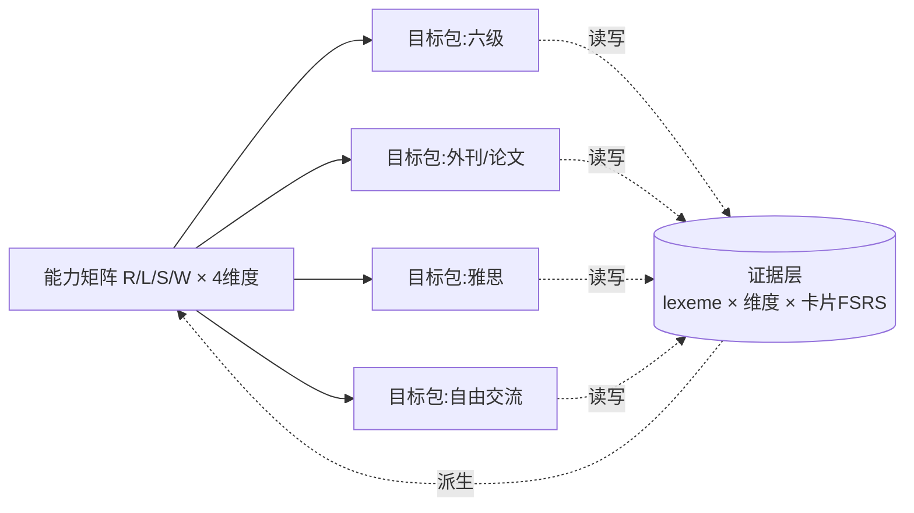
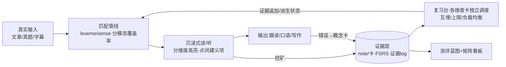
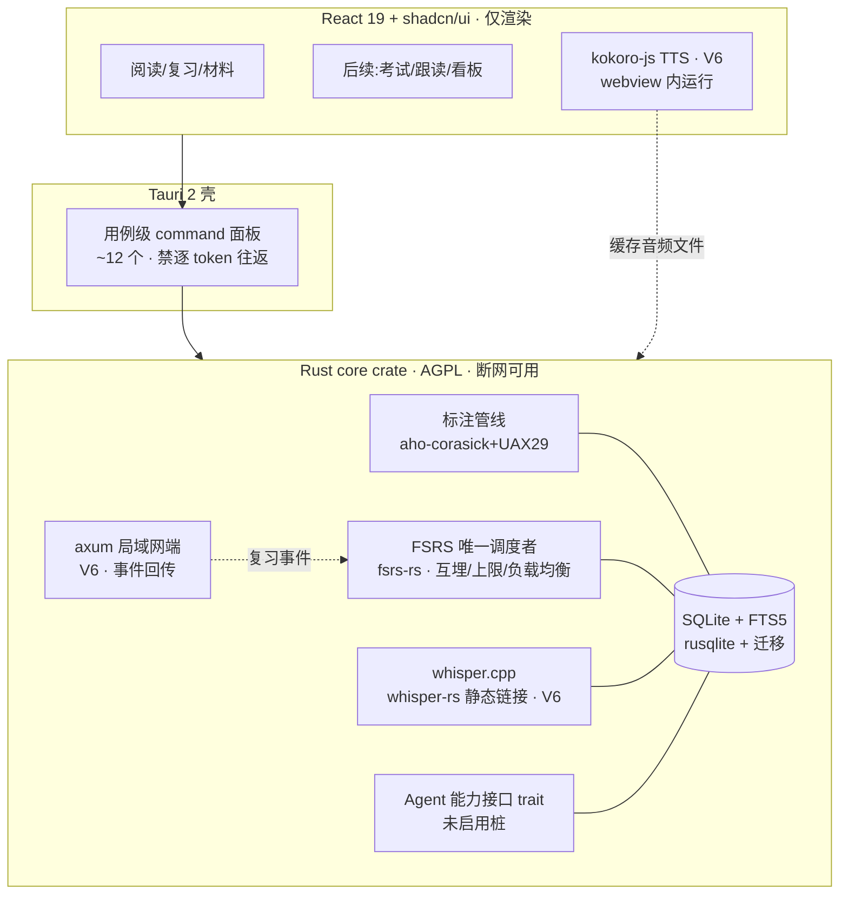
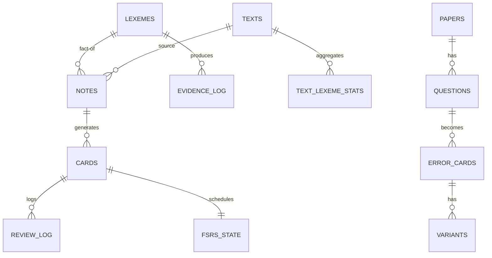
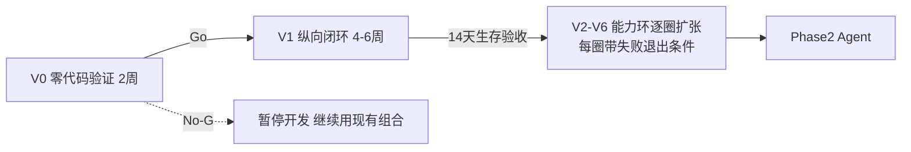

# 个人英语能力底座 · 项目方案（v1.3）

> **v1.3 的定位**：产品模型**沿用 v1.2**（能力矩阵、证据层+派生状态、测评蓝图、V0→V1 门控、能力环扩张），本版不推翻任何产品判断，专注补齐三块短板：①**工程架构补全**——v1.2 留下的最大空白是"离线内核"没有落到运行时归属（Rust 还是 TS）、卡调度缺机制、语音管线没落工程、局域网复习端无架构；②**验证设计锐化**——V0 的纸面闭环验证的是已被商业产品反复证明的机制，真正该在零代码阶段验证的是**匹配管线可行性**与**本人的摩擦基线**；③**吸收四路外部调研**（Lute3/VocabSieve/yomitan/LingQ、Anki/FSRS 生态、Tauri 工程实践、TTS/STT 落地链条），把被验证过的机制直接内化，不再自行发明。
>
> 第三轮评审 = 作者自查 + 外部开源项目反推。**本轮仍然只出方案，不写代码。**

### 第三轮评审裁决表

| # | 评审意见 | 裁决 | v1.3 处理 |
|---|---|---|---|
| 1 | "离线内核"没有运行时归属：SQLite 用什么访问、标注管线跑在哪、ts-fsrs 在哪一层，全都没说；而"调度权唯一"隐含要求核心可被局域网端复用，TS-in-webview 内核做不到 | **采纳（本版最核心改动）** | 新增 **ADR-1：Rust fat core**（rusqlite + fsrs-rs + 标注管线 + 内嵌 axum），TS 只做渲染；设 M0 spike 降级触发器（第 13 节） |
| 2 | 卡模型直接挂卡，缺 Anki 三十年验证过的调度机制：同词多卡会同天互相泄露答案、复习量无上限会把"到期完成率≥90%"的验收直接打爆 | **采纳** | 借 Anki：**Note/Card 分离**、兄弟卡互埋、新卡/复习上限、负载均衡、postpone、leech、revlog 列对齐（第 7.4、17 节） |
| 3 | `text_tokens` 全量逐 token 落库：Lute3 的作者 2023 年明确拒绝过这条路线（issue #532——索引海量、回填贵、价值存疑），整本书的 token 行是最大的存储同步噩梦 | **采纳** | 改为**运行时标注**（Rust 毫秒级）+ `text_lexeme_stats` 聚合物化 + `evidence_log` 记接触；保留幂等重标注（第 15 节） |
| 4 | TTS 选了 Kokoro 却没说怎么跑（Python？sidecar？）；STT 的 faster-whisper 需要 Python sidecar（打包 150–250MB 且 PyInstaller 坑多） | **采纳** | TTS 主选 **kokoro-js**（webview 内、无 Python），并核实其 G2P 依赖 espeak-ng WASM（GPL 灰区，v1.2 的预判正确）；STT 换 **whisper.cpp/whisper-rs**（静态链接进 Rust，免 sidecar）；Piper MIT 冻结版兜底（第 14、18 节） |
| 5 | 局域网复习端"只回传事件"没有架构：谁起服务、怎么鉴权、防火墙怎么办 | **采纳** | Tauri 进程内 **axum**（async_runtime::spawn）+ 首次配对 token + 事件回传（第 18.4 节） |
| 6 | 无工程化基线：schema 迁移、备份恢复、测试策略、性能预算全部空白 | **采纳** | 新增第 19 节：rusqlite_migration、WAL+VACUUM INTO 滚动快照、golden 语料测试、FSRS 跨实现对拍、用例级 command 禁逐 token IPC |
| 7 | V0 的纸面闭环验证"旧词重现有没有用"——但这个机制 LingQ/Readlang/Anki 生态已商业验证 20 年，重证它验证错了对象；真正的技术风险（ECDICT 匹配质量）零代码也能量化 | **部分采纳** | V0 新增**手工标注预演**（技术可行性门槛，Go 门槛 #3），摩擦日志保留，纸面闭环降为 3 天轻量版；Go 门槛数字**前置承诺**，修复"V0 结束用数据定阈值"的循环论证（第 21 节） |
| 8 | V1 验收第 3 条用"覆盖率变化"当达标证据，与第 16 节"覆盖率只做诊断、防循环论证"自相矛盾 | **采纳** | V1 验收改为：旧词重现率（纯机制）+ 陌生同级文章每百词主动查词数下降（行为指标）+ 可选手工小测；覆盖率只观察不验收（第 10、16.4 节） |
| 9 | 能力环只有生存验收，没有失败退出条件：验收失败后怎么办没写，单人项目最容易在这里烂尾 | **采纳** | 每圈加归因三选一规则（工具问题修一次 / 习惯问题降目标再验 / 机制问题砍掉），同圈两败即砍；全局 kill 标准（第 11 节） |
| 10 | v1.1 的 Agent 能力接口缝在 v1.2 被弱化成一句话，Phase 2 接 LLM 时会碰核心 | **采纳** | 恢复 4 个 Rust trait 能力接口 + "未启用"桩实现（第 13.3 节） |
| 11 | 口径细节：LingQ 按"词形"计 known 数且含专名，被社区骂了多年；英英释义（L3 拐杖）需要英文释义源而 ECDICT 只有中英 | **采纳** | 词汇量统计口径排除专名/数字；L3 英英候选 WordNet/Wiktionary，V2 引入（第 7.6、8 节） |
| 12 | 小勘误：misaki 是 Apache-2.0 非 MIT；kokoro-onnx int8 实测 92.4MB 非"约 80MB"；ECDICT 官方提供预构建 stardict.db 可免自导 | **采纳** | 第 14、24 节更新 |

---

## 0. 一页速览

- **产品是什么**：一个本地优先的**语言能力底座**——按 lexeme（词/短语/义项）积累**分技能证据**，用 FSRS 调度具体记忆卡，所有学习场景（考试、外刊、论文、雅思、交流）都读写同一份能力数据；AI 是后挂的可替换处理器。
- **底层模型**：能力矩阵（读/听/说/写 × 资产/速度/准确度/中文依赖）+ 证据层掌握度（分维度证据、派生展示状态），取代线性阶梯和词级六态。
- **怎么做**：先 **V0（两周零代码验证，含手工标注预演）**，过门槛后做 **V1 纵向闭环**（粘贴→点词→成卡→次日复习→回写→新文重评），连续自用 14 天存活后再按"能力环"逐圈扩张，**每圈带失败退出条件**；Agent 是 Phase 2。
- **内核归属（v1.3 定死）**：**Rust fat core**——SQLite（rusqlite）、FSRS 调度（fsrs-rs，Anki 同款）、标注管线（aho-corasick）、局域网复习端（内嵌 axum）、.apkg 导出全在 Rust；React 仅渲染。语音：TTS 用 kokoro-js（V6，webview 内），STT 用 whisper.cpp 静态链接（V6），全程**无 Python sidecar**（除非走 misaki 干净许可路径）。
- **首版默认技术栈（非锁死）**：Tauri 2 + React 19 + TS + shadcn/ui + rusqlite + fsrs-rs + ECDICT + kokoro-js(V6)；内核 AGPL-3.0 + 商业双授权。
- **本轮只出方案，不写代码。**

---

# 第一部分 产品本体

## 1. 0 号用户与产品边界

- **0 号用户 = 作者本人，自用优先**；外部商业化是自用验证后的期权。学习目标链保留：眼下六级，随后脱翻译读外网/论文，再到口语与雅思，最终接近英语思维——但它们在模型里不是线性四阶段（见第 2 节）。
- **产品边界一句话**：做"可积累、可迁移、可验证的语言能力底座"，不做"什么都有的大一统备考 App"。任何无法沉淀为长期能力证据的功能（一次性刷题快感、纯机翻浏览）优先级最低。

## 2. 能力矩阵：替代"四阶段阶梯"

### 2.1 为什么改

原 A→B→C→D 把四种不同概念排成了先后：A 是考试目标、B 是阅读场景、C 是技能+另一门考试、D 是认知状态。事实上读/听/说/写**并行发展**，"英语思维"不是走完前三步才出现的终点，而是贯穿全程、逐步增强的状态。

### 2.2 矩阵结构

| 技能 ＼ 维度 | 词汇/短语资产 | 理解/反应速度 | 输出准确度 | 中文依赖度 |
|---|---|---|---|---|
| **阅读 R** | 认读词汇量、搭配储备 | wpm、长句解析速度 | —（输入技能） | 查词/中文展开率 |
| **听力 L** | 听辨词汇量、音变识别 | 跟听速度、句中反应延迟 | — | 字幕/原文依赖率 |
| **口语 S** | 主动可调用词块 | 听问到开口启动延迟 | 语法/搭配/发音评分 | 脑内中译英频率（自评） |
| **写作 W** | 主动可写词块 | 成稿速度 | 语法/搭配/连贯评分 | 中文构思痕迹（自评） |

- 每个格子有**独立证据与水平估计**；允许"阅读 C1、口语 B1"这种真实不均衡状态存在并可见。
- **目标包（Goal Packs）**：六级 / 外刊论文 / 雅思 / 自由交流 = 对矩阵格子的**目标配置 + 专属材料与题型**，全部读写同一份证据。目标包只决定训练权重与材料源，**不锁定功能顺序、不做硬门槛**。

### 2.3 "英语思维（D）"操作化——它是横切状态，不是阶段

用 5 个可测指标刻画，随时间追踪：①英英释义使用率（英英展开/全部查词）；②英文复述质量（retell 量规分数曲线）；③听问到开口的启动延迟（秒）；④中文辅助调用率（每 session 中文展开+机翻次数，仅同难度比较）；⑤影子跟读延迟稳定性。它们落在矩阵"中文依赖度"行，任何阶段都可观测。

## 3. 真正的对手与"为什么不是现有组合+通用 AI"（结论沿用 v1.1/v1.2）

| 场景 | 现有方案 | 断点 |
|---|---|---|
| 六级 | 不背单词/墨墨、ExamCrafts/星火、每日英语听力、通用 AI | 词与题不通、错题不回炉、考完资产作废 |
| 外刊/论文 | 欧路词典、沉浸式翻译、Kimi/ChatGPT、LingQ | 机翻强化依赖；生词无分技能状态；AI 无记忆、不做选材 |
| 口语/雅思 | ELSA/Speak、雅思哥、Cambly、AI 语音 | 无个人错误档案与长期曲线，与输入资产无关 |
| 英语思维 | 无专门产品 | 空白带 |
| 底座 | Anki（卡片盒，无学习环境）、通用大模型（无状态顾问） | 都不是"能力底座" |

五条正面回答：①**资产层 vs 问答层**；②跨场景连续性——一份证据贯穿所有目标包；③撤拐方向相反；④闭环自动回流；⑤离线隐私是自用与科研人群卖点。模型越强 Agent 越便宜，差异化押证据资产不押模型能力。

**本次调研的补充佐证**：LingQ 按"词形"而非 lemma 计 known 数、且把专名计入，社区抱怨多年（官方回复"就是按 token 计的"）；其内置复习被重度用户批评为"学习的错觉"（只出 Mini Stories 例句），6 年老用户弃用内置复习、纯靠阅读自然重复——这恰好反证本产品"分维度证据 + 真实语境卡"的路线。Readlang 则完全不维护全局 known 状态，被指词汇统计弱。两者的中间路线（全局 lexeme 状态 + 严格口径）正是 v1.2/v1.3 已选的方向。

## 4. 形态与调度权

- **桌面优先**：读外刊/论文、整卷、长文是电脑深度场景。Phase 1 不做原生 App、不做云账号。
- **调度权唯一**：本产品是 FSRS 的**唯一调度者**。不做 Anki 双向同步；对 Anki 只支持**单向导出** .apkg（离开本产品时用），不回导、不双写。
  - 移动端过渡：M 阶段后期做**极简局域网网页复习端**（架构见第 18.4 节：Tauri 进程内起 axum，手机只拉到期卡、回传复习事件，调度计算仍在桌面核心）；
- 形态重估触发：自用记录显示手机学习占比 >50% 时，优先评估 Tauri Mobile。

## 5. 内容获取策略（沿用，强调体验目标）

- 目标体验：拖文件夹/粘链接 **30 秒入库**；同源第二份 10 秒。`.erpack` 单文件资源包（内容 JSON+音频+字幕+来源许可）可本地备份。
- 新题/新来源 = 新增一个解析适配器，不动核心；Agent 期可生成仿真卷。
- 红线：发行版不内置版权真题；GPL 数据集不打包、不并入仓库；社区共创留到商业化且设下架机制。

---

# 第二部分 学习模型

## 6. 学习科学原则（校准表述）

1. **可理解输入 i+1**：按分技能覆盖率辅助选材；95%/98% 只是**选材参考**——词汇覆盖率只是理解的因素之一，主题知识、语篇结构同样重要（Cambridge *Studies in SLA* 综述，见参考资料）。
2. **间隔重复 FSRS**：调度对象是**一张张具体记忆卡**；同保持率下比 SM-2 少约 20–30% 复习量（open-spaced-repetition 官方 wiki，基于仿真；KDD'22 论文，DOI 10.1145/3534678.3539081）。
3. **句子挖矿**：卡必须带真实语境与出处；复习卡可一键跳回原文（shiyu 已验证此体验的价值，LingQ 反例：复习只出固定例句被批"学习的错觉"）。
4. **可理解输出 + 影子跟读**：分技能补齐"会认不会用"。
5. **拐杖消退**：L1 中文为主→L2 中文折叠→L3 英英→L4 推断；只软建议不硬锁。

## 7. 证据层掌握度模型（v1.2 核心保留，7.4 本版重写）

### 7.1 为什么词级单一状态是错的

同一个词可能：阅读认识但听力听不出；选择题会但主动说不出；知道常见义但不懂当前语境义；单词会但搭配/句法不会。因此：
- **FSRS 调度的是一张卡（具体记忆项），不是一个词的全部能力**；
- `known/mastered` 不能直接挂在 lemma 上，更不能用"连续三次 Good"宣布整词掌握；
- 六态可以保留，但只是**证据计算出的 UI 投影**，不是数据库里的唯一真相。

### 7.2 基本单位：lexeme（词/短语/义项）

`lexeme = lemma + 词性 POS + 义项 sense`
- 多义词分义项：`bank/n/金融` ≠ `bank/n/河岸`；
- 短语动词与固定搭配是**独立 lexeme**：`give_up` ≠ `give`；
- 匹配管线（阅读/听力文本统一走）：

未命中分类分别统计（第 16 节覆盖率诊断），不能一股脑算"生词率"。**V1 明确不引入词性标注器**——义项消歧靠"点词时用户从词典候选中选定义项"完成（本来就要人确认），自动消歧留给后期。

### 7.3 证据维度（每个 lexeme 一组，只追加事件）

| 证据维度 | 含义 | 主要来源 |
|---|---|---|
| `reading_recognition` | 文本中认读 | 阅读命中、认读卡 |
| `listening_recognition` | 听音辨义 | 字幕/音频语境、听辨卡 |
| `meaning_recall` | 义→词主动回想 | 回想卡 |
| `spelling` | 听音/看义拼写正确 | 听写卡 |
| `production` | 说/写中正确使用（含搭配） | 口语/写作卡与 Agent 批改 |
| `context_diversity` | 出现过的**不同来源文本数**（分散度，区别于裸频次） | 所有输入 |

每条证据记录：时间、来源文本/题号、关联卡片 id、结果、置信度；全部可审计（`evidence_log`，只追加）。

### 7.4 卡模型与调度机制（本版重写：借 Anki 的 Note/Card 分离与负载控制）

v1.2 只说了"每张卡独立 FSRS"，没有回答四个必然撞上的问题：同一 lexeme 的多张卡同天出现互相泄露答案怎么办？复习量无上限时"到期完成率 ≥90%"的验收怎么达成？模板改了旧卡怎么办？复习历史怎么喂优化器？这些 Anki 全都有现成答案，直接内化：

- **Note/Card 分离**：`notes` 存"事实"（lexeme + 义项 + 语境句 + 出处 + 音频），`cards` 是按卡型模板从 note 生成的视图，每卡独立 FSRS 状态。好处：改模板可重新生成卡；删 note 级联删卡；.apkg 导出 guid 稳定；内容只存一份。
- **复习历史对齐 Anki revlog**：`review_log` 记（card_id, 时刻, rating 1–4, 答前间隔, 答后间隔, 耗时 ms, 队列类型），既可直接喂 fsrs-rs optimizer，也便于 .apkg 顺带导出复习史。
- **调度机制（默认全开，可配）**：

| 机制 | 默认值 | 解决什么 |
|---|---|---|
| 兄弟卡互埋（sibling burying） | 开 | 同一 lexeme 的认读卡和挖空卡不同天出现，避免"记得一张≈记得另一张"的虚假提取污染 FSRS 反馈 |
| 新卡上限 | 10 张/天（V1 期 5 张/天） | 控制复习雪球；稳态复习量约为新卡的 10 倍 |
| 复习上限 + 负载均衡 | 200 张/天；在 fuzz 区间内把到期卡挪到复习量少的日期 | 摊平到期曲线，保住"到期完成率 ≥90%"验收 |
| Easy days | 周末最小量 | 与生活节奏匹配（0 号用户业余开发） |
| Postpone（救堆积） | 保底 retrievability 下限 | 偶发中断后不产生雪崩，也不无脑清零 |
| Leech 标记 | 同卡 lapse ≥8 次标记 | 转入"问题词清单"，走第 11 节错题式处理（概念卡+变式），不硬suspend |

### 7.5 派生状态：六态是投影（沿用 v1.2）

- UI 状态（unseen/seen/learning/familiar/known/mastered）由证据**实时计算（可缓存）**，并**分维度展示**；用户手动覆盖本身也记为一条证据。
- 派生规则（默认值，V1 后用个人数据校准）：
  - `learning`：存在未毕业的卡；
  - 某维度 `known`：该维度对应卡进入长期调度且最近 3 次无 lapse；
  - lexeme 整体 `known`：reading 维度 known 且 context_diversity≥2；
  - `mastered`：≥2 个维度 known、context_diversity≥3、且 production 至少 1 次成功。
- **查词不降级**：已 known 的词被查，先判断是否遇到**新义项/搭配**——是则新建 lexeme 并记 `sense_miss`；只有同一义项的认读卡失败，才降该维度。
- "三篇材料零查词"不作为 mastered 证据；必须有多维度卡的成功证据。

### 7.6 分模态覆盖率与统计口径（本版补口径）

- **阅读覆盖率**只统计 reading_recognition 证据；**听力材料覆盖率**只统计 listening_recognition 证据——"看得懂听不懂"在数字上必须可见。
- 覆盖率输出分解：真生词、短语未命中、专名、数字各占多少；专名与数字不计入生词负担。
- **词汇量展示口径（新增，LingQ 教训）**：词汇量 = lexeme 计数，**排除专名与数字**；分母是"见过的 lexeme"而非"词形 token"。避免出现 LingQ 式"known 数虚高且跨材料不可比"。
- 覆盖率与已知比例按文本**抽样物化**（Lute 教训：整本书全量算 known% 又慢又没有必要——默认抽样前 5 页 + 手动"全量重算"按钮）。

## 8. 拐杖消退与软门控（沿用 + 一处补充）

L1–L4 作用于一切支撑性 UI；阶段/目标包之间只给"准备度%+差距清单"建议，**永不硬锁**。
**补充**：L3（英英释义）需要英文释义源——ECDICT 只有中英释义。候选：WordNet 3.1（宽松许可）/ Wiktionary extract（Wiktextract，CC BY-SA）。列入 V2 备料，V1 不阻塞（V1 只有 L1/L2）。

## 9. 核心闭环（证据回写，沿用）

---

# 第三部分 首版产品（做减法）

## 10. V1 纵向闭环：第一版唯一要做的东西

> **粘贴一篇文章（六级阅读/外刊）→ 匹配管线标注 → 点生词（选定义项）→ 自动建 note + 两张卡（r_recog + cloze）→ 次日 FSRS 复习（含互埋/上限/负载均衡）→ 证据回写 → 在第二篇陌生文章中重新评估。**

**V1 明确不做**：整卷模考、PDF 双栏论文、Whisper 跟读、写作语法、TTS（复习卡正反面用文本即可）、多来源自动解析、完整看板、错题 FSRS、移动端、Agent、多卡型（只做认读+挖空两种）。

**V1 必做（v1.3 新增两条）**：
- **复习负载控制**：新卡上限 5/天、兄弟卡互埋、负载均衡——没有它们，"到期完成率 ≥90%"的验收在第三周就会被雪球打爆；
- **幂等重标注**：matcher 版本升级后可对旧文本重跑标注（只重建渲染与聚合，不动证据与卡）。

**V1 生存验收（不达标不扩张；口径与第 16 节一致）**：
1. 作者本人连续 14 天每天跑通闭环；
2. 到期卡完成率 ≥90%（依赖新卡上限与互埋，量入为出）；
3. 第二篇陌生同级文章中：**旧词重现率 > 0**（纯机制数据）且**每百词主动查词数低于第一篇基线**（行为指标，非循环论证）；
4. （强烈建议）对该陌生文章做一次 5 题手工小测，作为理解分参考；
5. 期间"想换回旧工具组合"的次数趋零。

覆盖率变化只在看板里**观察**，不作为达标证据——它是系统自己判定的，用它验收就回到第 16.1 节批评过的循环论证。

## 11. 后续能力环（每圈带失败退出条件，v1.3 新增退出规则）

| 圈 | 内容 | 前置 |
|---|---|---|
| V2 材料与词库 | txt/epub 导入、考纲词牌组（ECDICT cet 标签）、最小看板、更多卡型（recall/spelling）、**英英释义源** | V1 存活 |
| V3 考试模式 | 试卷解析器、整卷模考（答题卡/计时/字幕同步）、**错题新方案** | V2 |
| V4 外网 | URL 抓取导入 → WXT 浏览器扩展（localhost） | V2 |
| V5 论文 | PDF、AWL 学术词、搭配库 | V4 |
| V6 听口 | l_recog 卡、跟读台、**whisper.cpp 转写**、**TTS 落地决策**、局域网网页复习端 | V3 |
| Phase 2 | Agent：能力接口注入 LLM 实现、长难句、批改、口语评分、材料改写 | V3 之后按需 |

**错题新方案（沿用）**：错题 → 标错误原因 → 针对原因生成**概念卡**进 FSRS + 配**变式题**；原题只按 1/3/7 天重做一轮，通过即归档，不进长期 FSRS。

**失败退出条件（新增）**：
- 某圈生存验收失败 → 冻结扩张，归因三选一：**工具质量问题**（修一次，再验一轮）/**习惯问题**（把每日目标降到 2 分钟最小闭环，再验一轮）/**机制问题**（该圈砍掉或重设计）；
- 同一圈连续两次未过 → 永久砍掉该圈，跳到下一圈（若被砍的是下一圈的前置，则跳过受影响的圈）；
- **全局 kill**：V1 失败且归因为"机制对本人无用"（而非质量/习惯）→ 项目暂停，保留 SQLite 与 JSON 导出，资产不丢。

## 12. 考试模块设计要点（V3，沿用）

整卷+右侧 710 分答题卡+计时；听力逐句字幕、隐藏原文/中文接拐杖档；客观题离线判分→解析→错题流程；错题本多维筛选；写作/翻译离线留存、Agent 期评分。

---

# 第四部分 技术（v1.3 重写：从"选型表"到"运行时架构"）

## 13. 运行时架构

### 13.1 ADR-1：内核归属 = Rust fat core（本版最重要决策）

**决策**：标注管线、SQLite 读写、FSRS 调度、.apkg 导出、局域网 HTTP 服务全部放在 **Rust 侧**（Tauri 2 主进程内的独立 crate `core`），React 只做渲染与交互。

**理由**：
1. **调度权唯一要求核心可复用**——局域网复习端必须与桌面端共享同一调度器与数据，TS-in-webview 的"内核"无法被手机页面复用，除非重写一遍（shiyu 把 ts-fsrs 放前端，因此它做不了第二入口——这正是我们不要的形态）；
2. **fsrs-rs 是 Anki 官方同款**（open-spaced-repetition 官方 Rust 实现，BSD-3，Anki 23.10 起采用），调度+优化器+模拟器一包齐全，比 ts-fsrs 多出 optimizer；
3. **标注是 CPU 工作**：aho-corasick（SIMD，LeftmostLongest）+ UAX#29 分词在 Rust 里对整本书毫秒~秒级，且可单测；放 webview 则要 web worker 兜底卡顿；
4. **IPC 前提**：Tauri 2 的 JSON IPC 有实测带宽墙（大 payload 可致数百毫秒卡顿）——对策是"标注结果落库、前端按页拉取 + 用例级 command"，这要求标注与存储在同侧（Rust）；
5. **.apkg 导出**：genanki-rs 现成；无 sidecar。

**代价与降级触发器**：Rust 对单人业余项目有学习曲线。**M0 spike 验收**：两周内完成"ECDICT 导入 + 粘贴文本点词高亮"最小链路。若失败，降级方案 = TS 内核（tauri-plugin-sql + web worker 标注 + ts-fsrs），代价是砍掉内嵌局域网端（改用 .apkg 导出兜底）并接受 IPC 开销。降级决定必须写入 M0 报告，不允许默默混用两个运行时。

### 13.2 架构图

### 13.3 Agent 能力接口缝（恢复 v1.1 设计，落到 Rust trait）

Core 定义四个能力接口，离线给"未启用"桩，Phase 2 注入 LLM 实现（Provider：Ollama/BYOK/官方云）；**Agent 关闭时产品完整**：

- `CardGenerator`：长难句拆解、自动造卡（V1 的卡只由模板生成，接口为 P2 预留）；
- `WritingScorer`：写作/翻译评分批注；
- `SpeakingScorer`：口语打分；
- `MaterialRewriter`：i+1 材料改写。

### 13.4 IPC command 面（用例级，非 CRUD）

`import_text` / `get_text_view(text_id, 页码)`（返回该页 token 标注，已落库聚合）/ `lookup(lexeme候选)` / `create_note(选定义项)` / `get_due_session` / `answer_card(rating, 耗时)` / `get_stats(范围)` / `export_apkg` / `reprocess(text_id | all)` / `settings_get/set` / `backup_now` / `lan_status`。前端一次交互 = 一次 command；标注、覆盖率、派生状态全部在 Rust 侧算好后整块返回。

## 14. 默认技术栈与替换条件（v1.3 更新）

| 层 | 默认选型 | 替换条件（触发即评估替代） |
|---|---|---|
| 桌面壳 | Tauri 2 | M0 spike 失败或 WebView2 兼容问题频发 → 评估 Electron |
| 前端 | React 19 + TS + Vite + Tailwind v4 + shadcn/ui + Zustand | —（保持） |
| 专项库 | TanStack Virtual、wavesurfer、pdf.js、ECharts、assistant-ui(P2) | 按能力环引入，不提前装 |
| 存储 | **rusqlite + rusqlite_migration**（PRAGMA user_version 顺序迁移；**不用 tauri-plugin-sql**——其迁移有静默不执行的 issue，且 JS 侧事务控制别扭） | — |
| SRS | **fsrs-rs**（BSD-3，Anki 同款，含 optimizer），本产品唯一调度 | M0 降级触发 → ts-fsrs（TS 侧，牺牲第二入口） |
| 标注/NLP | aho-corasick（LeftmostLongest）+ unicode-segmentation（UAX#29）+ ECDICT（**官方预构建 stardict.db**，MIT）+ 自写管线 | ECDICT 义项/搭配不足 → 补 Wiktionary/Wiktextract、开放搭配数据 |
| **TTS（V6 才定）** | 主选 **kokoro-js**（Apache-2.0，transformers.js，webview 内跑，q8 模型 90–120MB 一次下载；英文 G2P 走 phonemizer→espeak-ng WASM，**许可灰区见 18.1**） | 许可灰区对个人/AGPL 版无影响；商业发行版前必须切换到干净路径：**kokoro-onnx + misaki（Apache-2.0）Python sidecar** 或 **Piper 旧 MIT 冻结版**（piper-tts==1.2.0，归档停更） |
| STT（V6） | **whisper.cpp via whisper-rs**（Unlicense，build.rs 静态链入 Rust 进程，免 Python；base.en 起步，small int8 在 CPU 约 5–10× 实时） | 需要 faster-whisper 的词级时间戳管线时才引入其 Python sidecar（MIT，打包 150–250MB，最后手段） |
| 语法 | nlprule 离线规则（写作期评估，维护偏停滞） | 覆盖不足 → 规则只做高频错，其余交 Agent |
| LLM | Provider：Ollama/BYOK/官方云（Phase 2，注入 13.3 接口） | — |
| 协议 | 内核 AGPL-3.0 + 商业双授权；新依赖先过协议（准入清单见第 19 节） | — |

**依赖许可速查（已核实）**：fsrs-rs BSD-3；rusqlite/rusqlite_migration MIT；aho-corasick MIT/Apache 双许可；unicode-segmentation MIT/Apache；whisper-rs Unlicense；ECDICT MIT；Kokoro 权重 Apache-2.0；misaki Apache-2.0（v1.2 误写 MIT，更正）；kokoro-onnx 代码 MIT；espeak-ng GPL-3.0（灰区来源）；genanki-rs MIT。

## 15. 数据模型 v2（本版修订）

- `lexemes`(id, lemma, pos, sense, phrase_tokens_json, is_proper, cefr, tags, bnc/coca_freq)
- `notes`(id, lexeme_id, context_sentence, context_ref, audio_file, tags)——**事实层，借鉴 Anki**
- `cards`(id, note_id, card_type[r_recog/cloze/…], template_version)；`fsrs_state`(card_id, due, stability, difficulty, reps, lapses)——**每卡独立**
- `review_log`(card_id, rated_at, rating1to4, last_ivl, ivl, elapsed_ms, queue_type)——**列对齐 Anki revlog**，直接喂 optimizer 与 .apkg
- `evidence_log`(lexeme_id, dimension, result, confidence, source_type, source_ref, card_id, created_at)——**只追加**
- `texts`(id, source, raw_text, meta)；**`text_lexeme_stats`(text_id, lexeme_id, count, first_pos)——聚合落库**；**不存逐 token 行**（Lute issue #532 教训：海量、回填贵；渲染时由 Rust 运行时标注，毫秒级，matcher 版本变了还能幂等重算）
- `audio_cache`(key_hash, lexeme_id, engine, voice, file_path)——TTS cache-aside（第 18.1 节）
- `import_jobs`(text_id, status[queued/done/failed], matcher_version, error)——**幂等重标注入口**
- `derived_cache`(lexeme 派生状态、文本抽样覆盖率)——可随时由 evidence_log 重建；另有"全量重算"按钮（Lute 教训：统计必须有手动刷新兜底）
- 考试域：`papers/sections/questions/attempts/attempt_answers`；`error_cards` + `variants` + 原题 1/3/7 重做字段
- Agent 域（P2）：ai_provider_config/ai_cache/agent_sessions

**迁移与备份策略（详见 19 节）**：迁移走 rusqlite_migration（顺序 SQL + user_version）；备份走 WAL + `VACUUM INTO` 滚动快照；evidence_log 只追加保证派生层永远可重建。

## 16. 测评蓝图与指标体系（沿用 v1.2 + 16.4 新增）

### 16.1 为什么不冻结文章

同一篇文章反复测有**练习效应**；且覆盖率来自系统自己的判定，会形成"判 known→覆盖率升→宣布进步"的**循环论证**。

### 16.2 冻结蓝图，不冻结文本

- 测评蓝图 = 规格：{CEFR 档、领域、长度区间、题型、题量}；为每档准备**多套未见平行文本**。
- 每两周一次：抽一套新平行文本 + 客观理解题 + 摘要自评量规，限时完成。

### 16.3 指标分层

| 层级 | 指标 | 说明 |
|---|---|---|
| **主指标** | **陌生同级材料独立理解分** = 理解题正确率为主，叠加 wpm、依赖动作 | 材料每次未见、难度由蓝图恒定 |
| 诊断 | 分模态词汇覆盖率（含真生词/短语/专名/数字分解） | 只用于选材与找短板，**不单独宣布能力** |
| 过程 | **true retention**（成熟卡≥21 天、每卡每日首次作答、剔除 learning 队列——对齐 Anki 口径；FSRS 的目标就是让它收敛到 desired retention）、各维度卡毕业率、leech 数、新卡积压、context_diversity 分布、阅读量 | v1.3 新增 true retention 与负载指标 |
| 依赖（同难度内比较） | 每百词查词、中文展开、机翻次数；英语思维 5 指标 | 禁止跨难度比较 |
| 矩阵看板 | R/L/S/W × 4 维格子的水平与证据量 | 直接展示不均衡 |

### 16.4 V1 验收的指标口径（本版新增，消除矛盾）

V1 验收（第 10 节）**只允许**使用：①旧词重现率（机制事实）；②陌生同级文章每百词主动查词数的变化（行为指标，不依赖系统自判）；③可选手工小测正确率（外部证据）。**覆盖率变化只展示、不验收。**

## 17. FSRS 使用与同步策略（v1.3 更新）

1. **实现**：fsrs-rs（scheduler + optimizer 一体）。desired retention 默认 **0.90**，UI 限 0.85–0.95，>0.97 警告（工作量陡增）。
2. **参数拟合节奏**：默认参数起步；复习记录 **~100 条解锁部分参数、~400 条解锁全参数**（Anki 24.06.3+ 口径：任意数量可优化、按数据量分级），此后**每月或日志翻倍时**重拟。优化器用 fsrs-rs 内置（`compute_parameters`），不引入 Python。
3. **调度机制**：兄弟卡互埋、新卡/复习上限、负载均衡、easy days、postpone——见 7.4 表；调度只发生在桌面核心，局域网端只回传复习事件。
4. **正确性验证**：调度器做**跨实现对拍测试**——同一复习序列喂 fsrs-rs 与参考实现（ts-fsrs/py-fsrs），断言 D/S/R 与 due 一致，防自写包装层引入回归。
5. **Anki 只出不进**：单向导出 .apkg。**guid 规则（借鉴 genanki 但修正）**：guid = base91(sha256(lexeme 唯一键 + card_type) 前 8 字节)——**用内容无关的稳定键**（genanki 默认哈希字段内容，内容一改 guid 就变，Anki 侧会重复导入）；deck_id/model_id 硬编码常量；**note 第一字段放稳定键**防 Anki 按第一字段查重时冲突（yomitan 教训：同读音不同词会撞）。
6. 出处规范：20–30% 复习量结论标注 open-spaced-repetition 官方 wiki（仿真）与 KDD'22 论文。

## 18. 语音管线与局域网复习端（v1.3 新增）

### 18.1 TTS（V6 决策点，三条路径已核实）

| 路径 | 许可链 | 工程 | 风险 |
|---|---|---|---|
| **kokoro-js**（主选） | 包与权重 Apache-2.0；但英文 G2P 经 phonemizer→**espeak-ng WASM（GPL-3.0）** | webview 内 transformers.js，零 sidecar；q8 模型 90–120MB 首次下载 | 许可灰区：AGPL 内核可组合，**商业发行版不干净** → MB 前必须切换；G2P 质量低于 misaki（缺词典校正） |
| kokoro-onnx + misaki（干净路径） | 代码 MIT、权重 Apache-2.0、misaki Apache-2.0；注意其 release 附带 espeak-ng-data（GPL），**只用 misaki 自带英语 G2P、不启用 espeak 兜底** | 需 Python sidecar（Tauri externalBin），~100–200MB | 打包/签名/升级坑（sidecar 替换问题有公开 issue） |
| Piper 旧 MIT 冻结版（兜底） | rhasspy/piper 已归档（MIT），piper-tts==1.2.0 可装 | 最小最快 | 彻底停更；音质低于 Kokoro |

**工程惯例**：cache-aside 逐词条缓存——key=规范化文本+voice+语速，未命中合成一次落盘（首次 100–500ms），命中近 0ms；**不预生成整本书音频**（换音色/语速即全部作废）；卡片音频由 webview 合成后经 command 落 `audio_cache`。

### 18.2 STT（V6）

whisper.cpp + whisper-rs 静态链接（无 sidecar）；base.en 起步，专有名词/连读识别不足时切 small int8（CPU 5–10× 实时）。faster-whisper 仅在需要词级时间戳管线时引入。

### 18.3 跟读比对（V6）

whisper 转写 + 与原句对齐（编辑距离高亮差异）；延迟稳定性进"英语思维"指标⑤。

### 18.4 局域网复习端（V6）

- Tauri `setup` 里 `async_runtime::spawn` 起 **axum**，共享 core 的 SQLite（同进程，无同步问题）；
- 首次配对：桌面生成一次性 token + 二维码（URL 携带 token），手机浏览器保存；仅监听局域网接口，Windows 首次弹一次防火墙授权；
- 端点只有两个：`GET /due?limit=N`（拉到期卡，含音频缓存路径）与 `POST /review`（回传 rating+耗时）；**FSRS 计算、互埋、上限全在桌面核心**；
- 保底：.apkg 单向导出永远可用（不依赖局域网在线）。

## 19. 工程基线（v1.3 新增）

| 项 | 决策 |
|---|---|
| schema 迁移 | rusqlite_migration：顺序 SQL 文件 + user_version；迁移在事务内；**备份先行再迁移** |
| 备份/恢复 | WAL 模式 + synchronous=NORMAL；每日首次启动/退出时 `VACUUM INTO` 滚动保留 7 份快照（Litestream 对单机桌面过重，其文档自己也把 cron+VACUUM INTO 列为替代）；启动时 `PRAGMA integrity_check`，损坏→提示回退最近快照 |
| 数据导出 | SQLite 单文件即完整资产；另提供 JSON 全量导出（含 evidence_log），格式带版本号 |
| 测试 | ①**golden 语料**：V0 手工标注预演的 3 篇文本固化为 matcher 金标准（token 级期望输出），每次改管线全量比对；②派生状态 property test（随机证据序列 → 状态机不变量）；③试卷解析器 fixture 单测；④FSRS 跨实现对拍（17.4）；⑤备份/恢复演练进 V1 验收 |
| 依赖准入 | 新依赖必填：license、维护状态、是否进商业发行版；GPL 依赖只允许"可选插件/进程隔离"，禁入核心 |
| 性能预算 | 2000 词文本标注 <200ms（Rust）；整本书导入走后台 job + 进度条；IPC 只走 13.4 用例级 command；复习会话加载 <100ms |
| 可观测 | 结构化日志落盘 + "导出诊断包"按钮（日志+脱敏统计，单人排查用） |
| ECDICT 导入 | 官方 stardict.db 直接挂载或单事务导入（synchronous=OFF、后建索引），340 万行秒级~十几秒 |

---

# 第五部分 验证、计划与商业化

## 20. 总体推进结构（图沿用）

## 21. V0：开工前的两周零代码验证（v1.3 锐化版）

**目的**：v1.2 的 V0 用纸面闭环验证"旧词重现机制有没有用"——但该机制已被 LingQ/Readlang/Anki 生态商业验证二十年，重证它是验证错对象。V0 真正要回答的两个问题：**①摩擦是否真的值得开发（需求侧）；②ECDICT 匹配管线的质量底线是否可达（技术侧，零代码可测）**。期间不写产品代码。

1. **基线测量（每天记）**：学习时长、工具切换次数、单篇制卡耗时、复习完成率。
2. **摩擦日志（每次摩擦记）**：环节、耗时、严重度（1–3）、是否导致学习中断、当前工具、自动化后预计减少的步骤。
3. **手工标注预演（新增，核心技术门槛）**：取 3 篇不同难度真实文章（六级阅读/外刊/论文节选），用 ECDICT 数据（csv/stardict.db）+ 表格**人工模拟匹配管线**：分词→查 lemma 变体表→多词表达（记录有哪些 MWE 查不到）→专名→义项候选数。统计：可解析 token 未命中率、MWE 缺口清单、单词义项判定耗时。产出 V1 matcher 的量化底线。
4. **纸面闭环（降为 3 天轻量版）**：不再花两周重证机制，只验证"旧词重现"数据能否人工统计出来（收词登记 → 次日在新文中数旧词重现）。
5. **Go 门槛（四条全过才开工；数字前置承诺，杜绝"V0 结束用数据定阈值"的循环论证）**：
   - 工具割裂导致**每周损失 ≥60 分钟**（默认阈值提前写下；若要修改阈值，必须在报告里给理由）；
   - ≥1 次摩擦直接导致学习中断或放弃；
   - **手工标注预演：可解析 token 未命中率 ≤5%，且义项判定 ≤15 秒/词**；
   - 明知要投入开发，两周后仍强烈想解决。
6. **产出**：《V0 验证报告》（基线+摩擦统计+标注预演数据+MWE 缺口清单+Go/No-Go）。

## 22. 路线图与砍项（统一以周计，按每周 8–10 小时业余投入）

| 阶段 | 周次 | 内容 | 验收 | 超时先砍 |
|---|---|---|---|---|
| V0 | 第 -2~0 周 | 零代码验证（摩擦日志+**手工标注预演**） | 四条 Go 门槛 | —（不通过直接停） |
| V1 | 第 1–6 周 | 纵向闭环：M0 spike（**ADR-1 Rust 内核验证**）→匹配管线+Note/Card 两型卡+fsrs-rs 调度（互埋/上限）+证据回写+新文重评 | 连续 14 天自用生存验收（口径见 16.4） | 砍 cloze 只留认读；砍美化 |
| V2 | 第 7–12 周 | txt/epub、考纲牌组、更多卡型、最小看板、英英释义源 | 日常材料全部可导入 | epub→只留 txt/md |
| V3 | 第 13–20 周 | 考试模式+错题新方案 | 不联网完成六级闭环+14 天自用 | 写作范文对照、OCR |
| V4 | 第 21–28 周 | URL 导入→扩展 | 外网材料 30 秒入库 | 扩展本身（URL 导入可替代） |
| V5 | 第 29–34 周 | PDF 论文模式+AWL | 读完一整篇论文 | 双栏美化 |
| V6 | 第 35–42 周 | 听口证据、跟读、**whisper.cpp**、**TTS 三路径决策落地**、局域网复习端 | 全离线精听闭环 | **全局第一砍序位** |
| P2 | 其后 | Agent MA1–MA3、MV、MB | 见第 23 节 | — |

**总砍序**：V6 听口 → V5 论文 → V4 扩展；纵向闭环与证据层永不砍。所有时间估算以 V0/V1 门控为前提，门不过则后续重排。**每圈执行第 11 节失败退出条件。**

## 23. 商业化（沿用收敛后的单一滩头）

- open-core 三层不变：AGPL 内核免费 → BYOK/本地 Agent 免费 → 官方云订阅（托管模型、跨端同步、授权资源、AI 教练）。官方云是"第二个项目"，验证前不启动。
- **MV 只选一个滩头人群：研究生/科研人员读英文文献**；六级、雅思人群暂不并行。
- **付费证据**：定金/预付款候补、持续导入真实材料、30 天真实留存，三选一。
- 渠道：GitHub（开源口碑）+ 知乎/B 站（科研读文献长内容）。
- **新增许可注意**：TTS 若走 kokoro-js（espeak 灰区），商业发行版前必须完成 18.1 的干净路径切换；GPL 依赖一律进程隔离。

## 24. 风险与对策（v1.3 更新）

| 风险 | 对策 |
|---|---|
| 前提不成立 | V0 四条门槛（含标注预演），No-Go 不开发 |
| **Rust 开发速度不及预期（单人业余）** | M0 spike 两周验证 ADR-1；失败走降级方案（TS 内核+砍局域网端），决定写入报告 |
| 证据模型过度工程 | V1 只实现 r_recog/cloze 两型卡与两个维度，其余维度留接口不实现 |
| 派生状态与直觉不符 | evidence_log 可审计、可手动覆盖；V1 抽 100 词人工校验一致率 ≥90% |
| 多词匹配/消歧复杂 | 最长匹配+专名/数字兜底+未命中分类统计；V1 消歧靠用户点选不靠词性标注器；golden 语料锁质量 |
| **复习雪球打爆 90% 完成率** | 新卡上限 5/天+互埋+负载均衡+postpone（7.4） |
| **TTS 许可灰区（espeak GPL）** | 个人/AGPL 版无碍；商业版前切 misaki sidecar 或 Piper MIT；TTS 本身推迟到 V6 决策 |
| 匹配器升级后旧数据失真 | 幂等重标注（import_jobs），证据层不动，golden 语料防回归 |
| 单人排期膨胀 | 门控推进、砍项序、14 天生存验收、每圈失败退出条件 |
| 提前接 AI | V3 前冻结 Agent，能力接口 trait 先行 |
| 许可踩坑 | 第 14 节许可速查 + 依赖准入清单 |

## 25. 开工前备料（V0 期间即可做，不写产品代码）

1. 建《V0 学习摩擦日志》与基线表（每日 5 分钟记录）。
2. 备 ECDICT（**官方 stardict.db + ecdict.csv + lemma.en.txt**）、3–5 篇不同难度文章（同时用于纸面闭环与**手工标注预演**，预演后固化 golden 语料）。
3. 环境备而不装项目：Rust stable、Node 20 LTS、pnpm（V0 判定 Go 后再装齐）。
4. 核实清单已完成（本方案第 14 节许可速查），M0 前复核 kokoro-js 实际打包产物里的 espeak-ng 数据来源。

## 26. 参考资料

**同类项目（架构借鉴）**
- Lute3：https://github.com/LuteOrg/lute-v3 ；schema：https://github.com/LuteOrg/lute-v3/blob/master/lute/db/schema/baseline.sql ；token 不落库的裁决：https://github.com/LuteOrg/lute-v3/issues/532 ；父词条提议：https://github.com/LuteOrg/lute-v3/issues/587
- VocabSieve（调度全交 Anki）：https://github.com/FreeLanguageTools/vocabsieve
- yomitan（变形规则引擎、成卡模板）：https://github.com/yomidevs/yomitan ；language-transformer：https://github.com/yomidevs/yomitan/blob/master/ext/js/language/language-transformer.js
- LingQ 口径争论：https://forum.lingq.com/t/lemma-or-base-word-count-instead-of-or-in-addition-to-total-word-count/1781213 ；复习批评：https://forum.lingq.com/t/lingq-the-illusion-of-learning/975663
- 拾语（Tauri2+Rust+ts-fsrs 同构验证）：https://github.com/amluckydave/shiyu
- ExamCrafts：https://examcrafts.com/

**Anki / FSRS 生态**
- notes/cards/revlog 结构：https://github.com/ankidroid/Anki-Android/wiki/Database-Structure ；https://docs.ankiweb.net/studying.html
- 牌组选项（负载均衡/easy days/leech）：https://docs.ankiweb.net/deck-options.html ；leech：https://docs.ankiweb.net/leeches.html ；true retention：https://docs.ankiweb.net/stats.html
- fsrs-rs：https://github.com/open-spaced-repetition/fsrs-rs ；ts-fsrs：https://github.com/open-spaced-repetition/ts-fsrs
- 拟合门槛 FAQ：https://faqs.ankiweb.net/frequently-asked-questions-about-fsrs.html
- KDD'22 FSRS 论文：DOI 10.1145/3534678.3539081 ；FSRS wiki：https://github.com/open-spaced-repetition/fsrs4anki/wiki/ABC-of-FSRS
- genanki（guid 规则）：https://github.com/kerrickstaley/genanki ；genanki-rs：https://github.com/yannickfunk/genanki-rs

**Tauri / 工程实践**
- SQLite 插件迁移问题：https://github.com/tauri-apps/plugins-workspace/issues/509 ；rusqlite_migration：https://docs.rs/rusqlite_migration
- IPC 带宽墙：https://www.mechanicalrock.io/blog/it-s-physics-not-a-bug-the-ipc-bandwidth-wall-in-webview-apps ；Tauri 2 发布（raw IPC/Channel）：https://v2.tauri.app/blog/tauri-20/
- sidecar：https://v2.tauri.app/develop/sidecar/ ；升级坑：https://github.com/tauri-apps/tauri/issues/15134
- axum + Tauri：https://users.rust-lang.org/t/error-using-tauri-and-axum-in-the-main-function/91819
- aho-corasick：https://crates.io/crates/aho-corasick ；unicode-segmentation：https://docs.rs/unicode-segmentation
- 备份策略（Litestream 替代方案）：https://litestream.io/alternatives/cron/ ；VACUUM INTO：https://www.sqlite.org/backup.html
- ECDICT：https://github.com/skywind3000/ECDICT

**语音**
- kokoro-js：https://github.com/hexgrad/kokoro （kokoro.js 子目录；npm: kokoro-js）
- phonemizer（espeak-ng WASM）：https://github.com/xenova/phonemizer.js
- misaki（G2P，Apache-2.0）：https://github.com/hexgrad/misaki ；kokoro-onnx：https://github.com/thewh1teagle/kokoro-onnx
- Piper 归档：https://github.com/rhasspy/piper ；GPL 继任：https://github.com/OHF-Voice/piper1-gpl
- whisper.cpp / whisper-rs（Codeberg）：https://codeberg.org/tazz4843/whisper-rs ；faster-whisper：https://github.com/SYSTRAN/faster-whisper

**学习科学**
- 词汇覆盖率与理解（覆盖率非能力等号）：https://www.cambridge.org/core/journals/studies-in-second-language-acquisition/article/lexical-coverage-in-l1-and-l2-viewing-comprehension/DFCA6605076705D5762C98F286D16B27

## 变更记录

| 版本 | 日期 | 变更 |
|---|---|---|
| v0.1–v1.0 | 2026-09-11 | 调研→双层架构→技术定稿 |
| v1.1 | 2026-09-11 | 补产品前提、词级六态、锚定指标、软门控、砍项 |
| v1.2 | 2026-09-12 | 能力矩阵替代线性阶梯；证据层+派生状态替代词级状态机；测评蓝图替代固定锚文；V0 零代码验证前移；V1 收缩为纵向闭环；FSRS 拟合/调度权修正；TTS 换 Kokoro；错题改概念卡+变式题；英语思维操作化；商业化收敛单一滩头 |
| **v1.3** | 2026-09-12 | **工程架构补全：ADR-1 Rust fat core（fsrs-rs/rusqlite/aho-corasick/内嵌 axum）；Note/Card 分离与全套调度机制（互埋/上限/负载均衡/postpone/leech/true retention）；text_tokens 改运行时标注+聚合物化；V0 加手工标注预演并修复 Go 门槛循环论证；V1 验收指标去循环化；每圈失败退出条件；语音管线三路径落地（kokoro-js 主选+espeak 灰区标注、whisper.cpp 静态链接）；局域网端架构；工程基线（迁移/备份/golden 测试/依赖准入/性能预算）；恢复 Agent 能力接口；许可勘误（misaki Apache-2.0 等）** |
