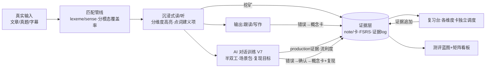
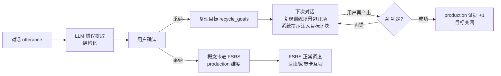
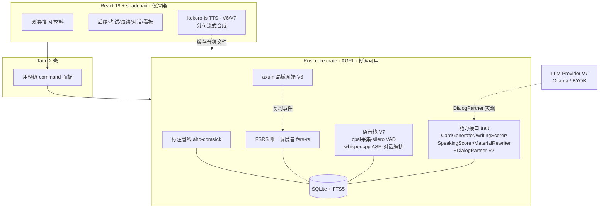
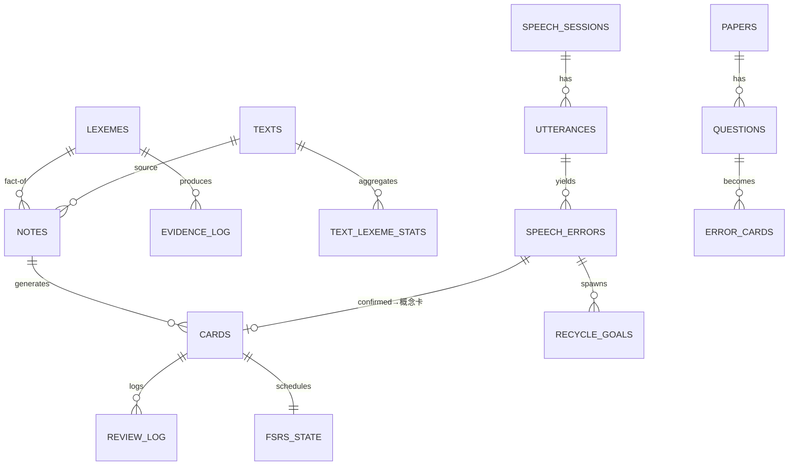
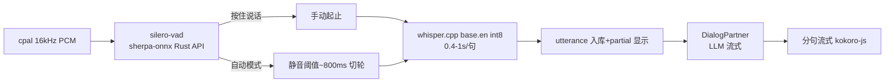
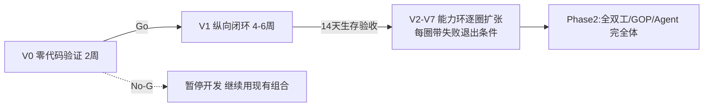

# 个人英语能力底座 · 项目方案（v1.4）

> **v1.4 的定位**：v1.3 的产品模型与工程架构**全部沿用**（能力矩阵、证据层、ADR-1 Rust fat core、Note/Card 调度、V0/V1 门控）。本版响应一个明确的新需求：**加入 AI 对话——用日常聊天训练口语，并对对话中的错误做强化修正训练**。为此新增：①**V7 能力环：AI 对话训练**（半双工先行），含对话语音栈完整设计（采集/VAD/识别/TTS/LLM）；②**强化修正训练闭环**——对话错误 → 结构化确认 → 概念卡进 FSRS → 下次对话复现引导 → production 证据，把口语真正接进证据层（外部检索确认：**"对话错误→SRS"目前没有完整的开源实现，是可确认的差异化空白**）；③语音栈调研落地（GitHub 项目核实：cpal、sherpa-onnx、silero-vad、smart-turn、pipecat 模式、freelingo 等）。
>
> 第四轮评审 = 用户需求 + 语音专项调研反推。**本轮仍然只出方案，不写代码。**

### 第四轮评审裁决表

| # | 评审意见 | 裁决 | v1.4 处理 |
|---|---|---|---|
| 1 | 用户需求：加 AI 对话，练口语日常聊天，做强化修正训练 | **采纳** | 新增 **V7 能力环**与第 13 节设计；强化修正闭环复用第 11 节"错题→概念卡+变式"机制，口语错误首次接入证据层 `production` 维度 |
| 2 | 声音获取方案：WebView2 `getUserMedia` 有"拒绝后无法再次弹窗"的已知坑（tauri#5042），MediaRecorder 只出 webm/opus 且采样率不可控 | **采纳** | **Rust 侧 cpal 采 16 kHz 单声道 PCM**，绕开 WebView2 权限与编码问题；按住说话与 VAD 自动切分共用同一条 PCM 流（第 19.5 节） |
| 3 | 对话识别方案：whisper.cpp 批量够 V7 半双工用；sherpa-rs（thewh1teagle）**已弃用**，VAD/流式应走 k2-fsa/sherpa-onnx 官方 Rust API（Apache-2.0） | **采纳** | V7：silero-vad（MIT）切分 + whisper.cpp base.en int8 批量转写；P2 全双工再上 sherpa-onnx 流式 zipformer（~20MB，RTF≈0.1）+ smart-turn 语义轮次（第 19.5 节） |
| 4 | 强化修正怎么设计才有效：二语习得研究表明流利型对话中**即时显式纠错破坏对话流**，recast（重铸）保流但 uptake 低，延迟报告利于反思（Lyster & Ranta 1997 六类 CF；ELSA/Duolingo Max 均用"对话中轻提示 + 会话后报告"组合） | **采纳** | 三层反馈：①对话中 recast 默认开、显式纠错默认关；②会话末 LLM 错误报告，**用户逐条确认**（防幻觉）；③确认的错误自动建概念卡 + 复现训练（第 13.3–13.5 节） |
| 5 | "对话错误→SRS"是否有人做过 | **核实：无完整开源先例** | freelingo 有语音+SRS 但两模块独立；Koala Cards 只有设计笔记。本产品的"错误→概念卡→下次对话引导复现→production 证据"闭环列为**差异化核心**，必须做进 V7 |
| 6 | 全双工/打断（barge-in）的复杂度：需要语义轮次检测、回声消除、播放中断 | **采纳后置** | V7 半双工（按住说话 + VAD 两种模式，延迟 1.5–2.5s 可接受）；barge-in/AEC/smart-turn 全部 P2（第 13.6 节） |
| 7 | 对话 TTS 不能整段合成：kokoro-js 冷启动 ~9s、warm 后短句 ~600ms，必须**分句流式**；Windows SpeechSynthesis TTFA ~50ms 可做零依赖兜底；edge-tts 是逆向非官方 API，历史多次封锁，不能当依赖 | **采纳** | 分句流式管线（标点驱动切分，>80 字符逗号二次切，每句 TTFA 目标 <1s）；SpeechSynthesis 兜底；edge-tts 仅可选在线增强并标注合规风险（第 19.1 节） |
| 8 | 发音评测的现实边界：开源 GOP 全在 Python 生态；自由对话场景（先 ASR 转写）音素级打分不可靠，只能词/句级 | **采纳** | V7 自由对话只做词/句级对照（ASR 错词 vs 目标词块）；音素级 GOP（wav2vec2→ONNX 自研，参照 OpenPronounce MIT 算法）留 P2 且仅限跟读/复述场景（第 19.6 节） |
| 9 | LLM Provider 何时进核心：对话绕不开 LLM，但云产品是商业化阶段的事 | **采纳** | V7 只做**最小 Provider**：Ollama 本地 / BYOK（OpenAI 兼容端点），注入既有能力接口；官方云仍在 MB，不提前（第 14.3、24 节） |
| 10 | 口语对话数据是否入证据层 | **采纳** | 新增 speech 域表（sessions/utterances/speech_errors/recycle_goals）；utterance 记流利度指标进矩阵"速度"行；复现成功记 production 证据（第 16 节） |

---

## 0. 一页速览

- **产品是什么**：一个本地优先的**语言能力底座**——按 lexeme 积累分技能证据，用 FSRS 调度具体记忆卡，所有学习场景读写同一份能力数据；**v1.4 新增：AI 口语对话作为第五个学习场景接入同一证据层**。
- **底层模型**：能力矩阵（R/L/S/W × 4 维度）+ 证据层掌握度。口语对话直接生产 `production` 证据与流利度指标，对话错误走"概念卡+复现训练"强化闭环。
- **怎么做**：V0（两周零代码验证）→ V1 纵向闭环 → V2–V6 能力环逐圈扩张 → **V7 AI 对话训练（半双工）** → Phase 2（全双工/雅思模考/发音 GOP/Agent 完全体）。每圈带失败退出条件。
- **内核归属（沿用 v1.3 ADR-1）**：Rust fat core——SQLite（rusqlite）、FSRS（fsrs-rs）、标注（aho-corasick）、局域网端（axum）、**语音（cpal 采集 + silero VAD + whisper.cpp 转写）**、对话编排；React 仅渲染；TTS 在 webview（kokoro-js）+ 分句流式。
- **首版默认技术栈（非锁死）**：Tauri 2 + React 19 + TS + shadcn/ui + rusqlite + fsrs-rs + ECDICT + kokoro-js(V6/V7) + cpal/sherpa-onnx-VAD/whisper.cpp(V7) + Ollama/BYOK(V7)。
- **本轮只出方案，不写代码。**

---

# 第一部分 产品本体

## 1. 0 号用户与产品边界

- **0 号用户 = 作者本人，自用优先**；外部商业化是自用验证后的期权。学习目标链：眼下六级 → 脱翻译读外网/论文 → 口语与雅思 → 接近英语思维（能力矩阵表达，非线性阶段）。
- **产品边界一句话**：做"可积累、可迁移、可验证的语言能力底座"。AI 对话必须沉淀为能力证据（production/流利度/错误卡），否则就是"又一个聊天玩具"——这是它区别于直接用 ChatGPT 语音聊天的唯一理由。

## 2. 能力矩阵（沿用 v1.2/v1.3）

| 技能 ＼ 维度 | 词汇/短语资产 | 理解/反应速度 | 输出准确度 | 中文依赖度 |
|---|---|---|---|---|
| **阅读 R** | 认读词汇量、搭配储备 | wpm、长句解析速度 | — | 查词/中文展开率 |
| **听力 L** | 听辨词汇量、音变识别 | 跟听速度、句中反应延迟 | — | 字幕/原文依赖率 |
| **口语 S** | 主动可调用词块 | 听问到开口启动延迟、**对话 wpm、填充词率（v1.4）** | 语法/搭配/发音评分 | 脑内中译英频率（自评） |
| **写作 W** | 主动可写词块 | 成稿速度 | 语法/搭配/连贯评分 | 中文构思痕迹（自评） |

- 每格独立证据与水平估计；允许不均衡状态可见。**v1.4：口语"速度"行的证据源从"跟读台"扩展为"跟读 + AI 对话"两源。**
- 目标包（Goal Packs）：六级 / 外刊论文 / 雅思 / **自由交流（v1.4 起由 V7 对话直接服务）**——只决定训练权重与材料源，不锁功能。

### 2.3 "英语思维"操作化（沿用，指标③④由 V7 自动补全）

5 个可测指标：①英英释义使用率；②英文复述质量；③听问到开口的启动延迟（**V7 对话自动记录**）；④中文辅助调用率（**对话中要求中文解释即计数**）；⑤影子跟读延迟稳定性。

## 3. 真正的对手（沿用 v1.3，补口语行）

| 场景 | 现有方案 | 断点 |
|---|---|---|
| 六级 | 不背单词/墨墨、ExamCrafts、每日英语听力、通用 AI | 词与题不通、错题不回炉、考完资产作废 |
| 外刊/论文 | 欧路、沉浸式翻译、Kimi/ChatGPT、LingQ | 机翻强化依赖；生词无分技能状态 |
| 口语 | ELSA/Speak/TalkPal（商业）、**GitHub 上 freelingo/dustland-talk/IELTS-Speaking-AI/LinguAI（开源）** | 无个人错误档案与长期曲线；**所有已查项目均未把对话错误接入 SRS**—— freelingo 最接近（语音+SRS 共存）但两模块独立 |
| 英语思维 | 无专门产品 | 空白带 |
| 底座 | Anki、通用大模型 | 不是能力底座；**直接用 ChatGPT 语音闲聊 = 无状态、无错误沉淀、无复现设计** |

五条正面回答沿用 v1.3（资产层 vs 问答层、跨场景连续性、撤拐方向、闭环回流、离线隐私）。**v1.4 增补第 6 条**：对口语，通用 AI 语音是"聊完即散"——本产品每场对话都留下：错误卡、复现目标、流利度曲线，下次对话从上次的错误继续（第 13 节）。

## 4. 形态与调度权（沿用）

- 桌面优先；FSRS 唯一调度者；Anki 只出不进；局域网复习端架构见第 19.4 节。
- **v1.4 补充**：口语对话是桌面场景（安静环境 + 头戴耳机），不改变形态判断；耳机同时是 P2 全双工的前置条件（回声消除）。

## 5. 内容获取策略（沿用）

拖文件夹/粘链接 30 秒入库；`.erpack` 资源包；新来源=新适配器；版权红线不变。**v1.4 补充**：对话场景包（点餐/机场/面试等）是"提示词 + 结束条件"配置而非题库，无版权问题（第 13.2 节）。

---

# 第二部分 学习模型

## 6. 学习科学原则（沿用，第 4 条扩写）

1. **可理解输入 i+1**：按分技能覆盖率辅助选材；95%/98% 仅选材参考。
2. **间隔重复 FSRS**：调度对象是具体记忆卡；同保持率下比 SM-2 少约 20–30% 复习量（open-spaced-repetition wiki；KDD'22，DOI 10.1145/3534678.3539081）。
3. **句子挖矿**：卡带真实语境与出处；复习卡可跳回原文。
4. **可理解输出 + 影子跟读 + **AI 对话（v1.4 扩写）**：输出训练分两路——跟读解决"说得对"，对话解决"说得开"。对话是唯一能同时训练启动延迟、流利度与真实交际策略的场景，且天然产生个人化错误流供强化训练。
5. **拐杖消退**：L1 中文为主→L2 折叠→L3 英英→L4 推断；软建议不硬锁。**对话中同样生效**：AI 回复附中文提示默认折叠（L2），逐级撤拐（第 13.3 节）。
6. **纠错反馈分层（v1.4 新增）**：流利型对话延迟纠错（保流），准确型练习即时纠错（促注意）；recast 默认、显式纠正可选（Lyster & Ranta 1997 六类 corrective feedback；prompts 比 recast 更促自纠——故复现训练用"诱导再说一次"而非"直接给答案"）。

## 7. 证据层掌握度模型（v1.3 沿用，7.3/7.4 微补）

### 7.1–7.2 基本单位与匹配管线（沿用 v1.3）

lexeme = lemma + POS + 义项；多词表达独立成 lexeme；匹配管线 = UAX#29 分词 → aho-corasick 最长匹配 → 专名/数字单列 → 用户点选义项消歧（V1 不引入词性标注器）。

### 7.3 证据维度（v1.4 微调：production 来源扩展）

| 证据维度 | 含义 | 主要来源 |
|---|---|---|
| `reading_recognition` | 文本中认读 | 阅读命中、认读卡 |
| `listening_recognition` | 听音辨义 | 字幕/音频语境、听辨卡 |
| `meaning_recall` | 义→词主动回想 | 回想卡 |
| `spelling` | 听音/看义拼写正确 | 听写卡 |
| `production` | 说/写中正确使用（含搭配） | 口语/写作卡、Agent 批改、**AI 对话 utterance（v1.4）** |
| `context_diversity` | 出现过的不同来源文本数 | 所有输入 |

### 7.4 卡模型与调度机制（沿用 v1.3）

Note/Card 分离（借 Anki）、revlog 列对齐、兄弟卡互埋、新卡上限（V1 期 5/天）、复习上限+负载均衡、easy days、postpone、leech（≥8 次 lapse）。**v1.4：对话错误产生的概念卡也走这套调度**（挂 production 维度），与考试错题概念卡同构。

### 7.5 派生状态（沿用）

六态为证据投影；mastered 要求 production 至少 1 次成功——**v1.4 起，对话复现训练是 production 证据的主要生产者**，口语对话由此直接推动 lexeme 走向 mastered。

### 7.6 分模态覆盖率与统计口径（沿用）

阅读/听力覆盖率分开统计；专名与数字不计入生词负担与词汇量；覆盖率按抽样物化+手动全量重算。

## 8. 拐杖消退与软门控（沿用）

L1–L4 作用于一切支撑性 UI（含对话的中文提示折叠）；永不硬锁；L3 英英释义源（WordNet/Wiktextract）V2 备料。

## 9. 核心闭环（v1.4：对话接入证据层）

---

# 第三部分 首版产品与能力环

## 10. V1 纵向闭环（沿用 v1.3，无变化）

粘贴文章 → 匹配标注 → 点词建 note+两卡 → 次日 FSRS 复习（互埋/上限/负载均衡）→ 证据回写 → 陌生新文重评。验收口径见第 17 节。TTS/对话均不在 V1。

## 11. 后续能力环（v1.4：插入 V7）

| 圈 | 内容 | 前置 |
|---|---|---|
| V2 材料与词库 | txt/epub、考纲牌组、最小看板、更多卡型、英英释义源 | V1 存活 |
| V3 考试模式 | 试卷解析器、整卷模考、错题新方案（概念卡+变式+1/3/7 重做） | V2 |
| V4 外网 | URL 导入 → WXT 扩展 | V2 |
| V5 论文 | PDF、AWL、搭配库 | V4 |
| V6 听口 | l_recog 卡、跟读台（whisper.cpp 词级时间戳比对）、**TTS 三路径决策落地**、局域网复习端 | V3 |
| **V7 AI 对话训练（v1.4 新增）** | cpal 采集+silero VAD+半双工对话、场景包（自由闲聊/角色扮演/复现训练）、**强化修正闭环**（错误报告→确认→概念卡→下次对话复现）、流利度指标 | V6（TTS 决策 + whisper.cpp） |
| Phase 2 | 全双工（smart-turn/barge-in/AEC）、发音音素级 GOP、雅思口写模考 band、Agent 完全体（长难句/批改/材料改写） | V3 之后按需 |

**失败退出条件（沿用 v1.3）**：某圈验收失败→冻结并归因（工具问题修一次 / 习惯问题降目标再验 / 机制问题砍掉）；同圈两败即砍；全局 kill = V1 失败且归因"机制无用"→项目暂停、资产保留。

## 12. 考试模块设计要点（V3，沿用）

整卷+710 分答题卡+计时；听力逐句字幕；客观题离线判分；错题→概念卡+变式；原题 1/3/7 重做。

## 13. AI 对话训练（V7，本版新增的核心设计）

### 13.1 目标与边界

- **目标**：日常聊天把"认识"练成"说得出口"——训练启动延迟、流利度、主动词块调用；同时把每场对话变成证据与卡片。
- **不是**：不做实时同传、不做纯聊天玩具、V7 不做口语考试评分（雅思模考在 P2）。
- **延迟目标（全本地半双工）**：用户说完→AI 开始答 ≤3s（ASR 0.4–1s + LLM 首 token 0.5–2s + TTS 首音频 0.6s）；行业口径 <800ms 才"自然"、>1.5s 明显劣化——**语言练习场景可接受 1.5–3s**（学习者本来就会停顿），不为 800ms 牺牲架构。

### 13.2 场景包（Scenario Packs）：一条管线，换 prompt 与结束条件

| 场景包 | 内容 | 结束条件 |
|---|---|---|
| 自由闲聊 | 日常话题，AI 主动续话题 | 定时（默认 10 分钟）或手动 |
| 角色扮演 | 点餐/机场/面试/租房等脚本场景 | 完成任务目标 |
| **复现训练** | 系统围绕"待复现词块"生成开场与引导话题（见 13.5） | 目标词块全部产出或超时 |
| 雅思模考（P2） | Part1/2/3 题卡→计时→band 评分 | 考完 |

场景包=提示词+结束条件+拐杖档预设，无版权内容。

### 13.3 对话中的反馈：recast 默认，显式纠正可选

- **recast（重铸，默认开）**：用户说 "I very like it"，AI 回复自然包含 "Oh, you really like it? ..."——正确形式融进对话，不点破、不打断。写进 AI system prompt。
- **显式即时纠正（默认关，可开）**：开启后 AI 在当前轮结束、AI 作答前用一行轻提示给出修正（如 "💡 更自然的说法：I really like it"）。仅提示不展开解释，解释留给会话报告。
- **中文拐杖**：AI 回复可附中文要点（默认折叠，L2 档），听不懂的点开；用户用中文提问计入"中文依赖"证据。

### 13.4 会话后：错误报告与确认（防幻觉是硬要求）

会话结束 30 秒内产出**错误报告**，每条结构化为：`原句 span → 修正 → 错误类型（语法/搭配/选词/疑似发音/流利度）→ 一句话解释`。

- **用户逐条确认（采纳/忽略）**是硬门槛：LLM 错误提取必然有幻觉，确认动作同时是一次主动注意（学习事件本身）。
- 疑似发音错误（ASR 转写明显偏离、但语法无误）只标记"建议跟读验证"，不直接建卡（自由对话里无法做音素级判定，见 19.6）。
- 报告同时给出本场流利度摘要：启动延迟均值、wpm、填充词次数（um/uh/like 词表匹配）。

### 13.5 强化修正训练闭环（差异化核心）

- 确认的错误自动生成**概念卡**（正面：语境原句挖空目标词块；背面：正确形式+一句话解释），走 7.4 全套调度；
- 同时登记**复现目标**：下次进入"复现训练"场景包时，AI 的 system prompt 注入待复现词块清单，通过话题设计诱导用户再产出（**elicitation 诱导自纠**——比直接重教更有效）；
- 用户再次正确产出 → `production` 证据 +1 → 推进 7.5 的 mastered 判定 → 目标关闭。**至此，读→矿→复习→对话→证据→再对话的环完全闭合**，这是"对话接进底座"而非"加个聊天功能"的全部含义。

### 13.6 全双工与打断（P2，显式后置）

barge-in（TTS 播放中 VAD 检出人声→停播+取消 LLM 生成，pipecat 控制帧模式）、smart-turn 语义轮次（BSD-2，int8 8MB，需自移植 ONNX）、回声消除（仅耳机场景）——全部 P2。V7 的半双工不是妥协而是教学选择：学习者需要"说完→想→听"的节奏，1.5–3s 延迟恰好留出思考时间。

---

# 第四部分 技术（v1.3 沿用，语音栈 v1.4 扩充）

## 14. 运行时架构

### 14.1 ADR-1（沿用 v1.3）：Rust fat core

标注管线、SQLite、FSRS、.apkg 导出、局域网端、**v1.4 追加：音频采集/VAD/ASR/对话编排**全在 Rust；React 只渲染。M0 spike 降级触发器不变（两周内"ECDICT 导入+点词高亮"做不完→评估 TS 内核，代价是砍局域网端；语音栈在降级场景同样收缩为 webview MediaRecorder 兜底）。

### 14.2 架构图

### 14.3 能力接口（v1.4：新增 DialogPartner）

Core 定义能力接口（Rust trait），离线给"未启用"桩，LLM 实现注入，**Agent 关闭产品完整**：
- `CardGenerator` / `WritingScorer` / `SpeakingScorer` / `MaterialRewriter`（P2 完全体）
- **`DialogPartner`（V7）**：`open_session(scenario, recycle_goals) → system_prompt`；`respond(history, user_utterance) → 流式回复`；`extract_errors(session) → Vec<SpeechError>`。V7 唯一实现=Ollama/BYOK（OpenAI 兼容协议，抄 LibreChat 的"引擎+端点+模型"三要素配置模式）。

### 14.4 IPC command 面（追加 V7 命令）

v1.3 的 12 个用例级 command 之外追加：`dialog_start(scenario)` / `dialog_audio_chunk(pcm)` / `dialog_end → 报告` / `confirm_error(id, accept)` / `get_recycle_goals`。音频不走 IPC：cpal 在 Rust 侧直接进对话编排管线，webview 只收事件（partial 转写、AI 回复文本）做渲染。

## 15. 默认技术栈与替换条件（v1.4 更新）

| 层 | 默认选型 | 替换条件 |
|---|---|---|
| 桌面壳/前端/存储/SRS/标注 | 沿用 v1.3：Tauri 2 + React 19 + rusqlite(+rusqlite_migration) + fsrs-rs + aho-corasick + ECDICT | 沿用 v1.3 替换条件 |
| **音频采集（V7）** | **cpal**（MIT/Apache，Rust 侧直采 16kHz PCM） | cpal 设备兼容问题 → webview getUserMedia 兜底（权限拒绝后需清 WebView2 数据重弹，已知坑 tauri#5042） |
| **VAD（V7）** | **silero-vad（MIT，v5 约 2.2MB）经 k2-fsa/sherpa-onnx 官方 Rust API（Apache-2.0）**；**不用已弃用的 sherpa-rs** | — |
| **ASR（V7）** | whisper.cpp base.en int8 批量（5–10s 语句 0.4–1s）；small 留离线精转 | 需要边说边出字 → sherpa-onnx 流式 zipformer small-en（~20MB，RTF≈0.1），P2 全双工必上 |
| **轮次结束（V7/P2）** | V7：静音阈值（~800ms，可调）+ 按住说话手动模式 | P2：smart-turn v3（BSD-2，int8 8MB，10–100ms 推理；官方推理为 Python，需自移植 ONNX） |
| **LLM（V7）** | Ollama（本地 7B Q4）或 BYOK OpenAI 兼容端点；短 system prompt + 流式 | —（云托管在 MB） |
| **TTS（V6/V7）** | kokoro-js 分句流式（warm ~600ms/句，WebGPU 加速）；Windows SpeechSynthesis 零依赖兜底（TTFA ~50ms，必须分句——15s 长文本暂停 bug）；edge-tts 仅可选在线增强（逆向 API，历史多次 403，合规风险标注） | 沿用 v1.3 三路径表（espeak 灰区→商业版前切 misaki sidecar 或 Piper MIT） |
| **发音评测（P2）** | wav2vec2 CTC→ONNX 经 `ort` 自研 logit-GOP（参照 OpenPronounce，MIT；数据集 speechocean762 CC BY 4.0 不打包进发行物） | 现成方案全在 Python 生态，不引入 |
| 协议 | 内核 AGPL-3.0 + 商业双授权；依赖准入清单更新：cpal/sherpa-onnx/silero-vad/smart-turn/whisper.cpp/whisper-rs 均宽松许可 | — |

## 16. 数据模型（v1.3 沿用 + speech 域新增）

- v1.3 全部表沿用（notes/cards/review_log/evidence_log/text_lexeme_stats/audio_cache/import_jobs/derived_cache/考试域）。
- **v1.4 新增**：
  - `speech_sessions`(id, scenario, mode[ptt/vad], started_at, duration_s, provider, summary)
  - `utterances`(id, session_id, role[user/ai], text, audio_ref, dur_ms, wpm, onset_delay_ms, fillers)
  - `speech_errors`(id, session_id, utterance_id, span_text, correction, error_type[grammar/collocation/word_choice/pronunciation_suspect/fluency], explanation, status[pending/confirmed/dismissed], card_id)
  - `recycle_goals`(id, error_id, target_note_id, status[open/closed], attempts, created_at)
  - utterance 音频默认保留 30 天可配置（防体积膨胀）；utterance 落 `evidence_log`（production 维度，confidence 由 AI 判定+用户确认加权）。

## 17. 测评蓝图与指标（v1.3 沿用，过程指标补口语）

- 主指标/诊断/依赖口径不变：测评蓝图仍冻结规格、每两周抽未见平行文本；**覆盖率只展示不验收**（V1 验收口径 = 旧词重现率 + 陌生同级文章每百词主动查词数下降 + 可选手工小测，见第 10 节）。
- **过程指标（v1.4 增补）**：true retention、leech 数、新卡积压之外，新增**口语**：对话场次/周、平均启动延迟、对话 wpm、填充词率、复现目标关闭率（recycle 关闭数/创建数——强化闭环的健康度指标）。
- 矩阵看板口语格的证据源 = 跟读 + 对话双源。

## 18. FSRS 使用与同步策略（v1.3 沿用，无实质变化）

fsrs-rs；desired retention 0.90；~100/~400 条分级解锁拟合、每月或翻倍重拟；兄弟卡互埋/上限/负载均衡；跨实现对拍测试；.apkg 单向导出（稳定键 guid）。对话概念卡同走此套调度。

## 19. 语音管线与局域网端

### 19.1 TTS（v1.3 三路径沿用 + v1.4 对话流式）

- v1.3 结论沿用：主选 kokoro-js（espeak 灰区标注，商业版前切干净路径）；Piper MIT 冻结版兜底；misaki=Apache-2.0。
- **v1.4 对话模式**：LLM 流式输出 → 句末标点切分（>80 字符在逗号二次切）→ 逐句送 kokoro-js（WebGPU，warm ~600ms/句，TTFA 目标 <1s）→ 句间无缝衔接；SpeechSynthesis 兜底引擎；卡片音频仍走 audio_cache 的 cache-aside 惯例。

### 19.2 STT（V7 更新）

whisper.cpp base.en int8 批量（够半双工）；whisper.cpp 词级时间戳（`-ml 1` + token_timestamps，精度"quite off"但跟读高亮够用）；流式 zipformer 留 P2。

### 19.3 跟读比对（V6，沿用+明确）

whisper.cpp 词级时间戳 vs 参考文本对齐 → 漏读/多读/错读高亮；句级相似度打分；音素级 GOP 留 P2（19.6）。

### 19.4 局域网复习端（V6，沿用 v1.3）

Tauri 进程内 axum + Bearer token + 事件回传；.apkg 保底。

### 19.5 对话语音栈（V7，v1.4 新增）

- **为什么不用 webview 麦克风**：getUserMedia 权限被拒后 WebView2 无法再次弹窗（tauri#5042），MediaRecorder 仅 webm/opus 且采样率约束被忽略——cpal 直采 16k f32 PCM，VAD/whisper 都吃这个格式，零转换。
- 按住说话（空格键）与 VAD 自动切分共用同一条 PCM 流与同一条 ASR 管线，只差起止判定。

### 19.6 发音评测（P2，边界明确）

- **跟读/复述（文本已知）**：wav2vec2 CTC（espeak 音素）→ ONNX → `ort` 跑 logit-GOP，音素级打分可行（OpenPronounce 在 speechocean762 上 ρ≈0.65，够自用反馈）；
- **自由对话（文本未知）**：只能词/句级（ASR 错词对照目标词块），UI 明示"非音素级"——不假装能做 ELSA 级音素评分。

## 20. 工程基线（v1.3 沿用 + 语音项）

迁移（rusqlite_migration）、备份（WAL+VACUUM INTO 滚动 7 份+integrity_check）、导出、依赖准入、性能预算、可观测全部沿用 v1.3 第 19 节。**v1.4 追加**：
- golden 语料测试外，**ASR 回归集**：10 段真人录音（不同口音/语速）+ 期望转写，whisper 模型升级时比对 WER 不回退；
- 对话编排层用 channel+enum 实现 pipecat 的 Frame 模式（AudioFrame/PartialTextFrame/UserSpeakingFrame/CancelFrame），**文本旁路聚合**（音频流播放、文本流喂错误检测/历史聚合）；
- utterance 音频落盘目录与 audio_cache 分离，清理任务随每日备份跑。

---

# 第五部分 验证、计划与商业化

## 21. 总体推进结构

## 22. V0 零代码验证（沿用 v1.3，无变化）

摩擦日志 + 基线 + **手工标注预演**（可解析 token 未命中 ≤5%、义项判定 ≤15s/词）+ 3 天轻量纸面闭环；四条 Go 门槛数字前置承诺。

## 23. 路线图与砍项（v1.4：插入 V7）

| 阶段 | 周次 | 内容 | 验收 | 超时先砍 |
|---|---|---|---|---|
| V0 | 第 -2~0 周 | 零代码验证 | 四条 Go 门槛 | — |
| V1 | 第 1–6 周 | 纵向闭环 | 14 天生存验收（17.4 口径） | 砍 cloze 只留认读 |
| V2 | 第 7–12 周 | 材料与词库 | 日常材料全可导入 | epub→txt/md |
| V3 | 第 13–20 周 | 考试模式+错题方案 | 不联网六级闭环+14 天自用 | 写作范文对照、OCR |
| V4 | 第 21–28 周 | 外网 | 30 秒入库 | 扩展本身 |
| V5 | 第 29–34 周 | 论文 | 读完一整篇论文 | 双栏美化 |
| V6 | 第 35–42 周 | 听口+TTS 落地+局域网端 | 全离线精听闭环 | 全局第一砍序位 |
| **V7** | **第 43–50 周** | **AI 对话训练：cpal+VAD+半双工+场景包+强化修正闭环** | ①连续 2 周 ≥10 场对话（每场 ≥5 轮）；②错误→确认→概念卡→复现闭环跑通 ≥10 次；③全本地每轮响应 ≤3s；④"想直接用 ChatGPT 语音聊"次数趋零 | 场景包砍到只留自由闲聊；VAD 自动模式砍到只留按住说话 |
| P2 | 其后 | 全双工、GOP、雅思模考、Agent 完全体、MV/MB | 见第 24 节 | — |

**总砍序（v1.4 更新）**：V7 对话 → V6 听口 → V5 论文 → V4 扩展（V7 最新、未经生存验证，砍序首位；但 V7 依赖 V6 的 TTS/STT 基建，若自用数据显示口语需求强于精听，可在 V6 时合并最小 V7 提前）。

## 24. 商业化（沿用，v1.4 补两句）

- open-core 三层不变；MV 滩头仍是科研读文献人群。
- **v1.4 补充**：①对话功能的 LLM 默认本地（Ollama）或 BYOK，免费；官方云托管模型/评测属于 MB——对话本身不改变"云是第二个项目"的判断；②诚实标注：对话能力服务"自由交流"目标包，不是科研滩头的核心卖点，商业化叙事仍押文献场景。
- TTS espeak 灰区、GPL 依赖进程隔离的清障要求沿用第 23 节（v1.3）。

## 25. 风险与对策（v1.4 更新）

| 风险 | 对策 |
|---|---|
| （v1.3 全部风险沿用：前提/Rust 速度/过度工程/派生直觉/匹配复杂/复习雪球/TTS 灰区/重标注失真/排期/提前接 AI/许可） | 见 v1.3 对策，全部保留 |
| **对话延迟不达标（本地 7B CPU 首 token 2s+）** | 半双工接受 2–3s（教学场景反而要停顿）；不行→BYOK 云端 LLM 或 GPU（Vulkan）选项 |
| **LLM 错误提取幻觉** | 用户逐条确认硬门槛；只提取可验证类型；发音疑错只标记不建卡；错误卡模板化生成而非 LLM 自由发挥 |
| **麦克风权限/设备问题** | cpal 原生采集绕开 WebView2 权限坑；首次运行设备自检+失败引导；耳机为推荐配置 |
| **对话变成聊天玩具（用了但没沉淀）** | 场次/闭环指标进看板；复现目标关闭率作为 V7 生存验收指标之一；报告确认率异常低→对话设计回炉 |
| **音频体积膨胀** | utterance 音频默认 30 天滚动清理；卡片音频走 audio_cache 去重 |
| **LLM 依赖过重（离线完整性倒退）** | DialogPartner 未启用时对话环整体不可用但产品完整；复现目标不依赖 LLM 也能以"跟读任务"形式兜底执行 |

## 26. 开工前备料（V0 期间可做）

v1.3 第 25 节全部沿用（V0 日志、ECDICT、标注预演文本、环境）。**v1.4 追加（V6/V7 前完成即可）**：Ollama + qwen2.5:7b-instruct-q4 或 llama3.1:8b（离线对话用）；一副头戴耳机（P2 AEC 前置）；10 段自录语音作 ASR 回归集。

## 27. 参考资料

**v1.3 全部参考沿用**（Lute3/yomitan/LingQ/Anki/FSRS/Tauri/语音许可，见 v1.3 第 26 节）。

**v1.4 新增（语音栈与对话）**
- sherpa-onnx（官方 Rust API，Apache-2.0，含 VAD/流式 zipformer）：https://github.com/k2-fsa/sherpa-onnx ；流式模型文档：https://k2-fsa.github.io/sherpa/onnx/pretrained_models/online-transducer/zipformer-transducer-models.html ；sherpa-rs（已弃用，勿用）：https://github.com/thewh1teagle/sherpa-rs
- silero-vad（MIT）：https://github.com/snakers4/silero-vad
- smart-turn（BSD-2，语义轮次）：https://github.com/pipecat-ai/smart-turn
- cpal：https://github.com/RustAudio/cpal
- Tauri 麦克风权限坑：https://github.com/tauri-apps/tauri/issues/5042
- pipecat（Frame 管线/打断/上下文聚合，架构参照）：https://github.com/pipecat-ai/pipecat ；https://docs.pipecat.ai/pipecat/learn/pipeline
- 同类口语项目：freelingo（语音+SRS 未打通）：https://github.com/artcc/freelingo ；dustland/talk（雅思）：https://github.com/dustland/talk ；IELTS-Speaking-AI：https://github.com/1599570912/IELTS-Speaking-AI ；LinguAI：https://github.com/yatinbhalla/LinguAI
- LibreChat 语音配置模式（engine+endpoint+model）：https://www.librechat.ai/docs/configuration/stt_tts
- 纠错反馈研究：Lyster & Ranta 1997（六类 CF）：https://www.researchgate.net/publication/252160472 ；综述（recast vs prompts uptake）：https://pmc.ncbi.nlm.nih.gov/articles/PMC8318991/
- 发音评测：OpenPronounce（MIT，wav2vec2+DTW）：https://github.com/Halleck45/OpenPronounce ；GOPT：https://github.com/YuanGongND/gopt ；speechocean762（CC BY 4.0）：https://github.com/jimbozhang/speechocean762
- whisper.cpp 词级时间戳讨论：https://github.com/ggml-org/whisper.cpp/discussions/2307 ；whisperX（BSD-2，Python）：https://github.com/m-bain/whisperX
- 分句流式 TTS 参照：StreamingKokoroJS：https://github.com/rhulha/StreamingKokoroJS ；sentence-stream：https://github.com/OHF-Voice/sentence-stream
- edge-tts 封锁史（合规风险依据）：https://github.com/rany2/edge-tts/issues/290 ；https://github.com/rany2/edge-tts/issues/458
- 语音延迟基准：https://www.masterofcode.com/blog/voice-ai-latency
- "对话错误→SRS"空白佐证（Koala Cards 设计笔记）：https://rickcarlino.com/notes/spaced-repetition-and-learning-techniques/how-can-koala-cards-turn-user-errors-into-lessons.html

## 变更记录

| 版本 | 日期 | 变更 |
|---|---|---|
| v0.1–v1.0 | 2026-09-11 | 调研→双层架构→技术定稿 |
| v1.1 | 2026-09-11 | 产品前提、六态状态机、锚定指标、软门控、砍项 |
| v1.2 | 2026-09-12 | 能力矩阵；证据层+派生状态；测评蓝图；V0 前移；V1 纵向闭环；TTS 换 Kokoro；商业化收敛 |
| v1.3 | 2026-09-12 | ADR-1 Rust fat core；Note/Card 分离与调度机制；运行时标注；V0 手工标注预演；V1 验收去循环化；失败退出条件；语音三路径；工程基线 |
| **v1.4** | 2026-09-12 | **新增 V7 AI 对话训练（cpal 采集+silero VAD+whisper.cpp 半双工+场景包）；强化修正训练闭环（recast 默认+错误报告确认+概念卡+复现训练接 production 证据，确认为开源界差异化空白）；DialogPartner 能力接口与最小 LLM Provider（Ollama/BYOK）；speech 域数据模型；分句流式 TTS；发音评测边界（对话词/句级、GOP 留 P2 限跟读）；全双工/barge-in/smart-turn 显式后置 P2** |
