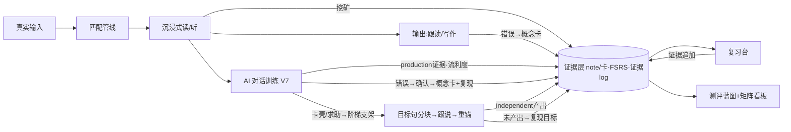
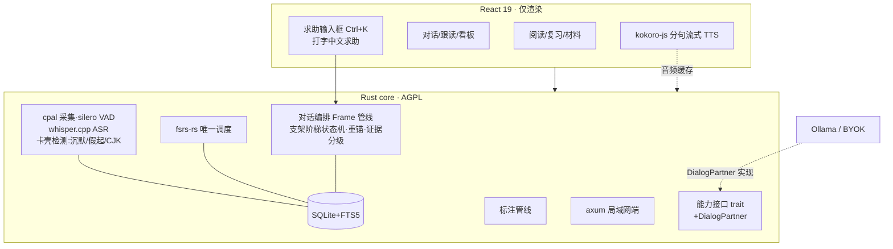

# 个人英语能力底座 · 项目方案（v1.5）

> **v1.5 的定位**：v1.4 的产品模型、工程架构与 V7 对话设计**全部沿用**。本版专攻一个此前设计最薄弱的场景：**用户卡壳与中文求助**——用户说到一半说不下去（沉默、反复放弃开头），或者直接用中文问"我想说……但是我不知道怎么说"，系统该怎么反馈。为此做了两路调研：①产品级（Speak 的母语降级/"刚好够"提示/次日迷你课机制、Gliglish/Univerbal/Langua 的提示按钮、Duolingo Max 与 ChatGPT 语音的无设计反例）；②理论级（Swain 的 languaging——求助本身是高价值学习事件；Rowe 的 wait-time 研究——沉默介入的 3 秒依据；circumlocution 绕说策略可训练；contingent scaffolding 支架渐撤）。落地为：**卡壳双通道检测、打字为主的求助通道、五级支架阶梯、求助回流与 production 证据分级**。
>
> 第五轮评审 = 用户需求 + 专项调研反推。**本轮仍然只出方案，不写代码。**

### 第五轮评审裁决表

| # | 评审意见 | 裁决 | v1.5 处理 |
|---|---|---|---|
| 1 | 用户需求：补齐"用户卡壳"和"用中文问我想说但不知道怎么说"时的反馈方案 | **采纳（本版核心）** | 新增 13.6–13.11：卡壳识别、求助通道、五级支架阶梯、重锚回流、证据分级、prompt 规范 |
| 2 | Speak 的可还原机制：卡壳时可降级用母语说、AI 给"刚好够"的提示（不给完整答案）、Premium Plus 把"没说出的话"自动生成次日 1–2 分钟迷你课、卡壳点优先进复习 | **采纳** | 五级阶梯的"刚好够"原则 + 求助回流（13.9）；迷你课对应本方案的复现训练场景包（13.5 已有），不另建 |
| 3 | 沉默多久该介入：Rowe wait-time 研究——教师平均等待不足 1 秒，延长到约 3 秒学生回答的长度/质量显著增加 | **采纳** | 0–3s 绝不介入；3–5s 轻介入；约 10s 或 2 次假起升支架（13.6） |
| 4 | "我想说但不会说"是学习事件不是失败：Swain 的 languaging——用语言讨论语言本身就是学习 | **采纳** | 求助不惩罚、不计失误；求助必回流（建卡+复现目标）、必重锚（13.9）；求助次数计入"中文依赖"证据而非扣分 |
| 5 | 绕说（circumlocution）是可训练的交际策略（Maleki 2007 实验；ACTFL OPI 视为中高级标志能力） | **采纳** | 支架 3 级正式做成功能："试着描述它"，先诱导绕说、不直接给词（13.8） |
| 6 | 混合语言 ASR 本地不可靠：base.en 对中文是幻觉输出；multilingual 模型按 30s 窗口判语言、句内 code-switching 差（学术微调后 MER 仍 ~14%）；ChatGPT 语音的中英夹杂被用户大量报告"整体漂移成中文" | **采纳** | **求助主走打字**（快捷键唤出，桌面打字成本极低，打中文同样是 languaging）；语音通道保持纯英语，CJK 字符/空输出仅作启发式兜底（提示改打字）；multilingual whisper 为可选下载不默认（13.7、第 15 节） |
| 7 | "抄答案"抱怨：Gliglish 直接建议下一句、Langua 自动建议回复，被批削弱产出；TalkPal 只有翻译按钮，新手每句都靠它成依赖 | **采纳** | 翻译与整句只在 4 级出现且必须重锚自产出；**不做自动建议回复**；4 级后强制重锚（13.8–13.9） |
| 8 | Praktika 全局切母语模式被批破坏沉浸 | **采纳** | 不做全局母语模式；拐杖仍是逐句折叠（L1–L4），求助按次触发 |
| 9 | production 证据需要分级：支架后产出 ≠ 独立产出 | **采纳** | `production_kind`（independent/assisted/helped）入 utterances 与证据；**mastered 判定只认 independent**（7.5 修订、13.10） |
| 10 | 语言漂移护栏：AI 被用户中文带跑是真实风险 | **采纳** | prompt 分节规范五种时刻 + 对话脚本回归集（13.11）；角色永远用英语继续，中文只出现在括号释义与求助响应里 |

---

## 0. 一页速览

- **产品是什么**：一个本地优先的**语言能力底座**——按 lexeme 积累分技能证据，用 FSRS 调度具体记忆卡，所有学习场景读写同一份能力数据；AI 口语对话作为第五个学习场景接入同一证据层。
- **底层模型**：能力矩阵（R/L/S/W × 4 维度）+ 证据层掌握度。对话直接生产 `production` 证据（**分级：independent/assisted/helped**）与流利度指标；对话错误与"没说出的话"都走"概念卡+复现训练"强化闭环。
- **卡壳与求助（v1.5 新增）**：0–3s 不介入（wait-time）、3–5s 轻介入、假起升级支架；**五级阶梯**等待→降难→句首→绕说→求助响应（翻译只在最重一级）；求助主走**打字**；求助永不浪费——必重锚、必建卡、必进复现目标。
- **怎么做**：V0 → V1 纵向闭环 → V2–V6 能力环 → V7 AI 对话训练（半双工）→ Phase 2（全双工/GOP/Agent 完全体）。每圈带失败退出条件。
- **内核归属（沿用 ADR-1）**：Rust fat core（cpal 采集+silero VAD+whisper.cpp+对话编排+SQLite+fsrs-rs+axum）；React 仅渲染；TTS 在 webview（kokoro-js 分句流式）。
- **本轮只出方案，不写代码。**

---

# 第一部分 产品本体

## 1. 0 号用户与产品边界

- **0 号用户 = 作者本人，自用优先**。学习目标链：眼下六级 → 脱翻译读外网/论文 → 口语与雅思 → 接近英语思维（能力矩阵表达，非线性阶段）。
- **产品边界一句话**：做"可积累、可迁移、可验证的语言能力底座"。AI 对话必须沉淀为能力证据，否则就是"又一个聊天玩具"——卡壳和求助 moments 恰恰是最值得沉淀的原料（v1.5 的立场：求助不是对话的失败，是对话的产出之一）。

## 2. 能力矩阵（沿用 v1.4）

| 技能 ＼ 维度 | 词汇/短语资产 | 理解/反应速度 | 输出准确度 | 中文依赖度 |
|---|---|---|---|---|
| **阅读 R** | 认读词汇量、搭配储备 | wpm、长句解析速度 | — | 查词/中文展开率 |
| **听力 L** | 听辨词汇量、音变识别 | 跟听速度、句中反应延迟 | — | 字幕/原文依赖率 |
| **口语 S** | 主动可调用词块 | 听问到开口启动延迟、对话 wpm、填充词率 | 语法/搭配/发音评分 | **求助次数/场（v1.5）**、脑内中译英频率（自评） |
| **写作 W** | 主动可写词块 | 成稿速度 | 语法/搭配/连贯评分 | 中文构思痕迹（自评） |

- 目标包：六级 / 外刊论文 / 雅思 / 自由交流——只决定训练权重与材料源，不锁功能。

### 2.3 "英语思维"操作化（v1.4 沿用，指标④补自动计数）

①英英释义使用率；②英文复述质量；③听问到开口的启动延迟（对话自动记录）；④中文辅助调用率（**v1.5：中文求助次数自动计入**）；⑤影子跟读延迟稳定性。

## 3. 真正的对手（v1.4 沿用，口语行补齐）

| 场景 | 现有方案 | 断点 |
|---|---|---|
| 口语 | ELSA/Speak/TalkPal（商业）；开源 freelingo/dustland-talk/IELTS-Speaking-AI/LinguAI；**卡壳求助设计：Speak 母语降级+hint+迷你课、Gliglish Suggestions+Ask in your language、Univerbal Hint/Translator 并置、Langua 灯泡/乌龟慢速/整段母语** | 无个人错误档案；**对话错误不进 SRS（开源界空白）**；Duolingo Max 无 hint 按钮（用户"没话可说"只能挂断）；TalkPal 依赖陷阱；ChatGPT 语音求助内容不回流、中英夹杂语言漂移 |

五条正面回答沿用 v1.3 + v1.4 增补第 6 条。**v1.5 再补第 7 条**：对"卡壳时刻"，通用 AI 是"帮你把话说完然后忘掉"——本产品把它变成：目标句分块→跟说→重锚再产出→建卡→次日复现，**一次求助走完一个记忆循环**。

## 4. 形态与调度权（沿用 v1.4）

桌面优先；FSRS 唯一调度者；Anki 只出不进；局域网端见第 19.4 节；耳机为对话推荐配置。

## 5. 内容获取策略（沿用 v1.4）

30 秒入库；`.erpack`；新来源=新适配器；版权红线不变。场景包是"提示词+结束条件"配置，无版权问题。

---

# 第二部分 学习模型

## 6. 学习科学原则（v1.4 沿用，第 6 条扩写）

1. **可理解输入 i+1**：覆盖率辅助选材，95%/98% 仅参考。
2. **间隔重复 FSRS**：调度具体记忆卡；同保持率下比 SM-2 少 20–30% 复习量（FSRS wiki；KDD'22）。
3. **句子挖矿**：卡带真实语境；复习卡可跳回原文。
4. **可理解输出 + 影子跟读 + AI 对话**：跟读解决"说得对"，对话解决"说得开"；对话天然产生个人化错误流供强化训练。
5. **拐杖消退**：L1–L4 作用于一切支撑性 UI（含对话中文提示折叠）；软建议不硬锁。**求助是拐杖的一种用法而非拐杖本身**——每次求助都被安排"下一次不用拐杖走同一段路"（复现训练）。
6. **纠错反馈分层**：流利型对话延迟纠错、准确型练习即时纠错；recast 默认、显式纠正可选（Lyster & Ranta）。
7. **卡壳即学习事件（v1.5 新增）**：①求助=**languaging**（Swain：用语言讨论语言本身就是学习）；②介入要等——**wait-time 约 3 秒**起（Rowe：教师平均等待 <1s，延至 3s 产出显著变长变好）；③先诱导**绕说**（circumlocution，可训练，ACTFL 中高级标志能力），后给答案；④支架要**应变且渐撤**（contingent scaffolding：用户重新开口即逐级撤），翻译是最后一级不是第一级。

## 7. 证据层掌握度模型

### 7.1–7.3 基本单位、匹配管线与证据维度（沿用 v1.4）

lexeme = lemma+POS+义项；证据六维度；`production` 来源含 AI 对话 utterance。

### 7.4 卡模型与调度机制（沿用 v1.4）

Note/Card 分离、revlog 对齐、互埋、上限、负载均衡、easy days、postpone、leech；对话错误产生的概念卡走同一套调度。

### 7.5 派生状态（v1.5 修订 mastered 口径）

- 六态为证据投影；派生规则同 v1.4。
- **mastered 修订**：production 至少 **1 次独立成功（independent）**——assisted（支架后产出）与 helped（求助直接给答案后的跟说）**不计入** mastered，但计入 learning 进度（分级见 13.10）。理由：mastered 的含义是"无需支撑说得出"，支架后产出恰好证明"有支撑说得出"。

### 7.6 分模态覆盖率与统计口径（沿用 v1.4）

阅读/听力分开；专名数字不入词汇量；抽样物化+手动重算。

## 8. 拐杖消退与软门控（沿用 v1.4）

L1–L4 作用于一切支撑性 UI；永不硬锁；L3 英英源 V2 备料。**v1.5 明确**：对话内的求助走第 13 节五级阶梯，与全局拐杖档联动（拐杖档越高，2/3 级支架越早出现；L4 档下 4 级翻译前先强制 3 级绕说）。

## 9. 核心闭环（v1.5：求助接入）

---

# 第三部分 首版产品与能力环

## 10. V1 纵向闭环（沿用 v1.4）

粘贴文章 → 匹配 → 点词建卡 → 次日 FSRS 复习 → 证据回写 → 新文重评；验收口径见第 17 节；TTS/对话不在 V1。

## 11. 后续能力环（v1.5：V7 范围微调）

| 圈 | 内容 | 前置 |
|---|---|---|
| V2–V6 | 沿用 v1.4（材料/考试/外网/论文/听口+TTS 落地+局域网端） | — |
| **V7 AI 对话训练** | cpal+VAD+半双工对话、场景包、强化修正闭环、**卡壳识别与五级支架阶梯、打字求助通道、求助回流**、流利度指标 | V6 |
| Phase 2 | 全双工（smart-turn/barge-in/AEC）、音素级 GOP、雅思口写模考、Agent 完全体 | V3 之后按需 |

**失败退出条件（沿用）**：归因三选一；同圈两败即砍；全局 kill = V1 失败且归因"机制无用"。

## 12. 考试模块设计要点（V3，沿用）

## 13. AI 对话训练（V7，v1.5 扩写）

### 13.1 目标与边界

- 目标：日常聊天把"认识"练成"说得出口"；每场对话留下证据与卡片。
- 不是：不做实时同传、不做纯聊天玩具、V7 不做口语考试评分。
- 延迟目标：全本地半双工每轮 ≤3s（ASR 0.4–1s + LLM 首 token 0.5–2s + TTS 首音频 0.6s）；**求助响应另计 ≤2s**（打字求助无需 ASR，LLM 直接响应，感知更快）。

### 13.2 场景包（沿用 v1.4）

自由闲聊 / 角色扮演 / **复现训练** / 雅思模考（P2）；场景包=提示词+结束条件+拐杖档预设。

### 13.3 对话中的反馈（沿用 v1.4）

recast 默认开；显式即时纠正默认关（一行轻提示）；中文要点默认折叠（L2）。

### 13.4 会话后：错误报告与确认（沿用 v1.4）

LLM 结构化错误→用户逐条确认（防幻觉）→概念卡+复现目标；疑似发音错误只标记"建议跟读验证"；流利度摘要（启动延迟/wpm/填充词）。

### 13.5 强化修正训练闭环（沿用 v1.4）

确认的错误→概念卡进 FSRS+复现目标；复现训练场景包开场注入待复现词块；再产出成功→production 证据+1→目标关闭。

### 13.6 卡壳识别（v1.5 新增：被动检测，双通道）

| 信号 | 检测方式 | 阈值/依据 |
|---|---|---|
| 沉默 | 该用户开口而无声（VAD） | **0–3s 绝不介入**（Rowe wait-time：3s 前介入会显著缩短学习者产出）；3–5s 轻介入 |
| 假起（false start） | 同轮内 ≥2 次放弃性开头（<5 词即断，VAD 切段+ASR partial） | 升一级支架 |
| 长卡顿 | 同轮累计静默/填充 ~10s | 升一级支架 |
| 中文误入语音 | ASR 输出含 CJK 字符（`[\u4e00-\u9fff]`）或空输出/被过滤（whisper 自带 `no_speech_prob>0.6 且 avg_logprob<-1.0` 口径） | 判定"想求助"→引导打字求助（base.en 对中文是幻觉输出，不硬转） |

- **所有检测不计惩罚、不打断角色**（Speak 原则：先流利后准确；求助/卡壳只进报告不扣分）。
- 检测只在"轮到用户说"的窗口内生效；用户在 AI 说话时保持安静是正常听辨，不是卡壳。

### 13.7 求助通道（v1.5 新增：主动触发）

- **主通道：打字求助**。快捷键（默认 Ctrl+K）或长按"帮我说"按钮唤出输入框，输入中文（"我想说……但是不知道怎么说"，或直接一句话）。桌面打字成本极低；打中文同样是 languaging，学习价值不减；语音通道保持纯英语，强化"坚持英语"的产品主张。
- **辅通道：语音里自然说中文**（Gliglish/Speak 式"用母语提问"）。V7 实现为启发式：CJK/空输出检测→弹出"是不是想说中文？点这里打字求助"引导，同时把该段标记为求助意图（不要求用户重说）。multilingual whisper（base/small）作**可选下载兜底**（能整句转中文），不默认装、不追求句内 code-switching。
- **不做**：全局"母语模式"（Praktika 被批破坏沉浸）、自动建议回复（Langua/Gliglish 被批"抄答案"、TalkPal 依赖陷阱）。

### 13.8 五级支架阶梯（v1.5 核心新增：contingent scaffolding）

原则：**应变**（按信号逐级升）、**渐撤**（用户重新开口即逐级退）、**责任转移**（最终要用户自己产出）；翻译是最后一级，不是第一级。

| 级 | 动作 | 触发 | 出口 |
|---|---|---|---|
| 0 等待 | 沉默注视，AI 不接话 | 0–3s | 用户开口→结束 |
| 1 降难 | AI 换更简单问法 / 二选一问题 | 3–5s 沉默 | 同上 |
| 2 句首支架 | 给 sentence starter（"You could start with 'I was wondering if…'"） | 5s+ 或 1 次假起 | 同上 |
| 3 绕说引导 | "试着描述它：it's a thing you use to…"（不点破目标词） | 2 次假起或 2 级后仍卡 | 用户绕说成功→AI 接住并顺势给目标词（"Oh, a whisk!"）→**仍登记复现目标**（绕说成功但目标词尚未主动产出） |
| 4 求助响应 | **目标英文句**分 2–3 个 chunk 高亮（关键词块联动词典/lexeme）+ 乌龟慢速带读（Langua 模式）→ 用户跟说 1–2 遍（ASR 校验字词） | 用户明确求助（打字/语音中文）或 3 级仍卡 | 跟说通过→**立即重锚**（13.9） |
| 5 保流退出 | AI 自然继续对话，不再纠缠 | 4 级重锚后仍未产出 | 词块自动进复现目标，次日复现训练场景包再练 |

- "刚好够"原则（Speak）：1–3 级永远不给完整答案，防"抄答案"感。
- 拐杖档联动（第 8 节）：L1/L2 档下 4 级响应直接给中文对照；L3/L4 档下 4 级前必须先过 3 级绕说。

### 13.9 重锚与求助回流（v1.5：求助永不浪费）

- **重锚（Speak 的同话题重练）**：4 级跟说通过后，AI 不换话题，立即在**同一语境**抛一个必须用到目标句的追问（如用户求助"我想说这家店比那家便宜"→跟说 "This place is cheaper than that one" → AI 追问 "Cheaper by how much? Convince me!"）→ 用户再产出一次。
- **回流三件套**（对照 ChatGPT 语音"求助完就散"）：①目标句的关键词块自动**建卡**（认读/挖空卡，走 7.4 调度）；②登记**复现目标**（recycle_goals，13.5 机制）——次日复现训练场景包围绕它开场；③该句进入会话报告"今天没说出的 3 句话"清单（Speak 迷你课的对应物，由复现场景包承接）。
- **求助次数**计入"中文依赖度"证据（不惩罚，但曲线可见——依赖度下降本身是产品北极星之一）。

### 13.10 production 证据分级（v1.5：mastered 口径落地）

| 产出方式 | production_kind | 证据 confidence | 计入 mastered？ |
|---|---|---|---|
| 无支架独立说出 | `independent` | 1.0 | **是** |
| 1–3 级支架后说出 | `assisted`（记录 scaffold_level） | 0.6 | 否（计入 learning） |
| 4 级求助后跟说/重锚产出 | `helped` | 0.3 | 否（计入学习事件） |
| 复现训练中独立产出 | `independent`（recycled 标记） | 1.0 | 是 |

utterance 记 `production_kind + scaffold_level`，证据按上表落 `evidence_log`；会话报告分列"独立产出 / 支架产出 / 求助"三类，让进步可见。

### 13.11 prompt 规范与回归脚本（v1.5：把行为写进测试）

- DialogPartner 的 system prompt **分节定义六种时刻**：正常对话（recast 规则）/ 沉默 / 假起 / 绕说诱导 / 求助响应（含重锚指令）/ 话题结束。每节附**反例**：禁止语言漂移（用户说中文，AI 继续说英语，中文只出现在括号释义与求助响应——ChatGPT AVM 的教训）；禁止直接给整句答案（除非 4 级）；禁止连环追问制造挫败。
- **对话脚本回归集**：典型卡壳场景写成脚本（沉默 8s、连续 3 次假起、打字求助"我想说这家店比那家便宜"、求助后复现、中英夹杂输入）作为 LLM 行为抽查用例；每次调 prompt 重跑，进 V7 日常工程流程（与 ASR 回归集并列，见第 20 节）。

### 13.12 全双工与打断（P2，沿用 v1.4 后置）

barge-in、smart-turn 语义轮次、回声消除（耳机）——全部 P2。

---

# 第四部分 技术

## 14. 运行时架构

### 14.1 ADR-1（沿用）：Rust fat core；语音栈在 core 内；M0 spike 降级触发器不变。

### 14.2 架构图（v1.5：卡壳/求助信号进入对话编排）

### 14.3 能力接口（v1.5：DialogPartner 扩展）

`DialogPartner`：`open_session(scenario, recycle_goals)`；`respond(history, user_utterance)`；`coach(help_request) → {target_sentence, chunks, reanchor_prompt}`；`extract_errors(session) → Vec<SpeechError>`。V7 实现=Ollama/BYOK（OpenAI 兼容）。

### 14.4 IPC command 面（追加）

v1.4 之外追加：`help_request(text) → 支架响应`；`confirm_help_practiced(id)`；事件流（partial 转写/卡壳信号/AI 回复）经 Tauri event 推送渲染。

## 15. 默认技术栈与替换条件（v1.5 微调）

| 层 | 默认选型 | 替换条件 |
|---|---|---|
| 壳/前端/存储/SRS/标注/TTS | 沿用 v1.4 全表 | 沿用 |
| 音频采集/VAD | cpal + silero-vad（sherpa-onnx 官方 Rust API；不用已弃用 sherpa-rs） | 沿用 v1.4 |
| ASR | whisper.cpp base.en int8 批量；**multilingual base/small 为可选下载（仅语音中文求助兜底），默认不装** | 流式需求 → sherpa-onnx zipformer（P2） |
| 轮次/卡壳检测 | 静音阈值 + 假起计数 + CJK/空输出启发式（纯 Rust 实现，无新模型） | P2：smart-turn（BSD-2，8MB，需自移植 ONNX） |
| LLM | Ollama（7B Q4）/ BYOK；system prompt 分节规范（13.11） | — |
| 发音评测 | 沿用 v1.4 边界（对话词/句级；GOP 留 P2 限跟读） | — |

## 16. 数据模型（v1.5：help 域与证据分级）

v1.4 全部表沿用（speech_sessions/utterances/speech_errors/recycle_goals/notes/cards/review_log/evidence_log/text_lexeme_stats/audio_cache/import_jobs/考试域）。**v1.5 增改**：

- `utterances` + `production_kind[independent/assisted/helped]`、`scaffold_level int`；
- `help_requests`(id, session_id, channel[typed/voice_heuristic], native_text, target_sentence, target_chunks_json, status[open/re-anchored/closed], closed_by_independent bool)——关联 `recycle_goals` 与新建卡；
- `evidence_log` 的 production 证据按 13.10 分级落 confidence；
- 复现目标支持双来源：`from_error`（错误确认）与 `from_help`（求助未独立产出）。

## 17. 测评蓝图与指标（v1.5 微调）

- 蓝图/口径沿用；覆盖率只展示不验收（V1 验收口径见第 10 节）。
- 过程指标增补（v1.5）：**求助次数/场**（中文依赖行）、**重锚成功率**（4 级重锚后当轮独立产出比例）、**求助后 48h 独立复现率**（help_requests closed_by_independent / 全部求助）、支架产出 vs 独立产出比例曲线（依赖度健康度）。
- 矩阵看板口语格：独立/支架产出分色展示。

## 18. FSRS 使用与同步策略（沿用 v1.4，无变化）

## 19. 语音管线与局域网端

### 19.1–19.4（沿用 v1.4：TTS 三路径+对话分句流式、whisper.cpp、跟读比对、局域网端）

### 19.5 对话语音栈（v1.5 补卡壳/求助信号流）

v1.4 管线（cpal→VAD→ASR→DialogPartner→分句 TTS）之外新增两条信号支路：
- **卡壳检测支路**（纯 Rust，实时）：VAD 静音计时（3s/5s/10s 阈值）+ 假起计数（ASR partial 长度<5 词且被放弃）+ CJK 字符检测 → 事件帧进对话编排状态机（13.6/13.8）；
- **求助支路**：打字求助不经 ASR 直达 `coach()`；语音中文求助走 CJK 启发式→引导打字（multilingual 模型可选）。

### 19.6 发音评测（沿用 v1.4 边界）

## 20. 工程基线（v1.4 沿用 + v1.5 两项）

迁移/备份/导出/依赖准入/性能预算/可观测沿用。追加：
- **对话脚本回归集**（13.11）进 CI 日常流程：每次改 prompt 手动跑一遍脚本并记录 AI 行为（V7 期以"脚本+人工判定"为准，P2 评估自动判定）；
- **ASR 回归集**（v1.4 已有 10 段真人录音）追加 2 段"中英夹杂 + 整句中文"用例，验证 CJK 启发式不误判英文内容。

---

# 第五部分 验证、计划与商业化

## 21. 总体推进结构（沿用 v1.4，V2–V7 逐圈）

## 22. V0 零代码验证（沿用 v1.4：摩擦日志+手工标注预演+四条前置承诺门槛）

## 23. 路线图与砍项（v1.5：V7 验收微调）

| 阶段 | 周次 | 内容 | 验收 | 超时先砍 |
|---|---|---|---|---|
| V0–V6 | 沿用 v1.4 周次与验收 | — | — | 沿用 |
| **V7** | **第 43–50 周** | AI 对话训练：半双工+场景包+强化修正闭环+**卡壳五级阶梯+打字求助+回流** | ①连续 2 周 ≥10 场对话（每场 ≥5 轮）；②错误→确认→概念卡→复现闭环 ≥10 次；③**求助→重锚→独立复现闭环 ≥5 次**；④全本地每轮响应 ≤3s、求助响应 ≤2s；⑤"想直接用 ChatGPT 语音聊"次数趋零 | 支架阶梯砍到 3 级（保 0 等待/2 句首/4 求助）；乌龟慢速砍；场景包砍到只留自由闲聊 |
| P2 | 其后 | 沿用 v1.4 | — | — |

**总砍序**：V7 对话 → V6 听口 → V5 论文 → V4 扩展；**阶梯与回流是 V7 内不可砍项**（它们是"对话接入底座"的全部意义，砍掉就退化成聊天玩具）。

## 24. 商业化（沿用 v1.4 两点补充：LLM 本地/BYOK 免费、对话非科研滩头核心卖点）

## 25. 风险与对策（v1.5 更新）

| 风险 | 对策 |
|---|---|
| （v1.3/v1.4 全部风险沿用） | 见对应章节 |
| **提示依赖（每句都求助）** | 翻译/整句只在 4 级；无自动建议回复；求助次数曲线进报告显性化；4 级后强制重锚自产出 |
| **语言漂移（AI 被带跑成中文）** | prompt 反例护栏 + 脚本回归集 + 角色恒用英语 |
| **支架状态机误判（把正常思考当卡壳）** | 3s 内绝不介入；检测只在用户发言窗口生效；所有支架可一键跳过（按住说话即打断支架） |
| **打字求助打断心流** | 全局快捷键 + 输入框预填"我想说…"；语音中文求助启发式兜底 |
| （v1.4：延迟/幻觉/权限/玩具化/体积/LLM 依赖） | 沿用 v1.4 对策 |

## 26. 开工前备料（v1.4 沿用 + 一项）

V0 材料、ECDICT、标注预演文本、环境、Ollama 模型、耳机、ASR 回归集之外，追加：**multilingual whisper base 模型**（可选下载项，V7 期再装）。

## 27. 参考资料

**v1.3/v1.4 全部参考沿用。v1.5 新增（卡壳/求助/支架）**
- Speak 机制还原：Live Roleplays（"刚好够"提示）：https://www.speak.com/blog/live-roleplays ；产品哲学（先流利后准确、上下文示范）：https://www.speak.com/blog/how-speak-reinvents-language-learning ；第三方 54 天评测（母语降级转录、Smart Review 卡壳点追踪）：https://lingtuitive.com/blog/speak-review
- Gliglish（Suggestions + Ask in your language）：https://gliglish.com
- Langua 工具箱（灯泡/乌龟慢速/整段母语/替代说法）：https://support.languatalk.com/article/160-learn-how-to-use-langua-effectively-conversations-help-guide
- Univerbal（Hint+Translator 并置）：https://apps.apple.com/us/app/univerbal-ai-language-learning/id6443595452
- Duolingo Max 反例（无 hint，用户"没话可说"）：https://duoplanet.com/duolingo-video-call/
- languaging（Swain 2006；用语言讨论语言即学习）：https://en.wikipedia.org/wiki/Merrill_Swain ；https://dcdc.coe.hawaii.edu/ltec/612/wp-content/uploads/2014/07/Communicative-Language-Teaching.pdf
- 交际策略分类与绕说可训练性：Dörnyei & Scott 1997：https://www.academia.edu/5542012/1997_dornyei_scott_ll ；Maleki 2007（策略训练实验）：https://www.sciencedirect.com/science/article/abs/pii/S0346251X07000620
- Wait time（Rowe；3 秒依据）：https://barkleypd.com/blog/podcast-for-teachers-teaching-students-to-use-think-time/
- 支架渐撤（contingent scaffolding / fading）：https://pmc.ncbi.nlm.nih.gov/articles/PMC6519686/
- code-switching ASR 现状：whisper discussion：https://github.com/openai/whisper/discussions/49 ；学术基线（MER ~14%）：https://arxiv.org/pdf/2311.17382 ；whisper 无语音/低置信过滤口径：https://developers.cloudflare.com/workers-ai/models/whisper-large-v3-turbo/ ；ChatGPT AVM 中英夹杂漂移用户报告：https://www.reddit.com/r/ChatGPT/comments/1gd8i7f/

## 变更记录

| 版本 | 日期 | 变更 |
|---|---|---|
| v0.1–v1.0 | 2026-09-11 | 调研→双层架构→技术定稿 |
| v1.1–v1.2 | 2026-09-11/12 | 产品前提、六态→证据层、能力矩阵、V0/V1 门控、TTS 修正、商业化收敛 |
| v1.3 | 2026-09-12 | ADR-1 Rust fat core；Note/Card 分离与调度机制；运行时标注；V0 锐化；工程基线 |
| v1.4 | 2026-09-12 | V7 AI 对话训练；强化修正闭环（错误→概念卡→复现）；DialogPartner+最小 LLM Provider；speech 域数据模型；语音栈落地 |
| **v1.5** | 2026-09-12 | **卡壳与求助设计：双通道卡壳检测（wait-time 3s/假起/CJK 启发式）；打字求助主通道+语音中文启发式兜底；五级支架阶梯（等待→降难→句首→绕说→求助响应，翻译只在最重级）；求助必重锚必回流（建卡+复现目标+"没说出的话"清单）；production 证据三级分级，mastered 只认 independent；prompt 六时刻规范+对话脚本回归集；不做自动建议/全局母语模式（依赖陷阱）** |
