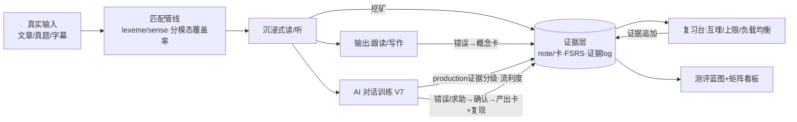
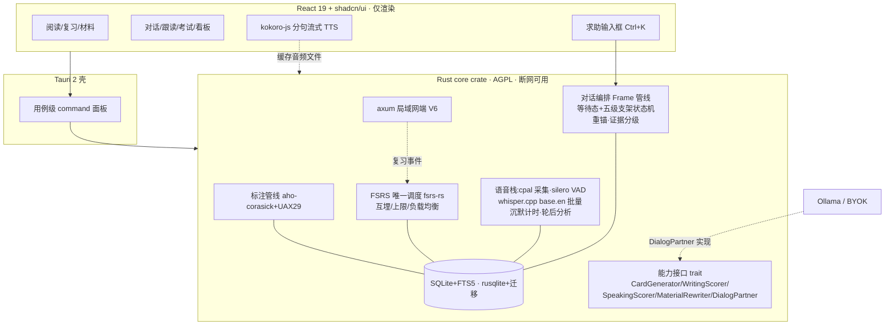
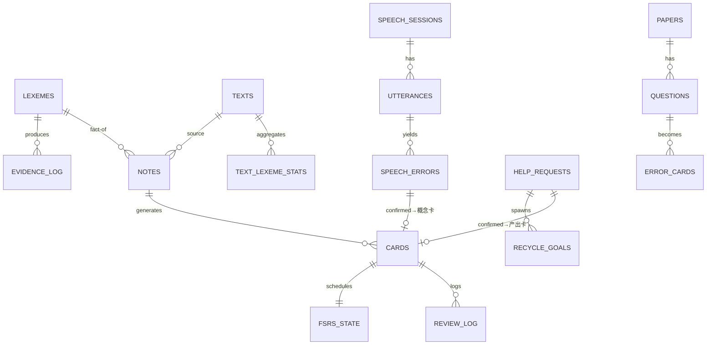
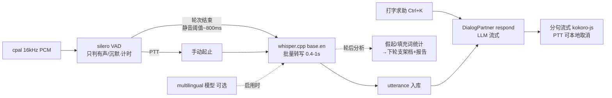
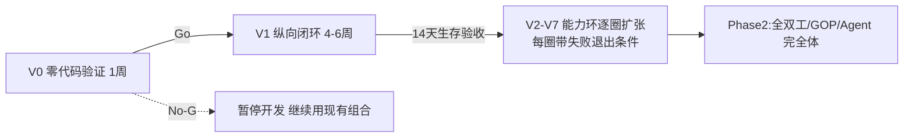

# 个人英语能力底座 · 项目方案（v1.6 · 开工定稿）

> **本版定位**：**单一事实源 + 开工定稿**。v1.6 合并 v1.3–v1.5 全部有效内容为一份自包含文档（不再有"沿用 v1.4"式引用），并按第六轮评审完成"可实施性收口"六项修正：①支架改为"等待态+五级支架"并加入**原因分流**；②修正 ASR 链路自相矛盾（CJK 检测移出默认链、假起改轮后分析）；③求助回流改为"必留证据≠必建卡"并强制**产出型卡**；④**mastered 门槛提高**（跨日期/跨语境/无重求助）；⑤V7 指标**去游戏化**（每百词求助、迁移率、p50/p95 延迟）；⑥敏感数据保留与删除策略。V7 细节冻结在设计级，**V6 结束后以真实数据重审**。
>
> **本版之后停止方案演进，进入 V0。**

### 第六轮评审裁决表（可实施性收口）

| # | 评审意见 | 裁决 | v1.6 处理 |
|---|---|---|---|
| 1 | 支架不能只按沉默时间逐级升级：沉默 5s 可能是没听懂/想不起词/不会组织/害怕/正常思考，需求各不相同 | **采纳** | 3–5s 后先给**无侵入分流询问**（"Take your time — repeat, simplify, or find a word?"），按原因路由支架；时间决定何时介入，类型决定给什么；3s 为默认值，按个人启动延迟历史自动调整（13.6/13.8） |
| 2 | ASR 链路自相矛盾：base.en 是英语专用模型，CJK 输出不可作中文意图检测；no_speech_prob/avg_logprob 是无语音/低置信过滤不是语言检测；批量 whisper.cpp 撑不起实时 partial，假起实时检测不成立（whisper.cpp stream 官方示例是每 ~500ms 重跑窗口的朴素实现） | **采纳（实现级修正）** | 默认链路收敛为：VAD 只判有声/沉默；base.en 只做英语批量转写；**中文求助只保证打字入口**；multilingual 模型（可选下载）启用时才做中文转写与语言判断；**删除默认链路"CJK=求助"承诺，降为实验性遥测**；假起检测降为**轮次结束后分析**，流式稳定后再考虑实时介入（13.6、15、19.5） |
| 3 | 求助后自动建"认读/挖空卡"与失败类型（说不出来）不匹配，会训练成"看见会、开口不会"；每次求助必建卡会产生低价值卡与复习债务 | **采纳** | 求助回流规则重写：**必留证据≠必建卡**；同 lexeme/句型去重合并；用户确认"值得学"才建卡；每场最多 1–3 项；低频专名/一次性表达只进会话记录；建卡必须含**至少一张产出型卡**（情境/意图→主动说出目标词块，录音作答；新语境复现而非重复原句）（13.9） |
| 4 | 一次独立产出不配叫 mastered：当轮重锚受启动效应，次日一次独立也可能是短期记忆 | **采纳** | mastered = independent ≥2 次（校准目标 3）、跨 ≥2 个日期、至少一次间隔 ≥48h、≥2 个不同语境、期间无重新求助；当轮重锚只记 `helped`；次日首次独立复现记"**可提取**"里程碑（13.10、7.5） |
| 5 | V7 指标游戏化："求助次数/场"受场次长度影响；"想用 ChatGPT 语音趋零"主观不可测；统一"≤3s"不成立（Whisper 速度高度依赖硬件） | **采纳** | 指标改：每百口语词求助次数（按场景难度分层）、策略性 vs 重复求助分开、同目标再求助率、48h/7 天独立迁移率；DoD 改：对话完成率、次周继续使用率、求助目标延迟独立复现率、同难度支架等级下降；延迟写**指定测试设备 warm/cold p50/p95**（17、23） |
| 6 | v1.5 大量"沿用 v1.4"甚至第 12 节只有标题，无法单独执行与审计 | **采纳（本版主体工作）** | v1.6 合并 v1.3–v1.5 全部有效内容为自包含单一事实源，全文可直接交付执行 |
| 7 | 小修正：五级阶梯实为 0–5 六状态；"CI 手动跑脚本"矛盾；"按住说话打断支架"与 barge-in 后置冲突；敏感数据无留存策略；V7 已到第 43–50 周不该再深挖 | **采纳** | 命名改"**等待态+五级支架**"（13.8）；确定性状态迁移=自动测试、真实 LLM 行为=人工评测记录，两者分开（13.11/20）；PTT 打断明确为"立即停本地 TTS 播放并取消合成"（本地取消，V7 范围），完整 barge-in（AEC/让路）仍 P2（13.12）；新增敏感数据保留/一键不留存/删除策略（16.2/20）；V7 冻结声明（13.13、23） |

---

## 0. 一页速览

- **产品是什么**：一个本地优先的**语言能力底座**——按 lexeme（词/短语/义项）积累分技能证据，用 FSRS 调度具体记忆卡；读、听、说、写、AI 对话五个场景读写同一份能力数据；AI 是后挂的可替换处理器。
- **底层模型**：能力矩阵（R/L/S/W × 资产/速度/准确度/中文依赖）+ 证据层掌握度（分维度证据、派生展示状态、production 证据三级分级 independent/assisted/helped）。
- **怎么做**：**V0（一周零代码验证）→ V1 纵向闭环 → V2–V7 能力环**（每圈带失败退出条件）→ Phase 2。V7 细节冻结在设计级，V6 后重审。
- **卡壳与求助**：等待态+五级支架，原因分流（时间管强度、类型管内容）；求助主走打字；求助必留证据≠必建卡；求助必重锚必回流。
- **内核归属（ADR-1）**：Rust fat core——SQLite（rusqlite+rusqlite_migration）、FSRS（fsrs-rs）、标注（aho-corasick）、语音（cpal+silero VAD+whisper.cpp）、对话编排、局域网端（axum）全在 Rust；React 仅渲染；TTS 在 webview（kokoro-js 分句流式）。
- **首版默认技术栈（非锁死）**：Tauri 2 + React 19 + TS + shadcn/ui + rusqlite + fsrs-rs + ECDICT + kokoro-js(V6/V7) + cpal/whisper.cpp(V7) + Ollama/BYOK(V7)；内核 AGPL-3.0 + 商业双授权。
- **本轮只出方案，不写代码；V0 为下一步。**

> **运行时与语音栈以后续 ADR 为准（v1.6.2 加注）**：ADR-2 已将运行时切到 Electron/JS（两条铁律：禁原生 Node 模块、禁重打包 electron.exe）；**ADR-3（2026-09-14）重定语音栈——浏览器标准采集 + 独立 Web Worker 内 WASM/WebGPU 推理，ASR 暂定 Transformers.js Whisper、TTS 商业路径未决、V6 不引入实时 VAD、锁定前须过 V6 技术闸门**。本文件 §14–15、§19 中的 Rust/cpal/whisper.cpp 原生表述为 ADR-1 历史形态，语音相关条目以 §19/§15 内【v1.6.2 修订】标注与 ADR-3 原文为准。

---

# 第一部分 产品本体

## 1. 0 号用户与产品边界

- **0 号用户 = 作者本人，自用优先**；外部商业化是自用验证后的期权。学习目标链：眼下六级 → 脱翻译读外网/论文 → 口语与雅思 → 接近英语思维（能力矩阵表达，非线性阶段，见第 2 节）。
- **产品边界一句话**：做"可积累、可迁移、可验证的语言能力底座"，不做"什么都有的大一统备考 App"。任何无法沉淀为长期能力证据的功能（一次性刷题快感、纯机翻浏览、无沉淀的聊天）优先级最低。
- **既有流程痛点假设（H1–H5，待 V0 自证）**：H1 背词与阅读割裂；H2 工具数据互不相通；H3 通用 AI 无状态；H4 现有产品强化中文依赖、无撤拐路径；H5 模考/精听/错题/生词分散多工具。

## 2. 能力矩阵：替代"四阶段阶梯"

### 2.1 为什么改

原 A→B→C→D 混合了考试/场景/技能/认知状态四类概念。读/听/说/写**并行发展**，"英语思维"是贯穿全程、逐步增强的状态，不是终点阶段。

### 2.2 矩阵结构

| 技能 ＼ 维度 | 词汇/短语资产 | 理解/反应速度 | 输出准确度 | 中文依赖度 |
|---|---|---|---|---|
| **阅读 R** | 认读词汇量、搭配储备 | wpm、长句解析速度 | —（输入技能） | 查词/中文展开率 |
| **听力 L** | 听辨词汇量、音变识别 | 跟听速度、句中反应延迟 | — | 字幕/原文依赖率 |
| **口语 S** | 主动可调用词块 | 听问到开口启动延迟、对话 wpm、填充词率 | 语法/搭配/发音评分 | **每百口语词求助次数（分层比较）**、脑内中译英频率（自评） |
| **写作 W** | 主动可写词块 | 成稿速度 | 语法/搭配/连贯评分 | 中文构思痕迹（自评） |

- 每格独立证据与水平估计；允许"阅读 C1、口语 B1"式不均衡可见。
- **目标包（Goal Packs）**：六级 / 外刊论文 / 雅思 / 自由交流——对矩阵格子的目标配置+专属材料与题型，全部读写同一份证据；只决定训练权重与材料源，不锁定功能顺序、不做硬门槛。
- **中文依赖类指标一律按场景难度分层比较，禁止跨难度**（与第 17 节指标纪律一致）。

### 2.3 "英语思维"操作化——横切状态，不是阶段

5 个可测指标：①英英释义使用率（英英展开/全部查词）；②英文复述质量（retell 量规曲线）；③听问到开口的启动延迟（V7 对话自动记录）；④中文辅助调用率（每 session 中文展开+机翻次数，**v1.6：中文求助按每百词口径计入**，仅同难度比较）；⑤影子跟读延迟稳定性。

## 3. 真正的对手与差异化

| 场景 | 现有方案 | 断点 |
|---|---|---|
| 六级 | 不背单词/墨墨、ExamCrafts/星火、每日英语听力、通用 AI | 词与题不通、错题不回炉、考完资产作废 |
| 外刊/论文 | 欧路、沉浸式翻译、Kimi/ChatGPT、LingQ | 机翻强化依赖；生词无分技能状态；LingQ 按"词形"计 known 且含专名（社区长期诟病） |
| 口语 | ELSA/Speak/TalkPal（商业）；freelingo/dustland-talk/IELTS-Speaking-AI/LinguAI（开源） | 无个人错误档案；对话错误不进 SRS（**开源界确认空白**）；Duolingo Max 无 hint；TalkPal 依赖陷阱；ChatGPT 语音求助不回流、中英夹杂语言漂移 |
| 英语思维 | 无专门产品 | 空白带 |
| 底座 | Anki（卡片盒）、通用大模型（无状态顾问） | 不是能力底座 |

七条正面回答：①资产层 vs 问答层；②跨场景连续性；③撤拐方向相反；④闭环自动回流；⑤离线隐私定位（自用与科研人群卖点，不对考生讲故事）；⑥口语：通用 AI 语音"聊完即散"，本产品每场对话留下错误卡、复现目标、流利度曲线；⑦卡壳时刻：通用 AI"帮你把话说完然后忘掉"，本产品一次求助走完一个记忆循环（目标句分块→跟说→重锚→建卡→次日复现）。差异化押证据资产不押模型能力。

## 4. 形态与调度权

- **桌面优先**：读外刊/论文、整卷、长文、安静环境口语对话均为桌面场景。Phase 1 不做原生 App、不做云账号。
- **调度权唯一**：本产品是 FSRS 的**唯一调度者**；不做 Anki 双向同步；对 Anki 只**单向导出** .apkg；局域网网页复习端只回传复习事件（架构见 19.4）。
- 形态重估触发：自用记录显示手机学习占比 >50% 时，优先评估 Tauri Mobile。耳机为对话推荐配置（P2 AEC 前置）。

## 5. 内容获取策略

- 目标体验：拖文件夹/粘链接 **30 秒入库**；同源第二份 10 秒；`.erpack` 单文件资源包（内容 JSON+音频+字幕+来源许可）可本地备份。
- 新来源=新适配器，不动核心；Agent 期可生成仿真卷。对话场景包是"提示词+结束条件"配置，无版权内容。
- 红线：发行版不内置版权真题；GPL 数据集不打包、不并入仓库；社区共创留到商业化且设下架机制。

---

# 第二部分 学习模型

## 6. 学习科学原则

1. **可理解输入 i+1**：按分技能覆盖率辅助选材；95%/98% 只是选材参考——覆盖率只是理解的因素之一（Cambridge *Studies in SLA* 综述）。
2. **间隔重复 FSRS**：调度对象是具体记忆卡；同保持率下比 SM-2 少约 20–30% 复习量（open-spaced-repetition wiki，仿真；KDD'22，DOI 10.1145/3534678.3539081）。
3. **句子挖矿**：卡带真实语境与出处；复习卡可跳回原文。
4. **可理解输出 + 影子跟读 + AI 对话**：跟读解决"说得对"，对话解决"说得开"；对话天然产生个人化错误流与求助流供强化训练。
5. **拐杖消退**：L1 中文为主→L2 折叠→L3 英英→L4 推断；软建议不硬锁。求助是拐杖的一种用法而非拐杖本身——每次求助都被安排"下一次不用拐杖走同一段路"。
6. **纠错反馈分层**：流利型对话延迟纠错（保流）、准确型练习即时纠错（促注意）；recast 默认、显式纠正可选（Lyster & Ranta 1997 六类 CF）。
7. **卡壳即学习事件**：①求助=languaging（Swain：用语言讨论语言本身就是学习）；②介入要等——wait-time 约 3 秒起（Rowe：教师平均等待 <1s，延至 3s 产出显著变长变好）；③先诱导绕说（circumlocution 可训练，ACTFL OPI 中高级标志能力），后给答案；④支架要应变且渐撤（contingent scaffolding），翻译是最后一级不是第一级。

## 7. 证据层掌握度模型

### 7.1 为什么词级单一状态是错的

同一个词可能：阅读认识但听力听不出；选择题会但主动说不出；知道常见义但不懂当前语境义。因此：FSRS 调度的是**一张卡**；`known/mastered` 不挂在 lemma 上；六态只是**证据计算出的 UI 投影**。

### 7.2 基本单位：lexeme（词/短语/义项）

`lexeme = lemma + POS + 义项`；多义词分义项；短语动词与固定搭配是独立 lexeme（`give_up` ≠ `give`）。匹配管线（阅读/听力统一走）：

未命中分类分别统计，不一股脑算生词率。

### 7.3 证据维度（每个 lexeme 一组，只追加事件）

| 证据维度 | 含义 | 主要来源 |
|---|---|---|
| `reading_recognition` | 文本中认读 | 阅读命中、认读卡 |
| `listening_recognition` | 听音辨义 | 字幕/音频语境、听辨卡 |
| `meaning_recall` | 义→词主动回想 | 回想卡 |
| `spelling` | 听音/看义拼写正确 | 听写卡 |
| `production` | 说/写中正确使用（含搭配） | 口语/写作卡、Agent 批改、**AI 对话 utterance（分级）** |
| `context_diversity` | 出现过的不同来源文本数 | 所有输入 |

每条证据记录：时间、来源、关联卡片 id、结果、置信度；全部可审计（`evidence_log` 只追加）。

### 7.4 卡模型与调度机制（借 Anki）

- **Note/Card 分离**：`notes` 存事实（lexeme+义项+语境句+出处+音频），`cards` 按卡型模板生成，每卡独立 FSRS 状态；改模板可重生成、删 note 级联删卡、.apkg guid 稳定。
- 卡型表：

| 卡型 | 训练维度 | 正面→背面 |
|---|---|---|
| r_recog | reading_recognition | 语境句挖空/高亮 → 义 |
| l_recog | listening_recognition | 发音 → 义 |
| recall | meaning_recall | 释义 → 词 |
| cloze | reading+搭配 | 真实句挖空 |
| spelling | spelling | 发音 → 拼写 |
| collocation | production | 搭配残缺 → 完整词块 |
| production | production | 用词造句/复述（自评/Agent） |
| **help-recall（v1.6）** | production | **情境/意图（英文情境或中文意图）→ 主动说出目标词块（录音作答，ASR 校验）**；配新语境复现任务 |

- **调度机制（默认全开，可配）**：兄弟卡互埋；新卡上限（V1 期 5/天，默认 10/天）；复习上限 200/天+负载均衡（fuzz 区间选 due 少的日子）；easy days（周末最小量）；postpone（保底 retrievability）；leech（同卡 lapse≥8 标记，转"问题词清单"走概念卡+变式处理）。
- `review_log` 列对齐 Anki revlog（rating/前后间隔/耗时/队列类型），直接喂 optimizer 与 .apkg。

### 7.5 派生状态：六态是投影（v1.6 修订 mastered 口径）

- UI 状态（unseen/seen/learning/familiar/known/mastered）由证据实时计算（可缓存）、分维度展示；手动覆盖记为证据。
- 派生规则：`learning`=存在未毕业的卡；维度 `known`=该维度卡进入长期调度且最近 3 次无 lapse；lexeme `known`=reading 维度 known 且 context_diversity≥2。
- **mastered（v1.6 提高门槛）**：满足全部——①`independent` production ≥2 次（校准目标 3 次）；②跨 ≥2 个日期；③至少一次间隔 ≥48h；④≥2 个不同语境/来源；⑤期间未对同一目标重新求助；⑥原有条件（≥2 维度 known、context_diversity≥3）。assisted/helped 不计入。
- 查词不降级（新义项→新 lexeme 记 `sense_miss`）；"三篇零查词"不作 mastered 证据。

### 7.6 分模态覆盖率与统计口径

- 阅读/听力覆盖率分开统计；输出分解真生词/短语/专名/数字，专名数字不计生词负担。
- 词汇量=lexeme 计数，排除专名与数字；分母是"见过的 lexeme"。
- 覆盖率/已知比例按文本抽样物化（默认前 5 页）+ 手动"全量重算"按钮（Lute 教训）。

## 8. 拐杖消退与软门控

L1–L4 作用于一切支撑性 UI（含对话中文提示折叠、支架阶梯档位联动——L3/L4 档下求助响应前先强制绕说）；阶段/目标包只给"准备度%+差距清单"，永不硬锁；L3 英英释义源（WordNet/Wiktextract）V2 备料。

## 9. 核心闭环

---

# 第三部分 首版产品与能力环

## 10. V1 纵向闭环：第一版唯一要做的东西

> **粘贴一篇文章（六级阅读/外刊）→ 匹配管线标注 → 点生词（选定义项）→ 自动建 note + 两张卡（r_recog + cloze）→ 次日 FSRS 复习（互埋/上限/负载均衡）→ 证据回写 → 在第二篇陌生文章中重新评估。**

**V1 明确不做**：整卷模考、PDF 论文、Whisper 跟读、写作语法、TTS、对话、多来源解析、完整看板、错题 FSRS、移动端、Agent、多卡型（只做认读+挖空）。

**V1 必做**：复习负载控制（新卡上限 5/天、互埋、负载均衡）；幂等重标注（matcher 升级后可重跑旧文本，只重建渲染与聚合）。

**V1 生存验收（不达标不扩张；口径与第 17 节一致）**：
1. 连续 14 天每天跑通闭环；
2. 到期卡完成率 ≥90%；
3. 第二篇陌生同级文章：旧词重现率 >0 且每百词主动查词数低于第一篇基线；
4. （建议）对该文做一次 5 题手工小测作理解分参考；
5. "想换回旧工具组合"次数趋零。

覆盖率变化只观察不验收（它是系统自判的，验收即循环论证）。

## 11. 后续能力环（每圈带失败退出条件）

| 圈 | 内容 | 前置 |
|---|---|---|
| V2 材料与词库 | txt/epub 导入、考纲词牌组（ECDICT cet 标签）、最小看板、更多卡型（recall/spelling）、英英释义源 | V1 存活 |
| V3 考试模式 | 试卷解析器、整卷模考（答题卡/计时/字幕同步）、错题新方案 | V2 |
| V4 外网 | URL 抓取导入 → WXT 浏览器扩展 | V2 |
| V5 论文 | PDF、AWL 学术词、搭配库 | V4 |
| V6 听口 | l_recog 卡、跟读台（**【ADR-3】** Transformers.js Whisper 词级时间戳估算对齐，措辞限定见 19.3）、TTS 落地（SAPI 兜底→kokoro-js 自用，商业路径未决）、局域网网页复习端；**开工先过 V6 技术闸门** | V3 |
| V7 AI 对话训练 | 半双工对话（**【ADR-3】** getUserMedia/AudioWorklet+vad-web+Whisper Worker，原 cpal+silero+whisper.cpp 为 Rust 形态示意）、场景包、强化修正闭环、卡壳五级支架+打字求助+回流、流利度指标 | V6；**设计冻结，开工前按 V6 实测数据重审（13.13）** |
| Phase 2 | 全双工（smart-turn/barge-in/AEC）、音素级 GOP、雅思口写模考、Agent 完全体 | V3 之后按需 |

**错题新方案（V3）**：错题→标错误原因（词汇/句法/题型技巧/辨音/粗心）→针对原因生成**概念卡**进 FSRS+配**变式题**（同源不同题防背答案）；原题只按 1/3/7 天重做一轮，通过即归档。

**失败退出条件**：某圈生存验收失败→冻结扩张，归因三选一（工具质量问题修一次再验 / 习惯问题把每日目标降到 2 分钟最小闭环再验 / 机制问题砍掉或重设计）；同圈两次未过→永久砍掉；全局 kill：V1 失败且归因"机制对本人无用"→项目暂停，SQLite+JSON 导出保留，资产不丢。

## 12. 考试模块设计要点（V3）

- **整卷模考**：试卷布局+右侧 710 分答题卡+全程计时；听力逐句字幕同步、AB 复读、按拐杖档隐藏原文/中文。
- **判分与解析**：客观题离线判分→展示原文/翻译/解析→错题自动归档。
- **错题流程**：按第 11 节错题新方案执行（原因→概念卡+变式；原题 1/3/7 重做；错题本多维筛选）。
- **考纲词**：ECDICT cet 标签牌组（考频+真题出现次数），与个人词库同一证据层。
- **写作/翻译**：离线留存+范文对照；评分留 Agent 期；nlprule 离线规则只做高频错。
- **真题来源**：按第 5 节适配器架构（公开 Markdown 真题、星火听力音频+字幕等本地测试夹具，不分发）。

## 13. AI 对话训练（V7；**设计冻结——V6 结束后以真实数据重审，见 13.13**）

### 13.1 目标、边界与延迟预算

- 目标：日常聊天把"认识"练成"说得出口"（启动延迟、流利度、主动词块调用），每场对话沉淀证据与卡片。
- 不是：不做实时同传、不做纯聊天玩具、V7 不做口语考试评分（雅思模考 P2）。
- **延迟目标（v1.6 修正为可测形式）**：在**指定测试设备**（V7 开工时写明 CPU/内存型号）上测 warm/cold 的 **p50/p95**：全本地半双工轮次（用户说完→AI 开始答）初始预算 warm p50 ≤3s / p95 ≤5s；cold（前 10 轮）p50 ≤6s；打字求助响应 p50 ≤2s。预算为开工基线，以实测校准后写入 V7 报告（Whisper 官方明确速度高度依赖硬件）。

### 13.2 场景包（Scenario Packs）

| 场景包 | 内容 | 结束条件 |
|---|---|---|
| 自由闲聊 | 日常话题，AI 主动续话题 | 定时（默认 10 分钟）或手动 |
| 角色扮演 | 点餐/机场/面试/租房脚本场景 | 完成任务目标 |
| 复现训练 | 围绕"待复现词块"生成开场与引导（13.5/13.9） | 目标词块全部产出或超时 |
| 雅思模考（P2） | Part1/2/3 题卡→计时→band 评分 | 考完 |

场景包=提示词+结束条件+拐杖档预设，无版权内容。

### 13.3 对话中的反馈

- **recast（重铸，默认开）**：正确形式自然融进 AI 回复，不点破不打断。
- **显式即时纠正（默认关，可开）**：当前轮结束后一行轻提示，仅提示不展开。
- **中文拐杖**：AI 回复可附中文要点（默认折叠 L2）；用户用中文提问计入中文依赖。

### 13.4 会话后：错误报告与确认

会话结束 30s 内产出错误报告，每条结构化：`原句 span → 修正 → 类型（语法/搭配/选词/疑似发音/流利度）→ 一句话解释`。**用户逐条确认**（采纳/忽略）是硬门槛：防 LLM 幻觉，确认本身是学习事件。疑似发音错误（转写偏离但语法无误）只标记"建议跟读验证"不建卡。报告附流利度摘要（启动延迟均值、wpm、填充词）。

### 13.5 强化修正训练闭环

确认的错误→概念卡进 FSRS（production 维度）+复现目标；"复现训练"场景包开场注入待复现词块，通过话题设计诱导再产出（elicitation）；成功→independent 证据+1→推进 mastered→目标关闭。

### 13.6 卡壳识别（v1.6 修正：默认链路只依赖可靠信号）

**默认链路的信号与其职责（严格分界）**：

| 组件 | 只负责 | 明确不负责 |
|---|---|---|
| VAD（silero；**【ADR-3】** Electron 形态为 @ricky0123/vad-web WASM，V7 才引入） | 有声/无声、沉默时长 | 任何内容判断 |
| Whisper base.en（**【ADR-3】** Transformers.js ONNX 暂定主选、独立 Worker；whisper.cpp WASM 备胎） | 英语批量转写（轮次结束触发） | 语言识别、中文、实时 partial |
| 打字输入框 | 中文求助（唯一保证的中文入口） | — |
| multilingual 模型（**可选下载**） | 启用时：整句中文转写、语言判断 | 句内 code-switching（不可靠） |

- **实时介入只依赖沉默计时**：用户发言窗口内 0–3s 不介入（Rowe wait-time）；3–5s 触发分流询问（13.8）。
- **假起（<5 词放弃性开头）检测降级为轮次结束后分析**（批量转写无实时 partial；朴素流式是每 ~500ms 重跑窗口，不作为 V7 依赖）：轮后统计假起次数，用于下一轮支架档位与会话报告；流式转写稳定后（**【ADR-3】** sherpa-onnx WASM zipformer 或 Moonshine 验证，V7 后半段实验/P2）才允许假起实时介入。
- **"CJK=求助"从默认链路删除**：base.en 对非英语是幻觉输出，CJK 字符检测只作**实验性遥测**（记录"未识别事件"计数，不驱动任何行为）；`no_speech_prob/avg_logprob` 仅用于丢弃空转写。语音中文识别只在用户主动启用 multilingual 模型后存在。
- **阈值个性化**：沉默介入阈值默认 3s，按个人历史自动调整：`max(3s, 1.5×个人 p50 启动延迟)`，上限 8s；用户可覆盖。
- 所有检测不计惩罚；检测只在"轮到用户说"的窗口生效。

### 13.7 求助通道

- **主通道：打字求助**。快捷键（默认 Ctrl+K）或长按"帮我说"按钮，输入中文（"我想说……但是不知道怎么说"或直接一句话）。打字成本低；打中文同样是 languaging；语音通道保持纯英语。
- **辅通道：语音中文**。默认行为=引导打字（"是不是想说中文？点这里"），该段标记为求助意图；仅当用户下载 multilingual 模型后才做语音中文转写。
- **不做**：全局母语模式（破坏沉浸）；自动建议回复（依赖陷阱/抄答案）。

### 13.8 支架设计：等待态 + 五级支架（v1.6 重构：原因分流）

**原则**：时间决定**何时**介入（强度），困难类型决定**给什么**（内容）；支架要应变、渐撤、责任转移；翻译是最后一级。

**等待态（0）**：0–3s 沉默不介入。

**分流询问（3–5s）**：AI 给一条无侵入选择（可忽略，继续沉默按默认最轻支架自动升级；用户开口即全部撤除）：

> Take your time. Do you need me to **repeat** it, **simplify**, or help you **find a word**?

按原因路由（五级支架）：

| 级 | 适用原因 | 动作 | 出口 |
|---|---|---|---|
| 1 降难 | 没听懂 | 复述原句 / 换更简单问法 / 二选一问题 | 用户开口→撤 |
| 2 语义提示 | 知道意思想不起词 | 给语义线索/首音/搭配线索→引导**绕说**（"试着描述它：it's a thing you use to…"，不点破目标词） | 绕说成功→AI 接住顺势给词→仍登记复现目标 |
| 3 句型支架 | 不会组织句子 | sentence starter（"You could start with 'I was wondering if…'"） | 用户续完→撤 |
| 4 求助响应 | 明确求助（打字/语音）或 2/3 级仍卡 | **目标英文句**分 2–3 chunk 高亮（关键词块联动 lexeme）+乌龟慢速带读→跟说 1–2 遍（ASR 校验） | 通过→**重锚**（13.9） |
| 5 保流退出 | 4 级重锚后仍未产出 | AI 自然继续对话，不再纠缠 | 词块进复现目标，次日复现训练再练 |

- 1–3 级永远不给完整答案（Speak"刚好够"原则，防抄答案）。
- 拐杖档联动：L1/L2 档 4 级直接给中文对照；L3/L4 档 4 级前必须先过 2 级绕说。
- 用户按住说话=**跳过当前支架**（立即停止支架语音），见 13.12。

### 13.9 重锚与求助回流（v1.6 重写：必留证据 ≠ 必建卡）

- **重锚（当轮，记 helped）**：4 级跟说通过后，AI 不换话题，立即在同一语境抛一个必须用到目标句的追问（启动效应所限，只计 helped）。
- **回流规则（修正 3 的落地）**：
  1. **必留证据**：求助事件、目标句、关键词块全部入库（help_requests）——"求助永不浪费"指证据，不是卡片；
  2. **建卡节制**：同一 lexeme/句型已有未关闭卡或复现目标→只合并证据；用户在会话报告中确认"值得学"才建卡；**每场最多沉淀 1–3 项**，超出进入"想学清单"待选；低频专名/一次性表达只进会话记录不进 FSRS；
  3. **卡型匹配失败类型**：确认建卡时必须包含**至少一张产出型卡**——help-recall 卡（英文情境/中文意图→主动说出目标词块，录音作答+ASR 校验关键词块），并配**新语境复现**任务（复现训练用不同语境引出，不重复原句）；认读/挖空卡只作辅助、不单独成立；
  4. 复现训练场景包按 recycle_goals 开场（13.5）。

### 13.10 production 证据分级与 mastered

| 产出方式 | production_kind | confidence | 计入 mastered |
|---|---|---|---|
| 无支架独立说出 | `independent` | 1.0 | **是** |
| 1–3 级支架后说出 | `assisted`（记 scaffold_level） | 0.6 | 否（计 learning） |
| 4 级求助后跟说/当轮重锚 | `helped` | 0.3 | 否 |
| 复现训练中独立产出 | `independent`（recycled） | 1.0 | **是** |

- **"可提取"里程碑**：次日或更晚（间隔 ≥24h）的首次 independent 产出——mastered 的前置信号，证据面板展示，不新增 UI 状态。
- **mastered 判定**见 7.5（independent ≥2 次、跨 ≥2 日期、≥1 次间隔 ≥48h、≥2 语境、期间无重新求助）。

### 13.11 prompt 规范与测试（v1.6 修正：测试分层）

- **确定性部分=自动测试**：支架状态机迁移（等待态→分流→各级→撤除）、阈值计算、原因路由、证据分级落库、重锚触发条件——单元/属性测试，进 CI。
- **LLM 真实行为=人工评测记录**：recast 质量、重锚自然度、分流询问语气——脚本化场景（沉默 8s、轮后假起统计、打字求助"我想说这家店比那家便宜"、求助后复现、multilingual 语音求助）+人工评分表；每次改 prompt 重跑并记录。**不叫"CI 跑"**。
- **system prompt 分节定义六种时刻**：正常对话（recast 规则）/沉默/轮后假起/绕说诱导/求助响应（含重锚指令）/话题结束；每节附反例：禁止语言漂移（用户说中文，AI 继续英语，中文只在括号释义与求助响应）、禁止直接给整句（除非 4 级）、禁止连环追问。

### 13.12 打断边界（v1.6 明确）

- **V7 范围（本地取消）**：用户按住说话（PTT）=**立即停止本地 TTS 播放并取消未完成的合成/请求**——这是纯本地取消，不涉及回声与语义轮次；支架语音同理可被打断（=跳过支架）。
- **P2 范围（完整 barge-in）**：AI 播放中用户自然开口→让路（需持续 VAD+回声消除 AEC+smart-turn 语义轮次）。V7 用耳机+PTT 规避此复杂性。

### 13.13 V7 设计冻结声明

本章细节冻结在设计级；**V6 结束后**以真实精听/跟读数据与 ASR 实测（设备延迟、VAD 准确率、识别质量）重审一遍再动工；在 V1 数据产出前不扩展 V7 设计。

---

# 第四部分 技术

## 14. 运行时架构

### 14.1 ADR-1：内核归属 = Rust fat core

标注管线、SQLite 读写、FSRS 调度、.apkg 导出、局域网 HTTP、音频采集/VAD/ASR/对话编排全在 **Rust 侧**（Tauri 2 主进程内独立 crate `core`），React 只渲染。

理由：①调度权唯一要求核心可被局域网端复用（TS-in-webview 内核做不到）；②fsrs-rs 是 Anki 官方同款（BSD-3，含 optimizer）；③标注是 CPU 工作（aho-corasick SIMD+UAX#29），Rust 毫秒级且可单测；④Tauri 2 JSON IPC 有带宽墙，对策"标注落库、按页拉取+用例级 command"要求标注与存储同侧；⑤genanki-rs/whisper-rs 等生态齐全，无 sidecar。

**降级触发器**：M0 spike（两周内"ECDICT 导入+粘贴文本点词高亮"）失败→评估 TS 内核（tauri-plugin-sql+web worker 标注+ts-fsrs），代价=砍内嵌局域网端（.apkg 兜底）；决定写入 M0 报告，不允许混用两个运行时。

### 14.2 架构图

### 14.3 能力接口（Rust trait，离线"未启用"桩，Agent 关闭产品完整）

- `CardGenerator`（P2：长难句拆解、自动造卡）
- `WritingScorer`（P2：写作/翻译评分批注）
- `SpeakingScorer`（P2：口语打分）
- `MaterialRewriter`（P2：i+1 材料改写）
- `DialogPartner`（V7）：`open_session(scenario, recycle_goals) → system_prompt`；`respond(history, user_utterance) → 流式回复`；`coach(help_request) → {target_sentence, chunks, reanchor_prompt}`；`extract_errors(session) → Vec<SpeechError>`。V7 实现=Ollama 本地 / BYOK（OpenAI 兼容，"引擎+端点+模型"三要素配置）。

### 14.4 IPC command 面（用例级，非 CRUD；禁逐 token 往返）

`import_text` / `get_text_view(text_id,页码)` / `lookup` / `create_note` / `get_due_session` / `answer_card(rating,耗时)` / `get_stats(范围)` / `export_apkg` / `reprocess(text_id|all)` / `settings_get/set` / `backup_now` / `lan_status`；V7 追加：`dialog_start(scenario)` / `dialog_audio_chunk(pcm)` / `dialog_end → 报告` / `confirm_error(id,accept)` / `get_recycle_goals` / `help_request(text) → 支架响应` / `confirm_help_practiced(id)`。音频不走 IPC（cpal 在 Rust 侧直进管线，webview 只收事件渲染）。

## 15. 默认技术栈与替换条件

| 层 | 默认选型 | 替换条件 |
|---|---|---|
| 桌面壳 | Tauri 2 | M0 spike 失败或 WebView2 兼容问题频发 → Electron |
| 前端 | React 19 + TS + Vite + Tailwind v4 + shadcn/ui + Zustand | — |
| 专项库 | TanStack Virtual、wavesurfer、pdf.js、ECharts、assistant-ui(P2) | 按能力环引入 |
| 存储 | rusqlite + rusqlite_migration（user_version 顺序迁移；不用 tauri-plugin-sql——迁移有静默不执行 issue、JS 侧事务别扭） | — |
| SRS | fsrs-rs（BSD-3，Anki 同款，含 optimizer），唯一调度 | M0 降级 → ts-fsrs |
| 标注/NLP | aho-corasick（LeftmostLongest）+ unicode-segmentation（UAX#29）+ ECDICT（官方预构建 stardict.db，MIT）+ 自写管线 | 义项/搭配不足 → Wiktionary/Wiktextract、开放搭配数据 |
| 音频采集 | **【v1.6.2，ADR-3】** 渲染进程 getUserMedia + AudioWorklet 直采 16kHz 单声道 PCM；推理在独立 Web Worker（WASM 基线/WebGPU 加速），禁止上 UI 主线程 | 设备兼容问题 → 系统语音/文件导入兜底 |
| VAD | **【v1.6.2，ADR-3】** V6 不引入实时 VAD（录完批量，首尾静音能量阈值裁剪）；V7 用 @ricky0123/vad-web（silero ONNX WASM，约 2MB） | — |
| ASR | **【v1.6.2，ADR-3】暂定主选** Transformers.js（Apache-2.0）+ Whisper ONNX（onnx-community/whisper-base.en 量化约 80MB，Worker 内 WASM/WebGPU；tiny/base/small 可选；multilingual 仅中文兜底可选下载）；**锁定前须过 V6 技术闸门** | 备胎 whisper.cpp 官方 WASM（MIT，需 SIMD/跨域隔离）；V7 流式 → sherpa-onnx WASM zipformer 或 Moonshine |
| 轮次/卡壳信号 | 沉默计时（VAD）+轮后假起分析（批量转写）；**默认链路无 CJK 意图检测**（仅实验遥测） | P2：smart-turn v3（BSD-2，int8 8MB，10–100ms；需自移植 ONNX） |
| TTS | **【v1.6.2，ADR-3】** ①Web Speech API 零下载尽力兜底；②kokoro-js 分句流式（q8 约 90MB，Worker 内 WebGPU/WASM，warm ~600ms/句）为自用/AGPL 主力；③**商业版未决**（见下）；edge-tts 仅可选在线增强（逆向 API、历史 403、合规风险），不进默认链 | kokoro-js 英文 G2P 带 espeak-ng 数据（GPL-3.0）仅限个人/AGPL 版；**sherpa-onnx 当前 Kokoro 链路同样依赖 espeak-ng-data（issue #3731 计划 2.0 移除），不是现成干净路径**；商业版等无 espeak 的成熟英文 G2P、自实现，或 sherpa-onnx 2.x 审计后再评；Piper 仅 MIT 冻结版兜底 |
| LLM | V7：Ollama（7B Q4）/ BYOK OpenAI 兼容；短 system prompt+流式 | 官方云托管在 MB |
| STT 精转 | **【v1.6.2，ADR-3】** Whisper small ONNX（量化，可选下载，离线精转/跟读高精度）；词级时间戳为注意力/DTW 估算非强制对齐，措辞限定见 19.3 | — |
| 发音评测（P2） | wav2vec2 CTC→ONNX 经 `ort` 自研 logit-GOP（参照 OpenPronounce MIT；speechocean762 CC BY 4.0 不打包） | — |
| 语法 | nlprule（V3 写作期评估，维护偏停滞） | 覆盖不足 → 高频错规则+其余交 Agent |
| 协议 | 内核 AGPL-3.0 + 商业双授权；依赖准入：license、维护状态、是否进商业发行版；GPL 依赖只允许可选插件/进程隔离 | — |

**依赖许可速查（已核实）**：fsrs-rs BSD-3；rusqlite/rusqlite_migration MIT；aho-corasick MIT/Apache；unicode-segmentation MIT/Apache；cpal MIT/Apache；whisper.cpp/whisper-rs MIT/Unlicense；sherpa-onnx Apache-2.0（**框架许可；其当前 Kokoro TTS 链路携带 espeak-ng-data GPL-3.0，ADR-3**）；silero-vad MIT；smart-turn BSD-2；ECDICT MIT；Kokoro 权重 Apache-2.0；misaki Apache-2.0；kokoro-onnx MIT；espeak-ng GPL-3.0（灰区来源）；genanki-rs MIT；pipecat BSD-2（仅架构参照）。**【v1.6.2，ADR-3 新增】** Transformers.js Apache-2.0；Whisper 模型权重 MIT；@ricky0123/vad-web（silero WASM）MIT；onnxruntime-web MIT。**审计原则：框架许可、模型权重许可、完整链路许可分开核验，数据文件（如 espeak-ng-data）计入链路。**

## 16. 数据模型

### 16.1 表清单（ER 要点）

- `lexemes`(id, lemma, pos, sense, phrase_tokens_json, is_proper, cefr, tags, bnc/coca_freq)
- `notes`(id, lexeme_id, context_sentence, context_ref, audio_file, tags)；`cards`(id, note_id, card_type, template_version)；`fsrs_state`(card_id, due, stability, difficulty, reps, lapses)——每卡独立
- `review_log`(card_id, rated_at, rating1to4, last_ivl, ivl, elapsed_ms, queue_type)——列对齐 Anki revlog
- `evidence_log`(lexeme_id, dimension, result, confidence, source_type, source_ref, card_id, created_at)——只追加；production 证据按 13.10 分级落 confidence
- `texts`(id, source, raw_text, meta)；`text_lexeme_stats`(text_id, lexeme_id, count, first_pos)——聚合落库，**不存逐 token 行**（Lute issue #532 教训；渲染由 Rust 运行时标注，毫秒级，可幂等重算）
- `audio_cache`(key_hash, lexeme_id, engine, voice, file_path)——TTS cache-aside
- `import_jobs`(text_id, status, matcher_version, error)——幂等重标注
- `derived_cache`——派生状态/抽样覆盖率，可由 evidence_log 重建；带"全量重算"按钮
- 考试域：`papers/sections/questions/attempts/attempt_answers`；`error_cards`+`variants`+1/3/7 重做字段
- 语音域：`speech_sessions`(id, scenario, mode, started_at, duration_s, provider, summary)；`utterances`(id, session_id, role, text, audio_ref, dur_ms, wpm, onset_delay_ms, fillers, **production_kind, scaffold_level**)；`speech_errors`(id, session_id, utterance_id, span_text, correction, error_type, explanation, status, card_id)；`help_requests`(id, session_id, channel[typed/voice_ml], native_text, target_sentence, target_chunks_json, status[open/re-anchored/closed], closed_by_independent bool)；`recycle_goals`(id, source[from_error/from_help], target_note_id, status, attempts)
- Agent 域（P2）：ai_provider_config/ai_cache/agent_sessions

### 16.2 敏感数据与留存策略（v1.6 新增）

| 数据 | 默认策略 |
|---|---|
| 用户录音（utterance.audio_ref） | 保留 30 天滚动清理（可配 0–90 天，0=处理完即删） |
| 中文求助原文（help_requests.native_text） | 随会话报告保留，30 天清理；"隐私模式"下仅存当次会话内存、报告中不留原文 |
| 完整对话文本 | 保留至用户删除；报告只存结构化结论 |
| **一键不留存**（隐私模式开关） | 不落录音、求助原文不留档、对话结束只留分级证据与统计 |
| 用户删除会话 | 物理删除 utterances/音频/求助原文，记一条删除事件（不存内容） |
| 备份 | 滚动 7 份快照；已删数据在后续快照自然消失（最迟约 7 天），文档如实说明此窗口 |

## 17. 测评蓝图与指标体系

### 17.1 蓝图（防练习效应与循环论证）

冻结蓝图规格 {CEFR 档、领域、长度区间、题型、题量}，每档多套未见平行文本；每两周抽一套+客观理解题+摘要自评量规，限时完成。**覆盖率只展示不验收**。

### 17.2 指标分层

| 层级 | 指标 | 说明 |
|---|---|---|
| 主指标 | 陌生同级材料独立理解分（理解题正确率为主，叠加 wpm、依赖动作） | 材料每次未见、难度由蓝图恒定 |
| 诊断 | 分模态词汇覆盖率（真生词/短语/专名/数字分解） | 只用于选材与找短板 |
| 过程 | true retention（成熟卡≥21 天、每卡每日首答、剔除 learning 队列）、各维度卡毕业率、leech 数、新卡积压、context_diversity 分布、阅读量；**口语（V7）：对话完成率、对话 wpm、填充词率、支架产出 vs 独立产出比例** | — |
| 依赖（同难度内比较，禁止跨难度） | 每百词查词、中文展开、机翻次数；**每百口语词求助次数（分层）**；英语思维 5 指标 | — |
| 矩阵看板 | R/L/S/W × 4 维格子水平与证据量；口语格独立/支架产出分色 | 展示不均衡 |

### 17.3 对话强化闭环指标（v1.6 去游戏化）

| 指标 | 定义 | 用途 |
|---|---|---|
| 每百口语词求助次数 | 求助次数 /（用户口语词数/100），按场景难度分层 | 中文依赖代理，替代"求助次数/场" |
| 策略性 vs 重复求助 | 新目标求助 vs 同目标 48h 内再求助 | 依赖健康度 |
| 同目标再求助率 | 同一 recycle 目标再次求助的比例 | 支架有效性的反向指标 |
| 求助目标 48h / 7 天独立迁移率 | help_requests.closed_by_independent / 全部（按 48h、7 天窗口） | 回流闭环效果 |
| 重锚成功率 | 4 级重锚后当轮独立产出比例 | 阶梯设计质量 |
| 支架等级趋势 | 同难度场景支架等级中位数随周变化 | 应为下降 |

### 17.4 V1 验收口径

V1 验收（第 10 节）只用：①旧词重现率（机制事实）；②陌生同级文章每百词主动查词数变化（行为指标）；③可选手工小测正确率。覆盖率只展示。

## 18. FSRS 使用与同步策略

1. fsrs-rs（scheduler+optimizer）；desired retention 默认 0.90，UI 限 0.85–0.95，>0.97 警告。
2. 拟合节奏：默认参数起步；复习记录 ~100 条解锁部分参数、~400 条解锁全参数（Anki 24.06.3+ 口径），此后每月或日志翻倍重拟；优化器用 fsrs-rs 内置。
3. 调度机制见 7.4；调度只在桌面核心，局域网端只回传复习事件。
4. **跨实现对拍测试**：同一复习序列喂 fsrs-rs 与参考实现（ts-fsrs/py-fsrs），断言 D/S/R 与 due 一致。
5. .apkg 单向导出：guid=base91(sha256(lexeme 唯一键+card_type) 前 8 字节)（内容无关稳定键）；deck_id/model_id 硬编码；note 第一字段放稳定键防 Anki 查重冲突（yomitan 教训）。
6. 出处：20–30% 结论标注 FSRS wiki（仿真）与 KDD'22 论文。

## 19. 语音管线与局域网端

### 19.1 TTS

- **【v1.6.2 修订，ADR-3】路径重排（Electron/独立 Worker 形态）**：①**Web Speech API**（Windows SAPI）零下载、尽力而为兜底（不保证每机音色一致与离线可用）；②**kokoro-js**（Kokoro-82M，q8 约 90MB，Worker 内 WASM 基线/WebGPU 加速）为**自用/AGPL 版主力**——英文 G2P 带 espeak-ng 数据（GPL-3.0）灰区，自用无碍；③**闭源商业版 TTS 保持未决**：sherpa-onnx 当前 Kokoro 链路同样依赖 espeak-ng-data（官方 issue #3731 计划 2.0 移除），**不是**"全 Apache 干净路径"；等无 espeak 的成熟英文 G2P 或自实现，sherpa-onnx 2.x 发布并通过依赖审计后再评；Piper 已归档，仅 MIT 冻结版离线兜底；edge-tts 在线逆向不进默认链。**框架许可、模型权重许可、完整链路许可三者不得混为一件事。**
- 原 v1.6 三路径中的 kokoro-onnx+misaki **Python sidecar** 形态随 ADR-2/ADR-3 作废（无签名 sidecar 撞 SAC）。
- **对话分句流式**：LLM 流式输出→句末标点切分（>80 字符逗号二次切）→逐句 kokoro-js（每句 TTFA 目标 <1s）→句间衔接；SpeechSynthesis 兜底；卡片音频走 audio_cache cache-aside（key=文本+voice+语速；不预生成整书）。

### 19.2 STT

**【v1.6.2 修订，ADR-3】** 采集用 `getUserMedia + AudioWorklet` 录 16kHz 单声道 PCM；**推理必须在独立 Web Worker 内（禁止上 UI 主线程），WASM 为兼容基线、WebGPU 为可选加速**。ASR **暂定主选** `@huggingface/transformers`（Transformers.js，Apache-2.0）+ Whisper ONNX（onnx-community/whisper-base.en 量化约 80MB；tiny/base/small 用户可选；multilingual 仅作语音中文兜底的可选下载，默认不装）。whisper.cpp 官方 WASM 为备胎（主选 WER/速度不达标时启用）；V6 为录完批量识别，首尾静音用简单能量阈值裁剪，**不引入实时 VAD**；流式 zipformer/Moonshine 与 VAD（@ricky0123/vad-web，silero ONNX WASM 约 2MB）统一移到 V7 评估。**"暂定主选"须通过 ADR-3 的 V6 技术闸门后方可锁定。**

### 19.3 跟读比对（V6）

**【v1.6.2 修订，ADR-3】** Whisper 词级时间戳由注意力/DTW 估算，**不是强制对齐**；与参考文本对齐后只输出**漏词、疑似替换、节奏位置**三类提示 + 句级相似度。措辞硬约束：**不宣称音素级发音判定；不把 Whisper 识别错误直接计为用户发音错误；每个问题词可点击回听自录原音并人工确认。** 音素级 GOP 留 P2（仅跟读/复述场景）。

### 19.4 局域网复习端（V6）

Tauri setup 里 `async_runtime::spawn` 起 axum（共享 core SQLite）；首次配对=一次性 token+二维码；仅监听局域网接口（Windows 首次防火墙授权）；端点只有 `GET /due` 与 `POST /review`；FSRS 计算全在桌面核心；.apkg 导出永远可用作保底。**【v1.6.2，ADR-2/ADR-3】Electron 形态改为主进程内 Node http 服务（无 sidecar），机制与端点不变。**

### 19.5 对话语音栈（V7，v1.6 修正后）

- **实时介入只有沉默计时**（3s/5s 分流、10s 兜底升级）；假起=轮后分析；流式转写稳定后才考虑假起实时介入（V7 后半段实验/P2）。
- 默认链路无 CJK 意图检测；"未识别事件"仅遥测。
- **【v1.6.2，ADR-3】上图 cpal/silero/whisper.cpp 为 Rust 形态示意**：Electron 形态对应 getUserMedia/AudioWorklet 采集、@ricky0123/vad-web（V7）、Transformers.js Whisper 独立 Worker 推理；V7 开工前按"设计冻结、V6 后重审"约定随实测一并更新本图。

## 20. 工程基线

| 项 | 决策 |
|---|---|
| schema 迁移 | rusqlite_migration：顺序 SQL+user_version；事务内；备份先行再迁移 |
| 备份/恢复 | WAL+synchronous=NORMAL；每日首启/退出时 `VACUUM INTO` 滚动 7 份；启动 `PRAGMA integrity_check`，损坏→回退最近快照（Litestream 对单机桌面过重） |
| 数据导出 | SQLite 单文件即完整资产；JSON 全量导出（含 evidence_log）带版本号 |
| 测试 | ①matcher golden 语料（V0 手工标注预演的 3 篇文本固化为 token 级期望输出）；②派生状态 property test；③试卷解析器 fixture；④FSRS 跨实现对拍（18.4）；⑤**支架状态机迁移/阈值/分流路由/证据分级=自动测试进 CI**；⑥LLM 行为=脚本+人工评分表（不进 CI，13.11）；⑦ASR 回归集：10 段真人录音+期望转写，模型升级比对 WER；追加 2 段"中英夹杂+整句中文"用例验证启发式不误判；⑧备份/恢复演练进 V1 验收 |
| 依赖准入 | 新依赖必填 license/维护状态/是否进商业发行版；GPL 只允许可选插件/进程隔离，禁入核心 |
| 性能预算 | 2000 词文本标注 <200ms（Rust）；整书导入后台 job+进度；IPC 只走 14.4 用例级 command；复习会话加载 <100ms；延迟预算见 13.1（指定设备 p50/p95） |
| 隐私工程 | 16.2 策略落实为代码：留存期配置、隐私模式开关、物理删除、清理任务随每日备份跑 |
| 可观测 | 结构化日志落盘+"导出诊断包"按钮（日志+脱敏统计） |
| ECDICT 导入 | 官方 stardict.db 挂载或单事务导入（synchronous=OFF、后建索引），秒级~十几秒 |

---

# 第五部分 验证、计划与商业化

## 21. 总体推进结构

## 22. V0：开工前的一周零代码验证（v1.6.1 由两周压缩）

**目的**：回答两个问题——①摩擦是否值得开发（需求侧）；②ECDICT 匹配管线质量底线是否可达（技术侧）。期间不写产品代码。
**压缩依据**：技术侧门槛已于 2026-09-12 提前完成测量并通过（可解析 token 未命中率 0.05% ≤ 5%，见 `V0验证工具包/手工标注预演-技术测量.md`），故日历等待不再有独立价值；剩余三条门槛全部是需求/动机侧，**一个完整的自然周**足以量化"每周损失"（门槛 1 的分母就是一周），并保留一周冷却期（门槛 4 的防冲动功能）。

1. **基线测量（每天记，5 分钟）**：学习时长、工具切换次数、单篇制卡耗时、复习完成率。
2. **摩擦日志（每次摩擦记）**：环节、耗时、严重度（1–3）、是否导致学习中断、当前工具、自动化后预计减少的步骤。
3. **手工标注预演（已完成 2026-09-12）**：未命中率 0.05% 达标；**剩余人工部分**：抽 20 个多义词掐表"读义项候选→选定义项"（≤15 秒/词）。
4. **纸面闭环（3 天轻量版）**：验证"旧词重现"数据能否人工统计（收词登记→次日在新文中数旧词重现）；机制价值已有商业先例，不重证。
5. **Go 门槛（四条全过；数字前置承诺）**：
   - 工具割裂在本周造成 ≥60 分钟损失（默认阈值提前写下，修改须写入报告并给理由）；
   - ≥1 次摩擦直接导致学习中断或放弃；
   - 标注预演未命中率 ≤5%（已达标）+ 义项判定 ≤15 秒/词；
   - 一周结束时，明知要投入开发仍强烈想解决。
6. **产出**：《V0 验证报告》（基线+摩擦统计+义项计时+纸面闭环+Go/No-Go）。**No-Go 则不开发。**

## 23. 路线图与砍项（统一以周计，按每周 8–10 小时业余投入）

| 阶段 | 周次 | 内容 | 验收 | 超时先砍 |
|---|---|---|---|---|
| V0 | 第 -1~0 周 | 零代码验证（技术侧已完成，剩需求侧一周） | 四条 Go 门槛 | —（不通过直接停） |
| V1 | 第 1–6 周 | 纵向闭环（M0 spike=ADR-1 验证→匹配管线+Note/Card 两型卡+fsrs-rs+证据回写+新文重评） | 14 天生存验收（17.4 口径） | 砍 cloze 只留认读；砍美化 |
| V2 | 第 7–12 周 | txt/epub、考纲牌组、更多卡型、最小看板、英英释义源 | 日常材料全可导入 | epub→只留 txt/md |
| V3 | 第 13–20 周 | 考试模式+错题新方案 | 不联网六级闭环+14 天自用 | 写作范文对照、OCR |
| V4 | 第 21–28 周 | URL 导入→扩展 | 30 秒入库 | 扩展本身 |
| V5 | 第 29–34 周 | PDF 论文+AWL | 读完一整篇论文 | 双栏美化 |
| V6 | 第 35–42 周 | 听口（l_recog 卡、跟读台、spelling 卡）、TTS 落地、局域网端；**语音栈按 ADR-3：独立 Worker WASM/WebGPU，ASR 暂定 Transformers.js Whisper，开工先过 V6 技术闸门（30 分钟连续转写/UI 流畅度/词级戳质量/离线重启/下载失败恢复）后再锁定** | 全离线精听闭环；技术闸门全过 | 全局第一砍序位 |
| V7 | 第 43–50 周 | AI 对话训练（**开工前按 V6 实测重审设计**） | ①连续 2 周 ≥10 场对话且**对话完成率 ≥80%**；②**次周继续使用率 ≥60%**；③错误→确认→卡→复现 ≥10 次；④求助→重锚闭环 ≥5 次且**求助目标 48h 独立迁移率 ≥50%**；⑤**同难度支架等级中位数不上升**；⑥延迟：指定设备 warm p50 ≤3s / p95 ≤5s（实测校准） | 支架砍到 0/2/4 三级；乌龟慢速砍；场景包砍到自由闲聊 |
| P2 | 其后 | 全双工、GOP、雅思模考、Agent MA1–MA3、MV、MB | 见第 24 节 | — |

**总砍序**：V7 对话 → V6 听口 → V5 论文 → V4 扩展；纵向闭环与证据层永不砍；V7 内**阶梯与回流不可砍**（砍掉即退化为聊天玩具）。所有估算以 V0/V1 门控为前提。

## 24. 商业化

- open-core 三层：AGPL 内核免费 → BYOK/本地 Agent 免费 → 官方云订阅（托管模型、跨端同步、授权资源、AI 教练）；官方云是"第二个项目"，MV 前不启动；**对话功能 LLM 默认本地/BYOK 免费**。
- **MV 单一滩头：研究生/科研人员读英文文献**；六级、雅思暂不并行。诚实标注：对话服务"自由交流"目标包，非科研滩头核心卖点，商业化叙事仍押文献场景。
- 付费证据：定金/预付款候补、持续导入真实材料、30 天真实留存，三选一。
- 渠道：GitHub（开源口碑）+ 知乎/B 站（科研读文献长内容）。
- 许可清障：TTS espeak 灰区商业版前必须切换；GPL 依赖进程隔离。

## 25. 风险与对策

| 风险 | 对策 |
|---|---|
| 前提不成立 | V0 四条门槛（含标注预演），No-Go 不开发 |
| Rust 开发速度不及预期 | M0 spike 两周验证 ADR-1；失败走 TS 降级方案，决定写入报告 |
| 证据模型过度工程 | V1 只做 r_recog/cloze 两型卡两维度，其余留接口 |
| 派生状态与直觉不符 | evidence_log 可审计可覆盖；V1 抽 100 词人工校验一致率 ≥90% |
| 多词匹配/消歧复杂 | 最长匹配+专名/数字兜底+未命中分类；V1 消歧靠用户点选；golden 语料锁质量 |
| 复习雪球 | 新卡上限+互埋+负载均衡+postpone |
| TTS espeak 灰区 | **【v1.6.2，ADR-3】** 自用/AGPL 版用 kokoro-js 无碍；**商业 TTS 保持未决**——sherpa-onnx 当前链路同样带 espeak-ng-data，须等无 espeak G2P 或 sherpa 2.x 审计；框架/模型/链路许可分开核验 |
| WASM/WebGPU 推理稳定性 | **【v1.6.2，ADR-3】** 推理限独立 Worker；启动探测 WebGPU，失败回退 WASM、跨域隔离失败回退单线程；V6 技术闸门含 30 分钟连续转写压测（盯长音频显存不释放，transformers.js issue #1739） |
| 模型下载（国内网络/体积） | **【v1.6.2，ADR-3】** 模型不打包、按需下载到 data/models；断点续传+原子安装+哈希清单+空间预检+版本回滚+许可证元数据；镜像源用户可配（不硬编码镜像为官方源），商业版走自建对象存储；开工前实测广州直连 |
| matcher 升级失真 | 幂等重标注，证据层不动，golden 语料防回归 |
| 支架答非所需（沉默≠同因） | 原因分流（13.8）：时间管强度、类型管内容；阈值个性化 |
| 卡债（求助必建卡堆积低价值卡） | 建卡节制四规则（13.9）：去重/确认/每场上限/一次性表达不进 FSRS |
| 启动效应虚高 mastered | mastered 门槛（跨日期/语境/无重求助）；当轮重锚只记 helped |
| 对话延迟不达标 | 指定设备 p50/p95 实测；BYOK 云端 LLM 或 GPU 选项；半双工本身允许 2–3s |
| LLM 错误提取幻觉 | 用户确认硬门槛；只提取可验证类型；发音疑错只标记 |
| 提示依赖 | 翻译/整句只在 4 级；无自动建议；求助曲线显性化；强制重锚 |
| 语言漂移 | prompt 反例护栏+脚本回归+角色恒用英语 |
| 支架状态机误判 | 3s 内绝不介入；只在用户发言窗口检测；PTT 一键跳过支架 |
| 麦克风/设备 | **【v1.6.2，ADR-3】** getUserMedia+AudioWorklet 采集；首启自检+引导；耳机推荐 |
| 音频体积/隐私 | 30 天滚动清理+隐私模式+物理删除（16.2） |
| 对话玩具化 | 对话完成率/迁移率进 DoD；阶梯与回流不可砍 |
| ASR 回归 | 回归集（10 段自录+2 段中英夹杂，§26）锁 WER 与词级时间戳质量；**识别错误不计为发音错误，问题词一律可回听人工确认（ADR-3）** |
| 单人排期膨胀 | 门控推进、砍项序、14 天生存验收、每圈失败退出 |
| 提前接 AI | V3 前冻结 Agent；能力接口 trait 先行 |

## 26. 开工前备料（V0 期间即可做，不写产品代码）

1. 建《V0 学习摩擦日志》与基线表（模板见 `V0验证工具包/V0-记录模板.md`，每日 5 分钟）。
2. 备 ECDICT（官方 stardict.db + ecdict.csv + lemma.en.txt）、3–5 篇不同难度文章（纸面闭环+手工标注预演，预演后固化为 matcher golden 语料）。
3. 环境备而不装项目：Rust stable、Node 20 LTS、pnpm（V0 判定 Go 后再装齐）。
4. 许可核实已完成（第 15 节速查）；M0 前复核 kokoro-js 打包产物内 espeak-ng 数据来源。
5. V6/V7 期再备：Ollama + qwen2.5:7b-instruct-q4 或 llama3.1:8b；头戴耳机；10 段自录语音（ASR 回归集）+2 段中英夹杂用例；multilingual whisper base（可选）。

## 27. 参考资料

**同类项目（架构借鉴）**
- Lute3：https://github.com/LuteOrg/lute-v3 ；schema：https://github.com/LuteOrg/lute-v3/blob/master/lute/db/schema/baseline.sql ；token 不落库裁决：https://github.com/LuteOrg/lute-v3/issues/532
- VocabSieve：https://github.com/FreeLanguageTools/vocabsieve
- yomitan：https://github.com/yomidevs/yomitan ；language-transformer：https://github.com/yomidevs/yomitan/blob/master/ext/js/language/language-transformer.js
- LingQ 口径争论：https://forum.lingq.com/t/lemma-or-base-word-count-instead-of-or-in-addition-to-total-word-count/1781213 ；复习批评：https://forum.lingq.com/t/lingq-the-illusion-of-learning/975663
- 拾语（Tauri2+Rust+ts-fsrs 同构验证）：https://github.com/amluckydave/shiyu
- ExamCrafts：https://examcrafts.com/

**Anki / FSRS 生态**
- notes/cards/revlog：https://github.com/ankidroid/Anki-Android/wiki/Database-Structure ；https://docs.ankiweb.net/studying.html
- 牌组选项/leech/stats：https://docs.ankiweb.net/deck-options.html ；https://docs.ankiweb.net/leeches.html ；https://docs.ankiweb.net/stats.html
- fsrs-rs：https://github.com/open-spaced-repetition/fsrs-rs ；ts-fsrs：https://github.com/open-spaced-repetition/ts-fsrs ；拟合 FAQ：https://faqs.ankiweb.net/frequently-asked-questions-about-fsrs.html ；FSRS wiki：https://github.com/open-spaced-repetition/fsrs4anki/wiki/ABC-of-FSRS ；KDD'22：DOI 10.1145/3534678.3539081
- genanki（guid）：https://github.com/kerrickstaley/genanki ；genanki-rs：https://github.com/yannickfunk/genanki-rs

**Tauri / 工程实践**
- SQLite 插件迁移问题：https://github.com/tauri-apps/plugins-workspace/issues/509 ；rusqlite_migration：https://docs.rs/rusqlite_migration
- IPC 带宽墙：https://www.mechanicalrock.io/blog/it-s-physics-not-a-bug-the-ipc-bandwidth-wall-in-webview-apps ；Tauri 2：https://v2.tauri.app/blog/tauri-20/
- sidecar：https://v2.tauri.app/develop/sidecar/ ；升级坑：https://github.com/tauri-apps/tauri/issues/15134
- axum+Tauri：https://users.rust-lang.org/t/error-using-tauri-and-axum-in-the-main-function/91819
- aho-corasick：https://crates.io/crates/aho-corasick ；unicode-segmentation：https://docs.rs/unicode-segmentation
- 备份：https://litestream.io/alternatives/cron/ ；https://www.sqlite.org/backup.html
- ECDICT：https://github.com/skywind3000/ECDICT
- 麦克风权限坑：https://github.com/tauri-apps/tauri/issues/5042

**语音栈**
- sherpa-onnx（官方 Rust API）：https://github.com/k2-fsa/sherpa-onnx ；流式模型：https://k2-fsa.github.io/sherpa/onnx/pretrained_models/online-transducer/zipformer-transducer-models.html ；sherpa-rs（已弃用勿用）：https://github.com/thewh1teagle/sherpa-rs
- silero-vad（MIT）：https://github.com/snakers4/silero-vad ；smart-turn（BSD-2）：https://github.com/pipecat-ai/smart-turn
- cpal：https://github.com/RustAudio/cpal
- whisper.cpp：https://github.com/ggml-org/whisper.cpp ；流式示例（朴素实现）：https://github.com/ggml-org/whisper.cpp/blob/master/examples/stream/README.md ；词级时间戳讨论：https://github.com/ggml-org/whisper.cpp/discussions/2307
- Whisper 模型与硬件依赖说明：https://github.com/openai/whisper ；无语音/低置信过滤口径：https://developers.cloudflare.com/workers-ai/models/whisper-large-v3-turbo/
- pipecat（架构参照）：https://github.com/pipecat-ai/pipecat ；https://docs.pipecat.ai/pipecat/learn/pipeline
- kokoro-js：https://github.com/hexgrad/kokoro （kokoro.js 子目录）；phonemizer（espeak-ng WASM）：https://github.com/xenova/phonemizer.js ；misaki（Apache-2.0）：https://github.com/hexgrad/misaki ；kokoro-onnx：https://github.com/thewh1teagle/kokoro-onnx
- Piper 归档：https://github.com/rhasspy/piper ；GPL 继任：https://github.com/OHF-Voice/piper1-gpl
- whisper-rs（Codeberg）：https://codeberg.org/tazz4843/whisper-rs ；faster-whisper：https://github.com/SYSTRAN/faster-whisper
- StreamingKokoroJS：https://github.com/rhulha/StreamingKokoroJS ；sentence-stream：https://github.com/OHF-Voice/sentence-stream
- **【v1.6.2，ADR-3】Electron/浏览器语音栈**：Transformers.js：https://github.com/huggingface/transformers.js ；WebGPU 指南：https://github.com/huggingface/transformers.js/blob/main/packages/transformers/docs/source/guides/webgpu.md ；长音频显存问题：https://github.com/huggingface/transformers.js/issues/1739 ；Whisper 词级时间戳实现（注意力/DTW 估算，非强制对齐）：https://github.com/huggingface/transformers/blob/main/src/transformers/pipelines/automatic_speech_recognition.py
- **【v1.6.2，ADR-3】** @ricky0123/vad-web（silero WASM VAD）：https://github.com/ricky0123/vad ；Moonshine（V7 低延迟候选）：https://arxiv.org/html/2410.15608v1 、https://download.moonshine.ai/docs/moonshine_streaming_paper.pdf
- **【v1.6.2，ADR-3】** sherpa-onnx 移除 espeak 计划（#3731，2.0）：https://github.com/k2-fsa/sherpa-onnx/issues/3731 ；SharedArrayBuffer 跨域隔离要求：https://developer.mozilla.org/en-US/docs/Web/JavaScript/Reference/Global_Objects/SharedArrayBuffer ；Electron 自定义协议：https://www.electronjs.org/docs/latest/api/protocol ；Electron 安全：https://www.electronjs.org/docs/latest/tutorial/security
- edge-tts 封锁史：https://github.com/rany2/edge-tts/issues/290 ；https://github.com/rany2/edge-tts/issues/458
- 语音延迟基准：https://www.masterofcode.com/blog/voice-ai-latency
- 发音评测：OpenPronounce（MIT）：https://github.com/Halleck45/OpenPronounce ；GOPT：https://github.com/YuanGongND/gopt ；speechocean762（CC BY 4.0）：https://github.com/jimbozhang/speechocean762 ；whisperX（BSD-2）：https://github.com/m-bain/whisperX

**口语对话与卡壳/求助**
- Speak：Live Roleplays（"刚好够"提示）：https://www.speak.com/blog/live-roleplays ；产品哲学：https://www.speak.com/blog/how-speak-reinvents-language-learning ；第三方评测（母语降级/Smart Review）：https://lingtuitive.com/blog/speak-review
- Gliglish：https://gliglish.com ；Langua 工具箱：https://support.languatalk.com/article/160-learn-how-to-use-langua-effectively-conversations-help-guide ；Univerbal：https://apps.apple.com/us/app/univerbal-ai-language-learning/id6443595452 ；Duolingo Max 反例：https://duoplanet.com/duolingo-video-call/
- languaging（Swain）：https://en.wikipedia.org/wiki/Merrill_Swain ；https://dcdc.coe.hawaii.edu/ltec/612/wp-content/uploads/2014/07/Communicative-Language-Teaching.pdf
- 交际策略：Dörnyei & Scott 1997：https://www.academia.edu/5542012/1997_dornyei_scott_ll ；Maleki 2007：https://www.sciencedirect.com/science/article/abs/pii/S0346251X07000620
- Wait time（Rowe）：https://barkleypd.com/blog/podcast-for-teachers-teaching-students-to-use-think-time/
- 支架渐撤：https://pmc.ncbi.nlm.nih.gov/articles/PMC6519686/
- code-switching ASR：https://github.com/openai/whisper/discussions/49 ；https://arxiv.org/pdf/2311.17382 ；AVM 漂移用户报告：https://www.reddit.com/r/ChatGPT/comments/1gd8i7f/
- "对话错误→SRS"空白佐证：https://rickcarlino.com/notes/spaced-repetition-and-learning-techniques/how-can-koala-cards-turn-user-errors-into-lessons.html
- LibreChat 语音配置模式：https://www.librechat.ai/docs/configuration/stt_tts
- freelingo：https://github.com/artcc/freelingo ；dustland/talk：https://github.com/dustland/talk ；IELTS-Speaking-AI：https://github.com/1599570912/IELTS-Speaking-AI ；LinguAI：https://github.com/yatinbhalla/LinguAI

**学习科学**
- 词汇覆盖率与理解：https://www.cambridge.org/core/journals/studies-in-second-language-acquisition/article/lexical-coverage-in-l1-and-l2-viewing-comprehension/DFCA6605076705D5762C98F286D16B27
- 纠错反馈六类（Lyster & Ranta）：https://www.researchgate.net/publication/252160472 ；综述：https://pmc.ncbi.nlm.nih.gov/articles/PMC8318991/

## 变更记录

| 版本 | 日期 | 变更 |
|---|---|---|
| v0.1–v1.0 | 2026-09-11 | 调研→双层架构→技术定稿 |
| v1.1 | 2026-09-11 | 产品前提、六态状态机、锚定指标、软门控、砍项 |
| v1.2 | 2026-09-12 | 能力矩阵；证据层+派生状态；测评蓝图；V0 前移；V1 纵向闭环；TTS 修正；商业化收敛 |
| v1.3 | 2026-09-12 | ADR-1 Rust fat core；Note/Card 分离与调度机制；运行时标注；V0 手工标注预演；V1 验收去循环化；失败退出条件；工程基线 |
| v1.4 | 2026-09-12 | V7 AI 对话训练；强化修正闭环；DialogPartner+最小 LLM Provider；speech 域数据模型；语音栈落地 |
| v1.5 | 2026-09-12 | 卡壳与求助设计：支架阶梯、打字求助、重锚回流、证据分级、prompt 规范 |
| **v1.6.1** | 2026-09-12 | **V0 由两周压缩为一周：技术侧门槛提前完成测量（标注预演未命中率 0.05% ≤5%，达标；产物固化为 golden 语料），剩余三条门槛均为需求/动机侧，一个完整自然周足以量化周损失并保留冷却期；M0 spike 的"两周"验证期不变** |
| **v1.6** | 2026-09-12 | **开工定稿：合并 v1.3–v1.5 为单一事实源；支架改"等待态+五级支架"并加原因分流（时间管强度、类型管内容、阈值个性化）；ASR 链路修正（CJK 移出默认链、假起改轮后分析、multilingual 可选、流式后置）；求助回流改"必留证据≠必建卡"+产出型卡+建卡节制；mastered 门槛提高（跨日期/语境/无重求助，新增"可提取"里程碑）；V7 指标去游戏化（每百词求助/迁移率/完成率/p50p95 延迟）；敏感数据留存与删除策略；测试分层（状态机自动测试 vs LLM 人工评测）；PTT 本地取消与 barge-in 边界明确；V7 设计冻结至 V6 后重审。此后停止方案演进，进入 V0** |
| **v1.6.2** | 2026-09-14 | **ADR-3 语音栈 Electron 化修订（不改学习设计，只改实现层）：①采集 getUserMedia+AudioWorklet、推理限独立 Web Worker、WASM 基线/WebGPU 加速；②ASR 暂定主选由 whisper.cpp 原生改为 Transformers.js+Whisper ONNX（whisper.cpp WASM 降备胎，sherpa/Moonshine 留 V7，vosk 淘汰），词级时间戳为估算非强制对齐并加产品措辞硬约束；③COOP/COEP 仅限 app:// 按能力启用、失败回退单线程；④模型按需下载到 data/models（续传/原子安装/哈希清单/回滚/许可元数据），镜像用户可配、商业走自建对象存储；⑤TTS 路径重排（SAPI 兜底→kokoro-js 自用主力→商业版未决），纠正"sherpa-onnx=全 Apache 干净路径"误判（其 Kokoro 链路同样携带 GPL 的 espeak-ng-data，#3731 计划 2.0 移除）；⑥V6 不引入实时 VAD（能量阈值裁静音，VAD 移 V7）；⑦新增 V6 技术闸门（30 分钟连续转写/UI 流畅度/词级戳质量/离线重启/下载失败恢复），通过后"暂定"才升"锁定"。详见 ADR-3-语音栈Electron化修订.md** |
